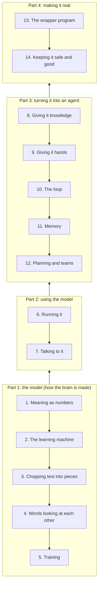

<h1 align="center">How AI agents work</h1>

<i>From "a program that guesses the next word" to "a program that does a job for you", one layer at a time, in plain English, with diagrams.</i>

Companion to <a href="https://github.com/alwintwk/dev-knowledge">dev-knowledge</a> (the word list) and <a href="https://github.com/alwintwk/big-tech-system-design">big-tech-system-design</a>. Last reviewed: October 2026.

**Why this repo:** most AI explainers are either maths-heavy ("here is the attention formula") or hype ("agents will do everything"). This one is a stack. Each layer adds exactly one idea on top of the layer below, and every technical word is explained in plain English first, with the real term in brackets after it.

## Table of contents

* [The whole thing in one picture](#the-whole-thing-in-one-picture)
* [How to read this repo](#how-to-read-this-repo)
* [The layers](#the-layers)
* [What an agent is made of](#what-an-agent-is-made-of)
* [Apps: real agents taken apart](#apps-real-agents-taken-apart)
* [Reading orders](#reading-orders)
* [Learning resources](#learning-resources)
* [Contributing](#contributing)
* [License](#license)

---

## The whole thing in one picture

Read it bottom to top. Nothing in a higher box works without the boxes under it.

> **The one-sentence version:** a language model only ever does one thing, guess the next piece of text. An agent is that same model, placed inside an ordinary program that lets it ask for actions, runs them, shows it the results, and repeats until the job is done.

<a href="#table-of-contents"><b>↥ Back to top</b></a>

## How to read this repo

Every layer page has the same layout:

1. **One-line summary** at the top.
2. **The problem it solves**: what was impossible with only the layers below.
3. **How it works**: step by step, with diagrams.
4. **Worked example**: one concrete case traced from start to finish.
5. **Common mistakes**: what people get wrong.
6. **Words to know**: each jargon word on the page, in plain English.
7. **Learn more**: a few sources worth your time.

Diagrams are written in [Mermaid](https://mermaid.js.org/), which GitHub draws automatically.

Short on time? Read [What an agent is made of](anatomy.md) and [Layer 10: the loop](layers/10-the-loop.md). Those two pages are the core of the repo.

<a href="#table-of-contents"><b>↥ Back to top</b></a>

## The layers

| # | Layer | The one new idea | Real terms you will meet | Status |
|---|---|---|---|---|
| 1 | Meaning as numbers | Words become lists of numbers, and close meanings sit close together | embedding, vector | planned |
| 2 | The learning machine | Millions of tiny dials, nudged a little after every wrong guess | neural network, weights, backpropagation | planned |
| 3 | Chopping text into pieces | The model reads word-pieces, not letters or words | token, tokenizer | planned |
| 4 | Words looking at each other | Each piece checks which other pieces matter to it | attention, transformer | planned |
| 5 | Training | Read a huge amount of text guessing the next piece, then get taught to be an assistant | pretraining, fine-tuning, RLHF | planned |
| 6 | [Running it](layers/06-running-the-model.md) | The model writes one piece at a time and forgets everything between calls | inference, sampling, temperature, context window | ready |
| 7 | [Talking to it](layers/07-talking-to-it.md) | The only steering wheel at run time is the text you send | prompt, system prompt, structured output | ready |
| 8 | [Giving it knowledge](layers/08-giving-it-knowledge.md) | Look things up first, then answer from what was found | RAG, vector database, chunking | ready |
| 9 | [Giving it hands](layers/09-giving-it-hands.md) | The model asks your code to do something, your code does it | tool use, function calling, MCP | ready |
| 10 | [The loop](layers/10-the-loop.md) | Think, act, look at the result, repeat until done | agent loop, ReAct, stop condition | ready |
| 11 | Memory | Choosing what goes into the limited reading space, and keeping notes across sessions | context engineering, compaction, long-term memory | planned |
| 12 | Planning and teams | Break a job into steps, hand parts to helper agents | planning, orchestrator, subagent | planned |
| 13 | The wrapper program | The ordinary code around the model that runs the loop and asks permission | agent harness, permissions, hooks | planned |
| 14 | Keeping it safe and good | Tests for AI answers, blocking bad actions, watching cost | evals, guardrails, prompt injection, observability | planned |

Layers 6 to 10 were written first on purpose: they are the stretch that explains how a chat model becomes an agent.

<a href="#table-of-contents"><b>↥ Back to top</b></a>

## What an agent is made of

The short answer, expanded in [anatomy.md](anatomy.md):

| Part | Plain English | Real term | Layer |
|---|---|---|---|
| Brain | The thing that reads text and decides what to write next | model (LLM) | 1 to 6 |
| Job description | Standing instructions it reads before every turn | system prompt | [7](layers/07-talking-to-it.md) |
| Reference books | Facts looked up when needed, not memorised | retrieval (RAG) | [8](layers/08-giving-it-knowledge.md) |
| Hands | Actions it can ask for: search, read a file, run code | tools | [9](layers/09-giving-it-hands.md) |
| Heartbeat | The repeat cycle that keeps it working until the job is done | agent loop | [10](layers/10-the-loop.md) |
| Notebook | What it can see right now, and what it saved for later | context and memory | 11 |
| Body | The ordinary program that holds all of this together | harness | 13 |

<a href="#table-of-contents"><b>↥ Back to top</b></a>

## Apps: real agents taken apart

The same parts, inside real products. Each page uses one layout and maps the app back to the layers. Start at the [apps index](apps/README.md) for a side-by-side comparison.

| App | What it is | Signature idea |
|---|---|---|
| [Claude Code](apps/claude-code.md) | Anthropic's coding agent | Add-ons that load only when needed |
| [Codex CLI](apps/codex-cli.md) | OpenAI's open-source coding agent | Commands run in a locked-down box (sandbox) |
| [opencode](apps/opencode.md) | Open-source coding agent for many models | The screen and the engine are separate programs |
| [Aider](apps/aider.md) | Open-source coding chat | A fixed recipe where you pick the files |
| [Hermes Agent](apps/hermes-agent.md) | Open-source personal agent | Writes its own how-to guides (skills) |
| [OpenClaw](apps/openclaw.md) | Open-source personal assistant | Lives in your chat apps and can wake itself |

<a href="#table-of-contents"><b>↥ Back to top</b></a>

## Reading orders

**"I just want to understand what an agent is"** (30 minutes)
1. [What an agent is made of](anatomy.md)
2. [Layer 9: giving it hands](layers/09-giving-it-hands.md)
3. [Layer 10: the loop](layers/10-the-loop.md)

**"I want to build something with a model API"**
1. [Layer 6: running it](layers/06-running-the-model.md)
2. [Layer 7: talking to it](layers/07-talking-to-it.md)
3. [Layer 8: giving it knowledge](layers/08-giving-it-knowledge.md)
4. [Layer 9: giving it hands](layers/09-giving-it-hands.md)
5. [Layer 10: the loop](layers/10-the-loop.md)

**"I want the full story from the bottom"**: layers 1 to 14 in order, once the planned pages land.

<a href="#table-of-contents"><b>↥ Back to top</b></a>

## Learning resources

* [Andrej Karpathy: Intro to Large Language Models](https://www.youtube.com/watch?v=zjkBMFhNj_g): one-hour talk, no maths needed.
* [Andrej Karpathy: Deep Dive into LLMs like ChatGPT](https://www.youtube.com/watch?v=7xTGNNLPyMI): the long version, covers training through to tool use.
* [3Blue1Brown: Neural networks](https://www.3blue1brown.com/topics/neural-networks): the best visual explanation of layers 2 and 4.
* [Anthropic: Building effective agents](https://www.anthropic.com/engineering/building-effective-agents): the clearest write-up of workflows versus agents.
* [Model Context Protocol](https://modelcontextprotocol.io/): the standard plug for connecting tools to models.

<a href="#table-of-contents"><b>↥ Back to top</b></a>

## Contributing

Found a mistake or an explanation that is still too jargon-heavy? Open an issue or a pull request. The rule for every page: plain English first, real term in brackets after.

## License

[CC0](LICENSE). Use it however you like.
