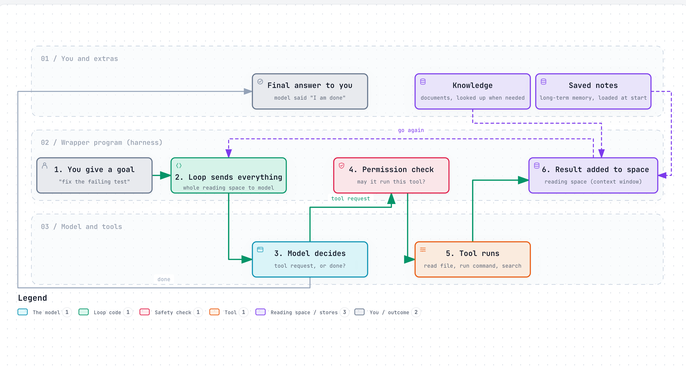
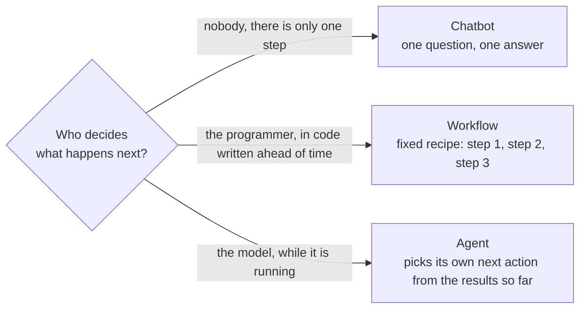

# What an agent is made of

> An agent is not a smarter kind of model. It is an ordinary model with six things bolted around it: instructions, knowledge, tools, a loop, memory, and a wrapper program.

## The problem this page solves

People say "AI agent" as if it were one thing. It is not. When you use a coding agent or a research agent, you are using a pile of separate parts, and only one of them is the AI model. The rest is normal software that a junior developer could read.

Knowing the parts matters because when an agent does something stupid, the fix is almost never "get a smarter model". It is usually one specific part: bad instructions, a missing tool, a tool that returns confusing output, or a reading space stuffed with junk.

## The parts

<a href="https://alwintwk.github.io/how-ai-agents-work/diagrams/anatomy-agent-parts.html">
  <picture>
    <source media="(prefers-color-scheme: dark)" srcset="diagrams/anatomy-agent-parts.dark.png">
    
  </picture>
</a>

Click the diagram for the interactive version (zoom, dark mode, trace a path).

> **Why this matters:** the model sits off to one side. It never touches your files, the internet, or anything else. It only receives text and returns text. Everything that actually happens in the world is done by the wrapper program.

| Part | Plain English | Real term | What breaks without it | Read more |
|---|---|---|---|---|
| Brain | Reads text, writes the most fitting next text | model, LLM (large language model) | Nothing works | Layers 1 to 6 |
| Job description | Standing instructions read before every turn | system prompt | It behaves like a generic chatbot and ignores your rules | [Layer 7](layers/07-talking-to-it.md) |
| Reference books | Facts fetched at the moment they are needed | retrieval, RAG | It makes things up about anything it was not trained on | [Layer 8](layers/08-giving-it-knowledge.md) |
| Hands | A list of actions it is allowed to ask for | tools, function calling | It can only talk about doing things | [Layer 9](layers/09-giving-it-hands.md) |
| Heartbeat | The cycle: ask the model, run what it asked for, show it the result, ask again | agent loop | It gets one shot and cannot react to what it finds | [Layer 10](layers/10-the-loop.md) |
| Notebook | What it can see right now, plus notes saved between sessions | context window, memory | It forgets the start of long jobs and every past session | Layer 11 (planned) |
| Body | The normal program that runs the loop, checks permissions, shows you output | harness | There is nothing to run the loop | Layer 13 (planned) |

## The same model, three different products

The model is the same in all three rows. Only the parts around it change.

| Product | Instructions | Knowledge | Tools | Loop | Is it an agent? |
|---|---|---|---|---|---|
| Plain chatbot | "Be helpful" | None | None | One reply per message | No |
| "Chat with your documents" bot | "Answer only from the documents" | Your documents, searched each turn | None | One reply per message | No. It is a fixed two-step recipe (workflow) |
| Coding agent | "You are a careful engineer, run the tests before you say done" | The codebase, searched on demand | Read file, edit file, run command | Repeats until the tests pass | Yes |

## Chatbot, workflow, or agent?

The dividing question is: **who decides the next step?**

A fixed recipe (workflow) is cheaper, faster, and more predictable. An agent copes with jobs where you cannot know the steps ahead of time, such as "find out why this test fails". Use a workflow when you can write the steps down. Use an agent when you cannot.

## Worked example: one request, every part

You type: **"Why is the checkout test failing?"**

1. **Body (harness)** builds the reading space: the job description, any saved notes about this project, the list of tools, and your message.
2. **Brain (model)** reads all of it and writes: "I want to run the tool `run_command` with `npm test checkout`."
3. **Body** checks permission, runs the command, and puts the output (a stack trace) into the reading space.
4. **Heartbeat (loop)** sends the now-longer reading space back to the model.
5. **Brain** reads the stack trace and writes: "I want `read_file` on `cart.ts`."
6. Steps 3 to 5 repeat. Each turn the model sees everything that happened so far.
7. **Brain** eventually writes plain text with no tool request: "The test fails because the tax rate is rounded before the discount is applied." No tool request means the loop stops.
8. **Body** shows you that answer.

The model was called several times. Between calls it remembered nothing. The only reason it seemed to "keep working" is that the wrapper program kept re-sending the growing record of what had happened.

## Common mistakes

- **Thinking the model runs the tools.** It does not. It writes a request. Your code decides whether to carry it out. This is where every safety check lives.
- **Thinking the agent remembers.** The model starts blank on every call. "Memory" is the wrapper program pasting earlier text back in.
- **Blaming the model first.** Most agent failures are a vague instruction, a badly described tool, or a reading space filled with irrelevant text.
- **Calling every AI feature an agent.** If the steps are fixed in code, it is a workflow. That is not an insult: workflows are often the better choice.
- **Adding more agents to fix one confused agent.** A team of confused agents is more confusion. Fix the instructions and tools of one first.

## Words to know

| Word | Plain English |
|---|---|
| Model / LLM | The trained program that guesses the next piece of text |
| System prompt | Standing instructions the model reads before the conversation |
| Tool | An action the model may ask for, described to it by name and inputs |
| Agent loop | The repeat cycle of ask model, run tool, show result |
| Context window | The limited amount of text the model can read in one call |
| Harness | The ordinary program around the model that makes it an agent |
| Workflow | A fixed sequence of model calls decided by the programmer |

## Learn more

- [Anthropic: Building effective agents](https://www.anthropic.com/engineering/building-effective-agents): workflows versus agents, with patterns for each.
- [Layer 10: the loop](layers/10-the-loop.md): the heartbeat in detail, with code.
