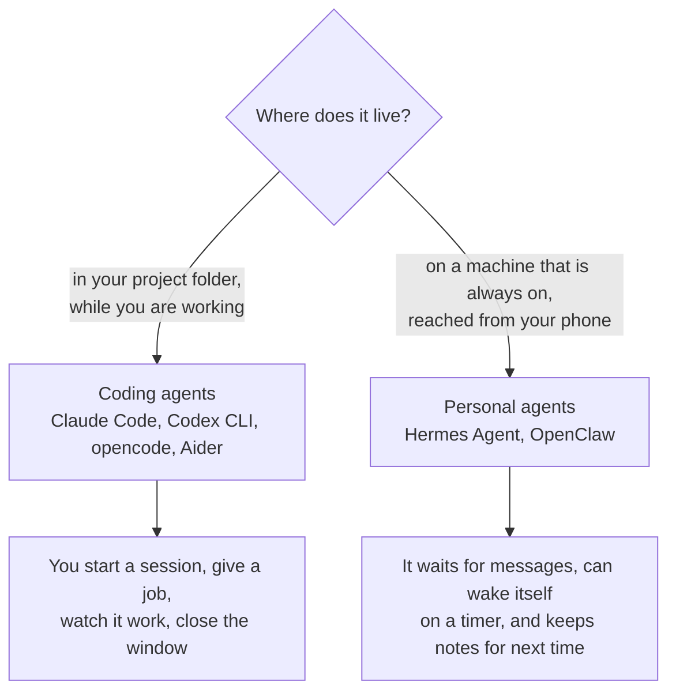

# Apps: real agents taken apart

> The layers explain the ideas. These pages show the same ideas inside real products you can install today.

Every page follows one layout ([TEMPLATE.md](TEMPLATE.md)) and fills in the same seven slots from [What an agent is made of](../anatomy.md): brain, job description, reference books, hands, heartbeat, notebook, body. Once you have read one page, the others are quick to compare.

Each page has four parts worth knowing about:

- **Component map:** the app's real building blocks, each tagged with the layer it belongs to.
- **Deep dive, part by part:** how the instructions are put together, how a tool request is carried out, when the loop stops, how the reading space is managed, how notes outlive a session, and how the wrapper program is laid out. Read from the source code where it is public.
- **Problems it faces:** what goes wrong with this design, which layer causes it, what the app does about it, and what is still unsolved. Backed by docs, source and public bug reports.
- **If you were building your own:** what to copy and what to think twice about.

The problems that show up in all six are collected in [The problems every agent runs into](problems.md).

*Last checked: October 2026. These apps change fast; each page links its sources.*

## The apps

| App | What it is | Made by | Open source? | Where you use it | Models |
|---|---|---|---|---|---|
| [Claude Code](claude-code.md) | Coding agent | Anthropic | No | Terminal, editors, desktop, web, phone | Anthropic's Claude models |
| [Codex CLI](codex-cli.md) | Coding agent | OpenAI | Yes (Apache-2.0) | Terminal | OpenAI's models by default |
| [opencode](opencode.md) | Coding agent | Anomaly | Yes (MIT) | Terminal, desktop, editors, web | Many |
| [Aider](aider.md) | Coding chat that edits your files | Aider AI | Yes (Apache-2.0) | Terminal | Many |
| [Hermes Agent](hermes-agent.md) | Personal agent that stays running | Nous Research | Yes (MIT) | Terminal and chat apps | Many |
| [OpenClaw](openclaw.md) | Personal assistant that stays running | OpenClaw Foundation | Yes (MIT) | Chat apps | Many |

## Two families

> **Why this matters:** both families run the same loop from [Layer 10](../layers/10-the-loop.md). What differs is everything around it: who can send it messages, how long it runs, and what it is allowed to touch while nobody is watching.

## Same slots, different choices

How each app answers the questions that separate one agent from another. "Not published" means the makers' docs do not say.

| App | Who picks the next step | How it finds things | How it edits files | Asks before acting? | Locked-down box for commands (sandbox) | Keeps notes between sessions |
|---|---|---|---|---|---|---|
| [Claude Code](claude-code.md) | The model (agent loop) | Searches and reads files as it goes | Edit tools | Depends on the permission mode you pick | Available, enforced by the operating system | Instruction files you write, plus notes it writes itself |
| [Codex CLI](codex-cli.md) | The model (agent loop) | Runs commands and reads files | A patch tool | Asks before going beyond the sandbox | Enforced by the operating system | Instruction files, plus an optional memories feature |
| [opencode](opencode.md) | The model (agent loop) | Searches and reads files as it goes | Edit tools | Most actions allowed by default; you tighten the rules | Not described in the docs | Instruction files |
| [Aider](aider.md) | Mostly you and a fixed recipe | A summary map of the whole project; you add the files | The model writes edits as plain text in a fixed layout | Asks before running a command or adding a file | Not published | Not by default |
| [Hermes Agent](hermes-agent.md) | The model (agent loop) | Web search, files, and its own saved how-to guides | File tools | Checks commands against a list of risky patterns | Optional: commands can run in a container or on another machine | Small note files, plus how-to guides it writes itself |
| [OpenClaw](openclaw.md) | The model (agent loop) | Web search, files, and its own notes | File tools | Off by default for commands on the host | Off by default | Plain note files in its working folder |

## What to notice

- **The loop is the same everywhere.** Five of the six run the loop from [Layer 10](../layers/10-the-loop.md) almost unchanged. opencode's is a plain `while (true)`. The interesting engineering is around the loop, not in it.
- **Aider is the exception, on purpose.** It is closer to a fixed recipe (workflow) than an agent: you choose the files, the model writes the edit, and ordinary code does the rest in the same order every time. It is a good reminder that more freedom for the model is a design choice, not an upgrade.
- **Safety defaults differ a lot.** Codex CLI is built around a sandbox. Claude Code's manual mode asks before edits and commands. opencode allows most actions unless you tighten the rules. OpenClaw starts with the sandbox off and no prompts for host commands. Read the "Staying safe" section of any app before you give it real access.
- **Always-on changes the risk.** A coding agent reads your code while you watch. A personal agent reads messages, emails and web pages from strangers while you are asleep. Hidden instructions in that content (prompt injection) matter far more there.
- **"Memory" is nearly always text files.** In every app here, what carries over between sessions is plain text pasted back into the reading space. See [Layer 6](../layers/06-running-the-model.md) for why it has to be that way.
- **Add-ons have converged.** Instruction files (`AGENTS.md`), add-on tool servers (MCP) and saved routines (`SKILL.md` skills) appear in most of these apps in nearly the same shape.

## Suggested reading order

1. [Aider](aider.md): the simplest design, and the clearest contrast between a fixed recipe and an agent.
2. [opencode](opencode.md): a full agent whose source code you can read, loop included.
3. [Codex CLI](codex-cli.md): the same loop, with the sandbox as the main idea.
4. [Claude Code](claude-code.md): the most add-on types, and how they are kept from filling the reading space.
5. [Hermes Agent](hermes-agent.md): an agent that writes its own how-to guides.
6. [OpenClaw](openclaw.md): an agent that lives in your chat apps, and what that costs in safety.

## Not covered yet

Cursor, Cline, Goose, Gemini CLI, GitHub Copilot's agent mode. To add one, copy [TEMPLATE.md](TEMPLATE.md) and keep every claim tied to a source.
