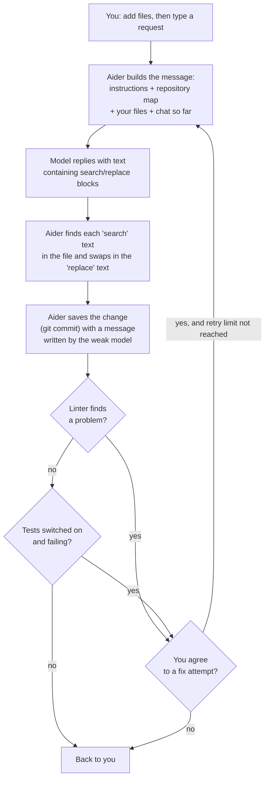

# Aider

> Aider is an open-source chat program for your terminal that edits the code in your own project folder, for developers who want to stay in charge of which files the AI touches.

*Last checked: October 2026. These apps change fast; check the linked sources for the current state.*

## At a glance

| | |
|---|---|
| Made by | Aider AI LLC (named in the privacy policy). The code lives under the `Aider-AI` organisation on GitHub |
| Open source? | Yes, Apache License 2.0 |
| Where it runs | Terminal, on Mac, Linux and Windows. It can also watch your files so you can drive it from any editor |
| Which models it can use | Many. Hosted models from several companies, and models running on your own machine |
| Written in | Python |
| Links | [Official site](https://aider.chat/) · [source code](https://github.com/Aider-AI/aider) · [docs](https://aider.chat/docs/) |

## What it is for

You give Aider small, concrete coding jobs: "add a retry to this function", "write a test for this class", "rename this field everywhere in these two files". It changes the files on your disk and saves each change in your project's history (git commit).

A normal session looks like this. You start `aider` in your project folder and name the files you want changed. You type a request. Aider sends the request and those files to the model, turns the reply into file edits, saves them, and waits for your next message.

The important habit is that **you pick the files**. The docs say: "Only add the files that need to be edited for your task." Aider gives the model a short summary of the rest of the project so it still understands how things fit together.

## The parts

How this app fills each slot from [What an agent is made of](../anatomy.md). Where the makers have not published a detail, the table says "not published".

| Part | How this app does it | Layer |
|---|---|---|
| Brain (model) | You choose. A main model writes the code. A cheaper helper model (weak model) writes commit messages and shortens old chat. In architect mode a second model (editor model) writes the actual edits | [6](../layers/06-running-the-model.md) |
| Job description (system prompt) | Built into the source code, one set per edit format. It tells the model to act as an expert developer and to answer in an exact edit layout. Your own rules are added from a conventions file | [7](../layers/07-talking-to-it.md) |
| Reference books (knowledge) | Filled differently from most agents. The model does not search. Aider builds a summary of the whole project (repository map) and sends the most relevant part. You add full files by hand with `/add`, read-only files with `/read`, and web pages with `/web` | [8](../layers/08-giving-it-knowledge.md) |
| Hands (tools) | Filled differently. The docs describe no menu of tools for the model to call. The model writes its edits as plain text in a fixed layout (edit format), and Aider applies them. It may also suggest a terminal command, which runs only if you say yes | [9](../layers/09-giving-it-hands.md) |
| Heartbeat (loop) | A short fixed recipe, not an open loop: send, apply edits, commit, check (lint), optionally test. If a check fails, Aider asks you whether to send the errors back for a fix. The source code caps these automatic retries at a small fixed number | [10](../layers/10-the-loop.md) |
| Notebook (context and memory) | The reading space holds the instructions, the repository map, the files you added, and the chat so far. Old chat is shortened by the weak model once it passes a size limit. The chat is saved to a file in your project. It is not loaded back next time unless you ask | 11 |
| Body (harness) | A Python command-line program. It reads your input, builds the message, parses the reply, writes files, runs git, the linter and the tests | 13 |

## How one request flows

> **Why this matters:** every box except one is ordinary code with a fixed order. The model fills in only the "what should the edit be" box. That makes Aider easy to predict: you always know what happens after the model replies.

## What makes it different

**1. A map of the project instead of a search tool (repository map).** Aider reads your code with a parser (tree-sitter) and lists each file with its main classes and functions. It then ranks files by how much other files depend on them (graph ranking) and sends only the top part that fits a size budget, set with `--map-tokens`. The makers chose this so the model can see how the project fits together without the cost of reading every file.

**2. Edits as plain text, not tool calls (edit formats).** The model is told to write changes in a fixed layout. The common one is a pair of blocks: the exact existing lines to find, then the lines to put there (search/replace block). Other layouts are the whole file, or a simplified version of the standard `diff` layout (unified diff). Aider picks the layout that suits each model. The makers measured this: asking for edits through structured tool calls (function calling) made the model write worse code and follow the layout less well than plain text.

**3. One model thinks, another types (architect mode).** Aider has four chat modes. `code` changes files. `ask` only discusses. `help` answers questions about Aider itself. `architect` splits the work: one model describes the solution in words, and an editor model turns that into exact edits. The reason given is that a model otherwise "has to split its attention between solving the coding problem and conforming to the edit format".

**4. Every change is a save point (automatic git commits).** Aider commits each edit it makes, with a message written by the weak model. If your files had unsaved changes, it commits those first so your work and its work stay separate. `/undo` removes the last commit Aider made.

**5. Check, then fix.** After editing, Aider runs a code checker (linter) on the files it changed. This is on by default. Running your tests after each edit is off by default and switched on with `--test-cmd` and `--auto-test`. When a check fails, the errors go back to the model for another try.

### Where it sits: workflow or agent?

This page's reading of the docs and source: Aider is much closer to a fixed recipe (workflow) than to a free-roaming agent.

Use the test from [What an agent is made of](../anatomy.md): who decides the next step?

| Decision | Who makes it |
|---|---|
| Which files the model can read in full and edit | You |
| What the edit says | The model |
| What happens after the edit (commit, lint, test) | Aider's code, same order every time |
| Whether to try fixing a failed check | You, by answering a yes or no question |
| Whether to open one more file, or run a command | The model can ask. You approve |

The model never picks its own next action from a tool menu. The only loop is the retry after a failed check, and it is capped. So this is a workflow with one small, bounded feedback step.

Why that is a reasonable choice:
- **Predictable cost.** One request is usually one model call plus a few possible retries, not an unknown number of steps.
- **Less to go wrong.** The docs warn that too many files "distract or confuse" the model. A human who picks two files avoids that.
- **Easy to review.** Each request becomes one commit you can read or undo.
- **Works with weaker models.** Writing text in a fixed layout is a smaller ask than planning many tool calls.

The cost is that you do more of the steering. Aider will not go exploring a strange codebase by itself to find a bug. For that kind of open-ended job, an agent loop fits better.

## Adding to it

- **Instruction files (conventions).** Write your rules in a small Markdown file such as `CONVENTIONS.md`. Load it with `--read`, with `/read` in the chat, or list it in the settings file `.aider.conf.yml` so it loads every time. It is marked read-only so the model does not edit it.
- **Settings file.** `.aider.conf.yml` holds the same options as the command line: model, lint command, test command, and so on.
- **Your own checks.** `--lint-cmd` and `--test-cmd` plug in any command that exits with an error code on failure.
- **Driving it from your editor.** Start with `--watch-files`, then write a code comment ending in `AI!` (make this change) or `AI?` (answer this question). Aider sees the comment and acts.
- **Scripts.** `--message` runs one instruction and exits, so a shell script can apply the same request to many files. There is a Python interface too, but the docs say it "is not officially supported".
- **Add-on tools (MCP servers), plug-ins, saved routines (skills), helper agents (subagents):** not published. The official docs checked for this page do not describe them.

## Staying safe

- **What it can touch.** Files in your project folder, using your own user account. It edits the files you added to the chat. If the model mentions another file, Aider asks "Add file to the chat?" first.
- **Commands.** The model can only suggest a terminal command. Aider asks before running it. Lint and test commands are ones you configured.
- **Undo.** Git is the safety net. Every edit is a commit, and `/undo` reverses the last one.
- **Skipping the questions.** `--yes-always` answers yes to every confirmation. That removes the human check, so use it with care.
- **Locked-down box (sandbox).** Not published. The docs do not describe one. Commands you approve run directly on your machine.
- **Where your code goes.** The files you add and the repository map are sent to whichever model provider you chose. Aider also has optional usage statistics (analytics) tied to a random ID, which you can switch off.

## Words to know

| Word | Plain English |
|---|---|
| Git commit | A saved snapshot of your project that you can go back to |
| Repository map | A short summary of a whole project: each file with its main classes and functions |
| Tree-sitter | A parser, a program that reads code and works out its structure |
| Graph ranking | Scoring files by how many other files depend on them, to find the important ones |
| Token | The small chunk of text that models count size and cost in |
| Edit format | The fixed layout the model must use to write its changes |
| Search/replace block | An edit written as "find these exact lines" then "put these lines instead" |
| Unified diff | A standard layout for showing changed lines, with `-` for removed and `+` for added |
| Function calling | The model asking for an action by filling in a structured form instead of writing plain text |
| Chat mode | Which behaviour Aider uses for a message: code, ask, architect or help |
| Architect mode | Two models in a row: one plans the change, one writes the exact edits |
| Editor model | The model that writes the edits in architect mode |
| Weak model | A cheaper model used for small jobs such as commit messages |
| Linter | A program that checks code for mistakes without running it |
| Conventions file | A file of your coding rules that Aider shows the model every time |
| Workflow | A fixed sequence of steps decided by the programmer |
| Agent loop | Ask the model, run the tool it asked for, show it the result, repeat |
| System prompt | Standing instructions the model reads before the conversation |
| Harness | The ordinary program around the model that does the real work |
| MCP server | A separate add-on program that offers extra tools to an AI app |
| Sandbox | A locked-down box for running commands so they cannot harm the rest of the machine |
| Analytics | Anonymous statistics about how a program is used |

## Sources

Every factual claim on the page should trace to one of these. Official docs and the source code first.

- [Aider home page](https://aider.chat/) and [documentation index](https://aider.chat/docs/)
- [Source repository: Aider-AI/aider](https://github.com/Aider-AI/aider) (language, licence)
- [LICENSE.txt](https://github.com/Aider-AI/aider/blob/main/LICENSE.txt) (Apache 2.0)
- [Privacy policy](https://aider.chat/docs/legal/privacy.html) (Aider AI LLC, analytics)
- [Installation](https://aider.chat/docs/install.html) (operating systems)
- [Usage](https://aider.chat/docs/usage.html) and [Tips](https://aider.chat/docs/usage/tips.html) (you pick the files)
- [FAQ](https://aider.chat/docs/faq.html) (why not to add many files)
- [Connecting to LLMs](https://aider.chat/docs/llms.html) (supported models, local models)
- [Repository map](https://aider.chat/docs/repomap.html) and [Building a better repository map with tree-sitter](https://aider.chat/2023/10/22/repomap.html)
- [Edit formats](https://aider.chat/docs/more/edit-formats.html) and [File editing problems](https://aider.chat/docs/troubleshooting/edit-errors.html)
- [GPT code editing benchmarks](https://aider.chat/docs/benchmarks.html) (plain text edits versus function calling)
- [Chat modes](https://aider.chat/docs/usage/modes.html) and [Separating code reasoning and editing](https://aider.chat/2024/09/26/architect.html)
- [Git integration](https://aider.chat/docs/git.html) (automatic commits, `/undo`)
- [Linting and testing](https://aider.chat/docs/usage/lint-test.html)
- [Specifying coding conventions](https://aider.chat/docs/usage/conventions.html)
- [In-chat commands](https://aider.chat/docs/usage/commands.html) and [Options reference](https://aider.chat/docs/config/options.html)
- [Aider in your IDE (watch files)](https://aider.chat/docs/usage/watch.html) and [Scripting aider](https://aider.chat/docs/scripting.html)
- [`base_coder.py`](https://github.com/Aider-AI/aider/blob/main/aider/coders/base_coder.py) (order of steps after an edit, retry cap, confirmation questions)
- [`editblock_prompts.py`](https://github.com/Aider-AI/aider/blob/main/aider/coders/editblock_prompts.py) (the built-in system prompt for search/replace blocks)
