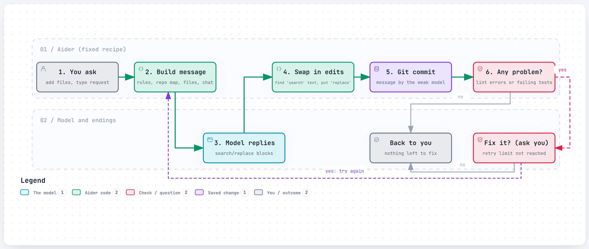
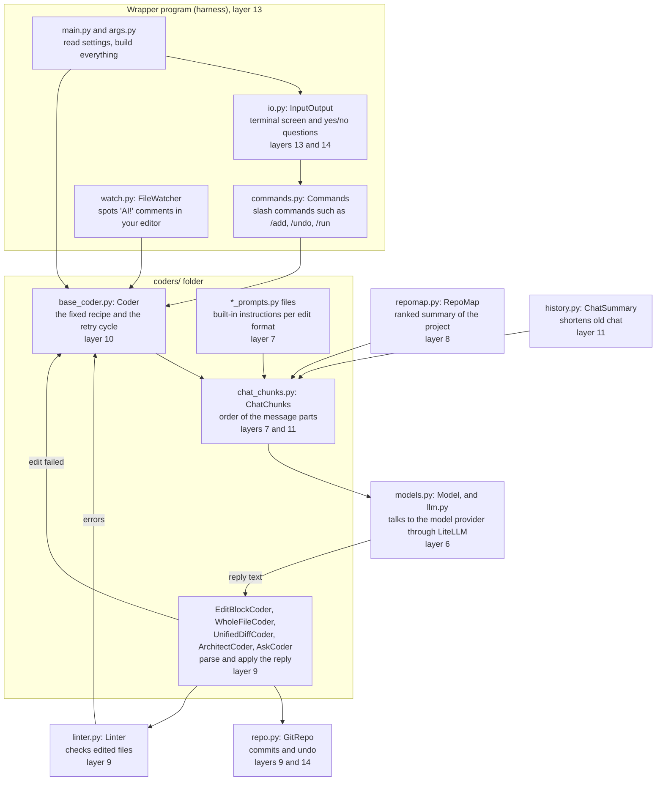

# Aider

> Aider is an open-source chat program for your terminal that edits the code in your own project folder, for developers who want to stay in charge of which files the AI touches.

*Last checked: October 2026. These apps change fast; check the linked sources for the current state.*

## At a glance

| | |
|---|---|
| Made by | Aider AI LLC (named in the privacy policy). The code lives under the `Aider-AI` organisation on GitHub |
| Open source? | Yes, Apache License 2.0 |
| Where it runs | Terminal, on Mac, Linux and Windows. It can also watch your files so you can drive it from any editor |
| Which models it can use | Many. Hosted models from several companies, and models running on your own machine |
| Written in | Python |
| Links | [Official site](https://aider.chat/) · [source code](https://github.com/Aider-AI/aider) · [docs](https://aider.chat/docs/) |

## What it is for

You give Aider small, concrete coding jobs: "add a retry to this function", "write a test for this class", "rename this field everywhere in these two files". It changes the files on your disk and saves each change in your project's history (git commit).

A normal session looks like this. You start `aider` in your project folder and name the files you want changed. You type a request. Aider sends the request and those files to the model, turns the reply into file edits, saves them, and waits for your next message.

The important habit is that **you pick the files**. The docs say: "Only add the files that need to be edited for your task." Aider gives the model a short summary of the rest of the project so it still understands how things fit together.

## The parts

How this app fills each slot from [What an agent is made of](../anatomy.md). Where the makers have not published a detail, the table says "not published".

| Part | How this app does it | Layer |
|---|---|---|
| Brain (model) | You choose. A main model writes the code. A cheaper helper model (weak model) writes commit messages and shortens old chat. In architect mode a second model (editor model) writes the actual edits | [6](../layers/06-running-the-model.md) |
| Job description (system prompt) | Built into the source code, one set per edit format. It tells the model to act as an expert developer and to answer in an exact edit layout. Your own rules are added from a conventions file | [7](../layers/07-talking-to-it.md) |
| Reference books (knowledge) | Filled differently from most agents. The model does not search. Aider builds a summary of the whole project (repository map) and sends the most relevant part. You add full files by hand with `/add`, read-only files with `/read`, and web pages with `/web` | [8](../layers/08-giving-it-knowledge.md) |
| Hands (tools) | Filled differently. No menu of tools is sent to the model (the source confirms this, see the deep dive). The model writes its edits as plain text in a fixed layout (edit format), and Aider applies them. It may also suggest a terminal command, which runs only if you say yes | [9](../layers/09-giving-it-hands.md) |
| Heartbeat (loop) | A short fixed recipe, not an open loop: send, apply edits, commit, check (lint), optionally test. If something fails, the error goes back to the model for another try (reflection). The source code caps these retries at a small fixed number | [10](../layers/10-the-loop.md) |
| Notebook (context and memory) | The reading space holds the instructions, the repository map, the files you added, and the chat so far. Old chat is shortened by the weak model once it passes a size limit. The chat is saved to a file in your project. It is not loaded back next time unless you ask | 11 |
| Body (harness) | A Python command-line program. It reads your input, builds the message, parses the reply, writes files, runs git, the linter and the tests | 13 |

## How one request flows

<a href="https://alwintwk.github.io/how-ai-agents-work/diagrams/apps-aider-loop.html">
  <picture>
    <source media="(prefers-color-scheme: dark)" srcset="../diagrams/apps-aider-loop.dark.png">
    
  </picture>
</a>

Click the diagram for the interactive version (zoom, dark mode, trace a path).

> **Why this matters:** every box except one is ordinary code with a fixed order. The model fills in only the "what should the edit be" box. That makes Aider easy to predict: you always know what happens after the model replies.

## Component map

These are the real file and class names from the `aider/` folder of the source. The number in each box is the layer it belongs to.

> **Why this matters:** there is one model box and about a dozen ordinary code boxes. Most of what makes Aider work well (the map, the edit parser, the commits, the checks) is plain Python you can read. Layers 6 to 11 and 13 are all here. What is missing is a tool menu and a model-driven loop.

## Deep dive, part by part

### How the instructions are put together (prompt assembly)

Where it lives: `format_chat_chunks()` in [`base_coder.py`](https://github.com/Aider-AI/aider/blob/main/aider/coders/base_coder.py) fills the parts. [`chat_chunks.py`](https://github.com/Aider-AI/aider/blob/main/aider/coders/chat_chunks.py) fixes their order.

Every call to the model is built fresh, in this exact order:

1. **System.** The built-in instructions for the active edit format, for example [`editblock_prompts.py`](https://github.com/Aider-AI/aider/blob/main/aider/coders/editblock_prompts.py). Aider fills in details such as your operating system. For models marked as lazy or overeager in its settings it adds an extra line, such as "You always COMPLETELY IMPLEMENT the needed code!" (see [`base_prompts.py`](https://github.com/Aider-AI/aider/blob/main/aider/coders/base_prompts.py)).
2. **Examples.** A short made-up conversation showing a correct edit (few-shot examples). It ends with a fake message saying "I switched to a new code base", so the model does not try to edit the example files.
3. **Read-only files.** Your conventions file and anything added with `/read`.
4. **Repository map.** Followed by a canned reply in the model's voice: "Ok, I won't try and edit those files without asking first."
5. **Earlier chat.** Finished exchanges, possibly already shortened.
6. **Chat files.** The full, current text of every file you added, read from disk each time.
7. **Current request.** Your message, plus anything said since.
8. **Reminder.** The edit format rules again, at the very end. It is left out if the message is already at the model's input limit.

Design choice: the parts that rarely change come first. That lets a provider reuse work from the last call (prompt caching). Aider marks the end of the examples, the map and the chat files as reuse points. The rules are repeated at the end because models follow recent text best.

What it costs: every file you added is sent again on every call, and the rules are sent twice. That is why the docs keep telling you to add few files.

### The tools and how a tool request is carried out (tool execution)

Where it lives: [`editblock_coder.py`](https://github.com/Aider-AI/aider/blob/main/aider/coders/editblock_coder.py) for the default search/replace layout. Each layout has its own class in the [`coders/`](https://github.com/Aider-AI/aider/tree/main/aider/coders) folder.

There is no tool menu, so "tool execution" here means reading the model's reply as text:

1. **Find the blocks.** `find_original_update_blocks()` walks the reply line by line looking for three markers: `<<<<<<< SEARCH`, `=======`, `>>>>>>> REPLACE`. The patterns accept a few more or fewer marker characters than asked for.
2. **Find the file name.** It looks in the few lines just above the block. It tries an exact match with a known file, then a match on the file name without its folder, then the closest spelling.
3. **Collect commands.** Code blocks marked as shell are set aside as suggested terminal commands.
4. **Check permission.** `allowed_to_edit()` passes files already in the chat. A new file triggers "Create new file?". Any other file triggers "Allow edits to file that has not been added to the chat?". Files ignored by git are skipped.
5. **Practice run.** All edits are tried without writing (dry run). Then any of your own unsaved changes in those files are committed first.
6. **Match the search text.** `replace_most_similar_chunk()` tries, in order:
   - the exact lines;
   - the same lines where every line is shifted by the same amount of indentation;
   - the same again after dropping a stray blank first line;
   - blocks where the model wrote `...` to skip code, matching the pieces in between.
   
   A looser "closest match" step (fuzzy matching) still exists in the file, but a bare `return` above it means it never runs. If the named file does not match, Aider tries the other files in the chat.
7. **On failure.** Aider does not guess. It builds an error message that names the failed block, shows similar real lines under "Did you mean to match some of these actual lines", says if the new lines are already in the file, and tells the model which blocks did succeed so it does not send them again. That message goes back to the model as the next request.

**About the `functions` argument.** `base_coder.py` passes `functions=self.functions` on every call, which looks like a tool menu. It is not in use. The base class sets `functions = None`, and `send_completion()` in [`models.py`](https://github.com/Aider-AI/aider/blob/main/aider/models.py) only adds tools when it is not `None`. The only classes that fill it are the old function-calling coders such as [`editblock_func_coder.py`](https://github.com/Aider-AI/aider/blob/main/aider/coders/editblock_func_coder.py). They are left out of the list in [`coders/__init__.py`](https://github.com/Aider-AI/aider/blob/main/aider/coders/__init__.py) and raise a "Deprecated" error if created. They are what remains of the benchmark experiment that found plain text worked better.

Design choice: plain text edits plus a forgiving matcher plus a helpful error. The makers report that turning off flexible matching for unified diffs gave "a 9X increase in editing errors".

What it costs: a parser and a set of instructions for every layout, all of which the makers must maintain. A wrongly applied edit is possible when the match is loose, which is likely why the loosest step is switched off.

### The loop and when it stops

Where it lives: `run_one()` and `send_message()` in [`base_coder.py`](https://github.com/Aider-AI/aider/blob/main/aider/coders/base_coder.py).

`run_one()` is a small `while` loop. It sends your message. If anything during that turn set a follow-up message (`reflected_message`), it sends that next. Otherwise it stops and waits for you.

Inside one turn the order is fixed:

1. Send the message. Provider errors that are worth retrying are retried with a growing wait.
2. If the reply names a file you have not added, ask "Add file to the chat?". If you say yes, **stop the turn here** and go round again with the file included.
3. Apply the edits. A bad layout or failed match sets the follow-up message.
4. Commit.
5. Run the linter on edited files and commit again. On errors ask "Attempt to fix lint errors?". Yes sets the follow-up message.
6. Offer suggested terminal commands: "Run shell command?".
7. If tests are switched on, run them. On failure ask "Attempt to fix test errors?".

The loop stops when no follow-up was set, or when the retry counter reaches `max_reflections`. Then it prints "Only N reflections allowed, stopping."

Architect mode adds one fixed step. [`architect_coder.py`](https://github.com/Aider-AI/aider/blob/main/aider/coders/architect_coder.py) takes the first model's plan, asks "Edit the files?", then creates a second coder with the editor model, no repository map and an empty chat, and gives it the plan as its request.

Design choice: the code owns the order, the model only fills in content, and a person approves each retry. The cap means a confused model cannot spend without limit.

What it costs: one follow-up channel is shared by four different causes. In step 2 the turn ends before step 3, so edits in that same reply are not applied. Users report this as lost changes (see Problems).

### Managing the reading space (context management)

**The repository map.** Where it lives: [`repomap.py`](https://github.com/Aider-AI/aider/blob/main/aider/repomap.py).

1. **Read every file's structure.** `get_tags()` runs tree-sitter with a query file per language to pull out two lists: names a file defines, and names it uses. Results are stored on disk in a `.aider.tags.cache` folder and reused until the file changes.
2. **Build a graph.** Each file is a dot. An arrow goes from a file that uses a name to the file that defines it.
3. **Weight the arrows.** Stronger if you typed that name in your message, if the name is long and specific, or if the file using it is in your chat. Weaker if the name starts with an underscore or is defined in many files.
4. **Rank.** It runs the PageRank method from the `networkx` library, tilted towards your chat files and files you mentioned (personalization).
5. **Cut to the budget.** The ranked definitions are turned into a text outline. A halving search (binary search) finds how many definitions fit the size budget, accepting a result that is close enough.
6. **Adjust.** With no files in the chat, the budget is multiplied up so the model gets a wider view.

**Old chat.** Where it lives: [`history.py`](https://github.com/Aider-AI/aider/blob/main/aider/history.py). When finished exchanges pass a size limit derived from the model's input size, a background thread starts. `ChatSummary` keeps the most recent messages as they are and asks the weak model to summarise the older part. The instructions say the summary "MUST include the function names, libraries, packages" and file names. If the result is still too big it repeats. If the weak model fails it tries the main model.

**Size checks.** Before sending, `check_tokens()` estimates the size. If it is over the model's limit it lists what to do (`/drop`, `/clear`) and asks "Try to proceed anyway?". The docs state: "Aider never enforces token limits, it only reports token limit errors from the API provider."

**Long replies.** If the model hits its output limit mid-reply, and the model supports it, Aider sends another request with the partial reply already filled in as the start of the answer (assistant prefill) and joins the pieces.

Design choice: a map that is computed, ranked and capped, instead of letting the model read files one by one.

What it costs: the map only shows names and signatures, not what the code does. It only covers files in your git repository, so outside libraries are invisible to it. The summary loses detail.

### Notes that outlive a session (memory)

Aider has no memory that it writes for itself. What survives between sessions:

- `.aider.chat.history.md`: a transcript of the chat. It is written every session. It is only loaded back if you pass `--restore-chat-history`, and then it is summarised.
- `.aider.input.history`: what you typed, for the up-arrow key.
- The `.aider.tags.cache` folder: the parsed structure of your files, for speed.
- Your conventions file and `.aider.conf.yml`: rules you wrote by hand.
- The git history: every change Aider made, with a message.

Design choice: your repository is the memory. What it costs: each session starts blank. Anything the model worked out yesterday must be in the code, in a commit message, or in a file you maintain.

### The wrapper program (harness): processes, storage, screens

- **Process.** One Python program on your machine. No server. [`main.py`](https://github.com/Aider-AI/aider/blob/main/aider/main.py) reads the settings and builds the objects in the component map.
- **Model layer.** [`models.py`](https://github.com/Aider-AI/aider/blob/main/aider/models.py) holds per-model settings: which edit format, which weak and editor model, whether to add the "lazy" line. [`llm.py`](https://github.com/Aider-AI/aider/blob/main/aider/llm.py) loads the LiteLLM library, which is how one program can talk to many providers.
- **Screens.** [`io.py`](https://github.com/Aider-AI/aider/blob/main/aider/io.py) draws the terminal prompt and owns every yes/no question. There is also an experimental browser screen (`--browser`) and the file watcher.
- **Commits.** [`repo.py`](https://github.com/Aider-AI/aider/blob/main/aider/repo.py) wraps git. For each commit it sends the changes (diff) to the weak model to get a message, falling back to the main model. By default it adds "(aider)" to the author name so you can tell its commits from yours.
- **Undo.** `/undo` in [`commands.py`](https://github.com/Aider-AI/aider/blob/main/aider/commands.py) refuses unless all of these hold: the last commit was made by Aider in this session, it is not a merge, the files have no unsaved changes, and it has not been pushed. Then it restores those files and moves the branch back one commit.
- **Linter.** [`linter.py`](https://github.com/Aider-AI/aider/blob/main/aider/linter.py) uses tree-sitter to find syntax errors in any language it can parse. Python files also get a compile check and `flake8`. Errors are shown with the surrounding code so the model can see where they are.

Design choice: lean on tools developers already trust (git, linters, their own tests) instead of building new ones. What it costs: without a git repository there are no commits and no `/undo`. And `/undo` only reaches back one commit, made in this session.

## Problems it faces

| Problem | Why it happens (which layer) | What this app does about it | What is still unsolved |
|---|---|---|---|
| The model does not follow the edit layout, so the edit cannot be applied | Layers 7 and 9. Edits are free text, so nothing forces the model to get the layout right | Forgiving matcher, a detailed error sent back, a retry cap, a layout chosen per model, architect mode | Weaker models still fail often. After the cap you fix it by hand |
| The model writes placeholder comments instead of code (lazy coding) | Layer 6. It is a habit of some models | An extra instruction line for models marked lazy. The unified diff layout was built to reduce it | Depends on the model |
| Message too big, or reply cut off | Layer 11. Full files are re-sent on every call | Size warning, `/tokens`, `/drop`, `/clear`, summarising, prefill for long replies | Aider only reports the limit. You must trim by hand |
| The model needs a file it cannot see, and edits get lost when it asks | Layers 8 and 10. The human picks the files. Asking for a file ends the turn before edits are applied | Asks "Add file to the chat?", then goes round again | Open reports of lost changes |
| The map leaves things out | Layer 8. The map covers files in your repository only, and only names | Budget setting, manual `/read` | Open request to include outside libraries |
| No add-on tools, no working unattended | Layers 9 and 10. By design there is no tool menu and no model-driven loop | Scripting with `--message` and `--yes-always` | Open requests for MCP and a more agent-like mode |
| Cost per request | Layer 11. Map plus files plus history go out every time | Prompt caching, a cheaper weak model for small jobs | Caching works only with some providers |
| Starts blank every session | Layer 11. No self-written memory | Conventions file, optional chat restore | Not addressed. No plan published |

**Edits that do not apply.** This is the main cost of plain text edits. The makers' own page on [file editing problems](https://aider.chat/docs/troubleshooting/edit-errors.html) says it "usually happens because the LLM is disobeying the system prompts", and that weaker models do it more. Their [leaderboard](https://aider.chat/docs/leaderboards/) has a column for how often each model used the correct layout, and many models score below full marks. The source shows the scars: a matcher with several fallbacks and comments such as "GPT often messes up leading whitespace". When retries run out, the user sees "Only 3 reflections allowed, stopping" ([issue 1440](https://github.com/Aider-AI/aider/issues/1440)), and an older report describes Aider stuck repeating the error ([issue 770](https://github.com/Aider-AI/aider/issues/770)).

**The human has to steer, and the file hand-off is fragile.** Aider depends on you adding the right files. When the model wants another one, the turn restarts. Because of the order in `send_message()`, edits in the same reply are not applied first. Two open reports describe exactly this: [issue 4314](https://github.com/Aider-AI/aider/issues/4314) and [issue 4438](https://github.com/Aider-AI/aider/issues/4438). An agent with a "read file" tool does not have this problem, because reading a file is just another step. Users have asked for that direction: MCP support ([issue 2525](https://github.com/Aider-AI/aider/issues/2525), [issue 3314](https://github.com/Aider-AI/aider/issues/3314)) and ideas borrowed from agent-style tools ([issue 3362](https://github.com/Aider-AI/aider/issues/3362)). The makers' answer to these is not published in the threads read for this page.

**Running out of room.** Every call carries the map, all added files and the chat. The [token limits](https://aider.chat/docs/troubleshooting/token-limits.html) page calls sending too much "the most common problem". Output is the other limit: a large edit can be cut off part way, which an early report shows for a popular model ([issue 705](https://github.com/Aider-AI/aider/issues/705)). The prefill trick helps only on models that support it. The map has its own gap: it leaves out outside libraries, which a user links to made-up function names ([issue 3603](https://github.com/Aider-AI/aider/issues/3603)).

## If you were building your own

**Worth copying:**

- **A commit per change, with undo.** It is cheap, it uses a tool the user already trusts, and it makes every model mistake reversible.
- **A helpful error when an edit fails.** Showing the model the real lines it probably meant turns a failure into a likely success on the next try.
- **A forgiving matcher, but not too forgiving.** Accept indentation slips. Refuse to guess beyond that. Aider's switched-off fuzzy step is a lesson in where to stop.
- **A ranked, capped summary of the project.** It gives the model the big picture for a fixed price, and ranking by "who uses what" is ordinary code.
- **A retry cap and a human yes before each retry.** It bounds cost and keeps the person informed.
- **Stable parts first in the message.** It makes prompt caching work without extra effort.

**Think twice:**

- **Text edits instead of tool calls.** The makers' test that favoured text was run on older models. Today it means one parser and one prompt per layout to maintain. Test with your own models before choosing.
- **Making the human pick the files.** It keeps cost and confusion down, but it breaks on jobs where nobody knows which files matter. If your users debug unfamiliar code, give the model a way to read files itself.
- **One follow-up channel for everything.** Aider uses the same retry message for "file added", "edit failed", "lint failed" and "test failed". That is simple, and it is also the cause of the lost-edit reports.
- **No memory.** Fine for short tasks. For long projects, plan where lessons learned will be stored.

## What makes it different

**1. A map of the project instead of a search tool (repository map).** The model does not go looking. Aider hands it a ranked summary of the project, cut to a size budget. The makers chose this so the model can see how the project fits together without the cost of reading every file. The mechanism is in the deep dive above.

**2. Edits as plain text, not tool calls (edit formats).** The model is told to write changes in a fixed layout. The common one is a search/replace block. Other layouts are the whole file, or a simplified version of the standard `diff` layout (unified diff). Aider picks the layout that suits each model. The makers measured this: asking for edits through structured tool calls (function calling) made the model write worse code and follow the layout less well than plain text.

**3. One model thinks, another types (architect mode).** Aider has four chat modes. `code` changes files. `ask` only discusses. `help` answers questions about Aider itself. `architect` splits the work: one model describes the solution in words, and an editor model turns that into exact edits. The reason given is that a model otherwise "has to split its attention between solving the coding problem and conforming to the edit format".

**4. Every change is a save point (automatic git commits).** Aider commits each edit it makes. If your files had unsaved changes, it commits those first so your work and its work stay separate. `/undo` removes the last commit Aider made.

**5. Check, then fix.** After editing, Aider runs a code checker (linter) on the files it changed. This is on by default. Running your tests after each edit is off by default and switched on with `--test-cmd` and `--auto-test`.

### Where it sits: workflow or agent?

This page's reading of the docs and source: Aider is much closer to a fixed recipe (workflow) than to a free-roaming agent.

Use the test from [What an agent is made of](../anatomy.md): who decides the next step?

| Decision | Who makes it |
|---|---|
| Which files the model can read in full and edit | You |
| What the edit says | The model |
| What happens after the edit (commit, lint, test) | Aider's code, same order every time |
| Whether to try fixing a failed check | You, by answering a yes or no question |
| Whether to open one more file, or run a command | The model can ask. You approve |

The model never picks its own next action from a tool menu. The only loop is the retry after a failed check, and it is capped. So this is a workflow with one small, bounded feedback step.

Why that is a reasonable choice:
- **Predictable cost.** One request is usually one model call plus a few possible retries, not an unknown number of steps.
- **Less to go wrong.** The docs warn that too many files "distract or confuse" the model. A human who picks two files avoids that.
- **Easy to review.** Each request becomes one commit you can read or undo.
- **Works with weaker models.** Writing text in a fixed layout is a smaller ask than planning many tool calls.

The cost is that you do more of the steering. Aider will not go exploring a strange codebase by itself to find a bug. For that kind of open-ended job, an agent loop fits better.

## Adding to it

- **Instruction files (conventions).** Write your rules in a small Markdown file such as `CONVENTIONS.md`. Load it with `--read`, with `/read` in the chat, or list it in the settings file `.aider.conf.yml` so it loads every time. It is marked read-only so the model does not edit it.
- **Settings file.** `.aider.conf.yml` holds the same options as the command line: model, lint command, test command, and so on.
- **Your own checks.** `--lint-cmd` and `--test-cmd` plug in any command that exits with an error code on failure.
- **Driving it from your editor.** Start with `--watch-files`, then write a code comment ending in `AI!` (make this change) or `AI?` (answer this question). Aider sees the comment and acts.
- **Scripts.** `--message` runs one instruction and exits, so a shell script can apply the same request to many files. There is a Python interface too, but the docs say it "is not officially supported".
- **Add-on tools (MCP servers), plug-ins, saved routines (skills), helper agents (subagents):** not published. The official docs checked for this page do not describe them.

## Staying safe

- **What it can touch.** Files in your project folder, using your own user account. It edits the files you added to the chat. If the model mentions another file, Aider asks "Add file to the chat?" first.
- **Commands.** The model can only suggest a terminal command. Aider asks before running it. Lint and test commands are ones you configured.
- **Undo.** Git is the safety net. Every edit is a commit, and `/undo` reverses the last one.
- **Skipping the questions.** `--yes-always` answers yes to the confirmations, which removes most of the human check, so use it with care. One exception in the source (`io.py`): suggested terminal commands need a typed yes, so this switch declines them instead of running them.
- **Locked-down box (sandbox).** Not published. The docs do not describe one. Commands you approve run directly on your machine.
- **Where your code goes.** The files you add and the repository map are sent to whichever model provider you chose. Aider also has optional usage statistics (analytics) tied to a random ID, which you can switch off.

## Words to know

| Word | Plain English |
|---|---|
| Git commit | A saved snapshot of your project that you can go back to |
| Repository map | A short summary of a whole project: each file with its main classes and functions |
| Tree-sitter | A parser, a program that reads code and works out its structure |
| Graph ranking | Scoring files by how many other files depend on them, to find the important ones |
| Token | The small chunk of text that models count size and cost in |
| Edit format | The fixed layout the model must use to write its changes |
| Search/replace block | An edit written as "find these exact lines" then "put these lines instead" |
| Unified diff | A standard layout for showing changed lines, with `-` for removed and `+` for added |
| Function calling | The model asking for an action by filling in a structured form instead of writing plain text |
| Chat mode | Which behaviour Aider uses for a message: code, ask, architect or help |
| Architect mode | Two models in a row: one plans the change, one writes the exact edits |
| Editor model | The model that writes the edits in architect mode |
| Weak model | A cheaper model used for small jobs such as commit messages |
| Linter | A program that checks code for mistakes without running it |
| Conventions file | A file of your coding rules that Aider shows the model every time |
| Workflow | A fixed sequence of steps decided by the programmer |
| Agent loop | Ask the model, run the tool it asked for, show it the result, repeat |
| System prompt | Standing instructions the model reads before the conversation |
| Harness | The ordinary program around the model that does the real work |
| MCP server | A separate add-on program that offers extra tools to an AI app |
| Sandbox | A locked-down box for running commands so they cannot harm the rest of the machine |
| Analytics | Anonymous statistics about how a program is used |
| Reflection | Aider's word for sending an error back to the model so it can try again |
| Few-shot examples | Sample exchanges placed in the instructions to show the model the expected answer shape |
| Prompt caching | The provider reusing its work on the unchanged start of a message, which lowers cost |
| Dry run | Trying an action without saving the result, to see if it would work |
| Fuzzy matching | Accepting text that is close to the target instead of identical |
| Lazy coding | A model writing a placeholder comment instead of the real code |
| PageRank | A method that scores items in a graph by how many important items point to them |
| Personalization | Tilting that scoring towards chosen items, here your chat files |
| Binary search | Finding a value by halving the range each time |
| Assistant prefill | Starting the model's answer for it, so it carries on from there |
| LiteLLM | A code library that lets one program talk to many model providers the same way |
| Diff | A listing of the lines that changed between two versions of a file |
| Deprecated | Kept in the code but no longer meant to be used |

## Sources

Every factual claim on the page should trace to one of these. Official docs and the source code first.

- [Aider home page](https://aider.chat/) and [documentation index](https://aider.chat/docs/)
- [Source repository: Aider-AI/aider](https://github.com/Aider-AI/aider) (language, licence)
- [LICENSE.txt](https://github.com/Aider-AI/aider/blob/main/LICENSE.txt) (Apache 2.0)
- [Privacy policy](https://aider.chat/docs/legal/privacy.html) (Aider AI LLC, analytics)
- [Installation](https://aider.chat/docs/install.html) (operating systems)
- [Usage](https://aider.chat/docs/usage.html) and [Tips](https://aider.chat/docs/usage/tips.html) (you pick the files)
- [FAQ](https://aider.chat/docs/faq.html) (why not to add many files)
- [Connecting to LLMs](https://aider.chat/docs/llms.html) (supported models, local models)
- [Repository map](https://aider.chat/docs/repomap.html) and [Building a better repository map with tree-sitter](https://aider.chat/2023/10/22/repomap.html)
- [Edit formats](https://aider.chat/docs/more/edit-formats.html) and [File editing problems](https://aider.chat/docs/troubleshooting/edit-errors.html)
- [GPT code editing benchmarks](https://aider.chat/docs/benchmarks.html) (plain text edits versus function calling)
- [Chat modes](https://aider.chat/docs/usage/modes.html) and [Separating code reasoning and editing](https://aider.chat/2024/09/26/architect.html)
- [Git integration](https://aider.chat/docs/git.html) (automatic commits, `/undo`)
- [Linting and testing](https://aider.chat/docs/usage/lint-test.html)
- [Specifying coding conventions](https://aider.chat/docs/usage/conventions.html)
- [In-chat commands](https://aider.chat/docs/usage/commands.html) and [Options reference](https://aider.chat/docs/config/options.html)
- [Aider in your IDE (watch files)](https://aider.chat/docs/usage/watch.html) and [Scripting aider](https://aider.chat/docs/scripting.html)
- [`base_coder.py`](https://github.com/Aider-AI/aider/blob/main/aider/coders/base_coder.py) (order of steps after an edit, retry cap, confirmation questions)
- [`editblock_prompts.py`](https://github.com/Aider-AI/aider/blob/main/aider/coders/editblock_prompts.py) (the built-in system prompt for search/replace blocks)
- [`chat_chunks.py`](https://github.com/Aider-AI/aider/blob/main/aider/coders/chat_chunks.py) (order of message parts, caching points) and [`base_prompts.py`](https://github.com/Aider-AI/aider/blob/main/aider/coders/base_prompts.py) (lazy and overeager lines)
- [`editblock_coder.py`](https://github.com/Aider-AI/aider/blob/main/aider/coders/editblock_coder.py) (parsing, matching fallbacks, failure message)
- [`coders/__init__.py`](https://github.com/Aider-AI/aider/blob/main/aider/coders/__init__.py), [`editblock_func_coder.py`](https://github.com/Aider-AI/aider/blob/main/aider/coders/editblock_func_coder.py) and [`models.py`](https://github.com/Aider-AI/aider/blob/main/aider/models.py) (the unused `functions` argument, per-model settings, history size limit)
- [`architect_coder.py`](https://github.com/Aider-AI/aider/blob/main/aider/coders/architect_coder.py), [`repomap.py`](https://github.com/Aider-AI/aider/blob/main/aider/repomap.py), [`history.py`](https://github.com/Aider-AI/aider/blob/main/aider/history.py), [`repo.py`](https://github.com/Aider-AI/aider/blob/main/aider/repo.py), [`commands.py`](https://github.com/Aider-AI/aider/blob/main/aider/commands.py), [`linter.py`](https://github.com/Aider-AI/aider/blob/main/aider/linter.py), [`io.py`](https://github.com/Aider-AI/aider/blob/main/aider/io.py), [`llm.py`](https://github.com/Aider-AI/aider/blob/main/aider/llm.py), [`main.py`](https://github.com/Aider-AI/aider/blob/main/aider/main.py)
- [Unified diffs make GPT-4 Turbo 3X less lazy](https://aider.chat/docs/unified-diffs.html) (lazy coding, flexible matching)
- [Token limits](https://aider.chat/docs/troubleshooting/token-limits.html), [Infinite output](https://aider.chat/docs/more/infinite-output.html), [Prompt caching](https://aider.chat/docs/usage/caching.html), [Browser screen](https://aider.chat/docs/usage/browser.html)
- [Aider LLM leaderboards](https://aider.chat/docs/leaderboards/) (correct edit format column)
- Issue tracker: [770](https://github.com/Aider-AI/aider/issues/770), [1440](https://github.com/Aider-AI/aider/issues/1440) (edit format errors and the retry cap); [4314](https://github.com/Aider-AI/aider/issues/4314), [4438](https://github.com/Aider-AI/aider/issues/4438) (edits lost when a file is added); [705](https://github.com/Aider-AI/aider/issues/705) (output limit); [3603](https://github.com/Aider-AI/aider/issues/3603) (map leaves out libraries); [2525](https://github.com/Aider-AI/aider/issues/2525), [3314](https://github.com/Aider-AI/aider/issues/3314), [3362](https://github.com/Aider-AI/aider/issues/3362) (MCP and agent-style requests)
