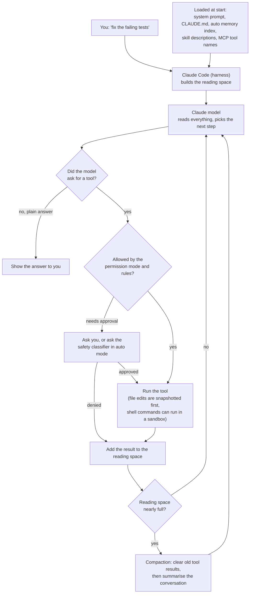
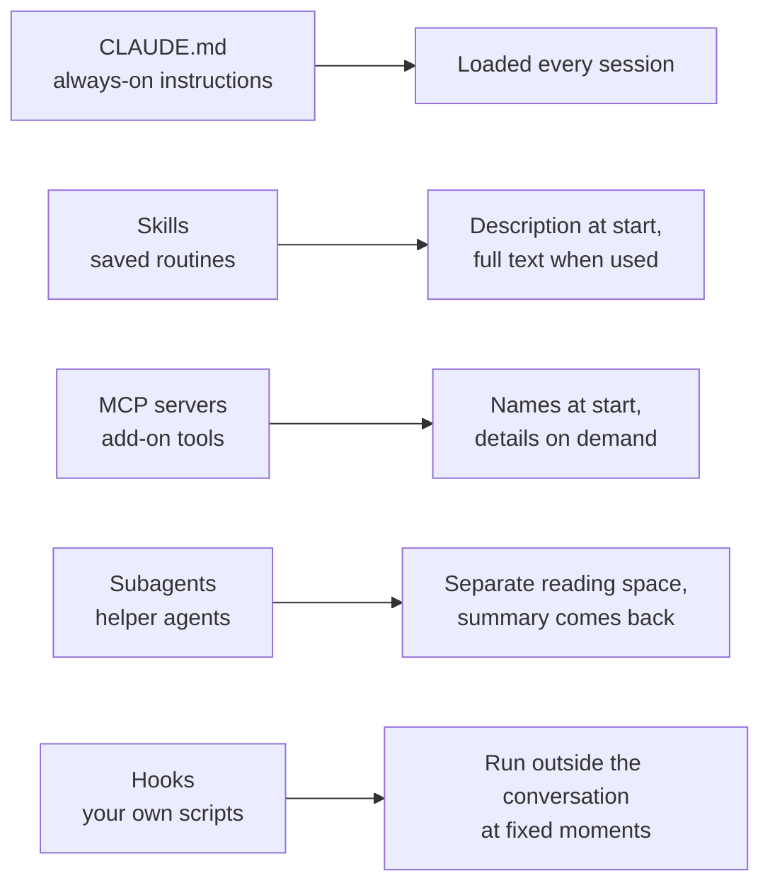

# Claude Code

> Claude Code is Anthropic's coding agent: a program that reads your project, edits files and runs commands for you, aimed at developers who want to hand over whole tasks instead of single lines.

*Last checked: October 2026. These apps change fast; check the linked sources for the current state.*

## At a glance

| | |
|---|---|
| Made by | Anthropic |
| Open source? | No. The public GitHub repo's licence file says "All rights reserved" and points to Anthropic's Commercial Terms of Service (closed, owner-keeps-all-rights licence, also called proprietary). The repo holds plug-ins, examples and scripts. The app's own source code is not published there. |
| Where it runs | Terminal (command-line program, CLI), VS Code and JetBrains editor plug-ins, a desktop app, the web at claude.ai/code, and the Claude phone app. Also inside Slack and automated build pipelines (CI/CD). |
| Which models it can use | Anthropic's Claude models. You can reach them through Anthropic directly or through Amazon Bedrock, Google Cloud or Microsoft Foundry. The docs describe no other model families. |
| Written in | Not published |
| Links | [Official site](https://www.claude.com/product/claude-code) · [GitHub repo](https://github.com/anthropics/claude-code) · [Docs](https://code.claude.com/docs/en/overview) |

## What it is for

You give it a job in plain words, such as "write tests for the login module, run them, and fix any failures". It then works through the job on its own: it searches the project, reads files, makes edits, runs commands, and checks the result.

A normal session starts by opening a terminal in your project folder and typing `claude`. You type a request. The agent shows each action as it goes. Depending on your settings it stops to ask before editing files or running commands. You can interrupt at any point, or type a correction while it is still working.

It is not limited to code. The docs say it can help with anything you can do from a command line: writing docs, running builds, searching files, working with git.

## The parts

How this app fills each slot from [What an agent is made of](../anatomy.md). Where the makers have not published a detail, the table says "not published".

| Part | How this app does it | Layer |
|---|---|---|
| Brain (model) | Anthropic's Claude models, run on Anthropic's servers or a supported cloud provider. You can switch model during a session with `/model`. | [6](../layers/06-running-the-model.md) |
| Job description (system prompt) | A built-in prompt covering behaviour, tool use, and safety rules. The docs describe what it covers, but the full text is not published in the docs. Your own instruction files (`CLAUDE.md`) are not part of it: they are added to the conversation as app-written notes (system reminders). | [7](../layers/07-talking-to-it.md) |
| Reference books (knowledge) | No documents are loaded up front beyond your instruction files and saved notes. The agent looks things up as it goes: it searches file names and file contents, reads files, and can search the web. Whether any search index is built behind the scenes is not published. | [8](../layers/08-giving-it-knowledge.md) |
| Hands (tools) | Built-in tools in five groups: file operations, search, running commands, web, and code intelligence (needs a plug-in). Plus tools for starting helper agents and asking you questions. More tools can be added through MCP servers. | [9](../layers/09-giving-it-hands.md) |
| Heartbeat (loop) | The docs describe three blended phases: gather context, take action, verify results. It repeats until the task is done or you interrupt. A fixed step limit is not published. | [10](../layers/10-the-loop.md) |
| Notebook (context and memory) | Each session starts with an empty reading space (context window). When it fills, the app clears older tool results first, then summarises the conversation (compaction). Two things carry over between sessions: `CLAUDE.md` files you write, and notes the agent writes for itself (auto memory). | 11 |
| Body (harness) | The Claude Code program itself. The docs call it the "agentic harness": it supplies the tools, manages the reading space, checks permissions, saves the session to disk, and snapshots files before editing them (checkpoints). | 13 |

## How one request flows

> **Why this matters:** the model only ever asks. Every edit and command passes through a permission check that lives in ordinary program code, so the safety of the agent depends on the harness and your settings, not on the model behaving well.

## What makes it different

**1. One engine, many front ends (surfaces).** The terminal, editor plug-ins, desktop app, web and phone all connect to the same underlying program. Your instruction files, settings and MCP servers work in each of them. The docs state the reason: the interface decides how you see the agent, but the loop underneath is identical. The same engine is also offered as a code library (the Agent SDK) for building your own agents.

**2. Extras load only when needed.** Every add-on costs reading space, so the app loads most of them in two stages. For saved routines (skills), only a short description loads at the start and the full text loads when used. For add-on tools (MCP), only tool names load at the start and the full definitions load on demand (tool search). Helper agents (subagents) work in their own separate reading space and hand back only a summary. The docs give the reason: too much loaded context fills the window and adds noise that makes the agent less effective.

**3. A second model can act as the reviewer (auto mode).** In auto mode you are not asked about routine actions. A separate checking model (the classifier) reviews actions before they run and blocks ones that go beyond your request or look driven by hostile content the agent read. The docs present it as a way to reduce prompt fatigue on long tasks.

**4. File edits can be rewound (checkpoints).** Before the agent edits a file, the app saves a snapshot. You can rewind to an earlier state. This is separate from git. It covers file changes only: actions on outside systems such as databases or deployments cannot be undone this way.

## Adding to it

> **Why this matters:** each kind of add-on answers a different question. Should the agent always know this, sometimes know this, be able to do this, do this out of sight, or be forced to do this?

- **Instruction files (`CLAUDE.md`).** Plain text files the agent reads at the start of every session. They can sit at organisation, personal, project and private-project level, and all levels are combined. The docs are clear that these are context, not enforced rules. The app can also read an `AGENTS.md` file used by other coding agents.
- **Saved notes (auto memory).** Notes the agent writes for itself about your preferences and corrections, kept per project on your machine. A short index loads at the start of each session and the rest is read on demand.
- **Saved routines (skills).** Text files holding knowledge or a step-by-step workflow. You start one by typing `/name` (a slash command), or the agent loads one when it fits the task.
- **Add-on tools (MCP servers).** Small programs that connect the agent to outside services, such as an issue tracker or a database, using an open standard (Model Context Protocol, MCP).
- **Helper agents (subagents).** Separate workers with their own reading space and their own instructions. Useful for side tasks that read many files.
- **Scripts at fixed moments (hooks).** Your own command runs when a set event happens, such as before a tool runs or after a file edit. Unlike instructions, a hook always fires, so the docs recommend hooks for rules that must hold every time.
- **Bundles (plugins).** A plugin packages skills, hooks, subagents and MCP servers into one installable unit. Collections of plugins are shared through a catalogue (marketplace).

## Staying safe

**Permission modes.** A mode sets what the agent may do without asking. The docs list six:

| Mode | What runs without asking |
|---|---|
| Manual (`default`) | Reading only |
| `acceptEdits` | Reading, file edits, and common file commands such as `mkdir` and `mv` |
| `plan` | Reading and exploring. The agent proposes a plan and does not edit your source files |
| `auto` | Everything, with the classifier checking in the background |
| `dontAsk` | Reading and tools you pre-approved. Anything else is refused |
| `bypassPermissions` | Everything. The docs say to use it only in isolated containers and virtual machines |

Which mode a session starts in depends on the surface, the version and your settings. You can also write allow and deny rules for specific tools and commands in a settings file. Writes to a small set of protected paths, such as the app's own configuration, are not auto-approved in most modes.

**What it can touch by default.** Files in the folder you started it in and its subfolders, plus any command you could run yourself in that terminal. Files elsewhere need your permission.

**Locked-down box for commands (sandbox).** The sandbox limits which files and network addresses a shell command can reach, enforced by the operating system. It uses Seatbelt on macOS and bubblewrap on Linux and WSL2. Native Windows is not supported. Inside it, commands can write to the working folder and a temporary folder, and no network addresses are pre-allowed. It applies to shell commands only, not to the built-in file tools, which are governed by permission rules instead. If the sandbox cannot start, the default is to warn and run commands without it, unless a setting makes that a hard failure.

**Undo.** Checkpoints let you rewind file edits, as described above.

## Words to know

| Word | Plain English |
|---|---|
| CLI | A program you use by typing commands in a terminal (command-line interface) |
| CI/CD | Automated pipelines that build, test and ship code |
| Proprietary | Owned and closed: you may use it under the owner's terms but not copy or change the source |
| Harness | The ordinary program around the model that runs the loop, tools and permission checks |
| Surface | One of the places you can use the app: terminal, editor, desktop, web, phone |
| Agent SDK | A code library that lets developers build their own agents on the same engine |
| System prompt | Built-in standing instructions the model reads before the conversation |
| System reminder | A note the app itself adds to the conversation, such as your `CLAUDE.md` content |
| Context window | The limited reading space the model can see in one call |
| Compaction | Shrinking a full reading space by clearing old tool results and summarising the conversation |
| Session | One saved conversation with the agent, tied to a folder |
| `CLAUDE.md` | A text file of standing instructions that you write for the agent |
| `AGENTS.md` | A similar instruction file used by other coding agents |
| Auto memory | Notes the agent writes for itself and reloads in later sessions |
| Tool | An action the model may ask for, such as read a file or run a command |
| Code intelligence | Editor-style help such as jump to definition and live type errors |
| MCP | Model Context Protocol, an open standard for plugging outside tools into an agent |
| MCP server | A small program that offers tools to the agent over MCP |
| Tool search | Loading a tool's full definition only when the agent needs it |
| Skill | A saved routine or reference text the agent loads on demand |
| Slash command | Something you start by typing `/` and a name, such as `/compact` |
| Subagent | A helper agent with its own reading space that returns a summary |
| Hook | Your own script that the app runs at a fixed moment, every time |
| Plugin | A bundle of skills, hooks, subagents and MCP servers |
| Marketplace | A catalogue that plugins are installed from |
| Permission mode | The setting that decides what the agent may do without asking |
| Classifier | A second model that checks actions before they run in auto mode |
| Protected paths | Files the app will not let the agent change without extra approval |
| Checkpoint | A snapshot of a file taken before the agent edits it, so you can rewind |
| Sandbox | A locked-down box that limits what a command can read, write or connect to |
| Seatbelt / bubblewrap | The operating system features that enforce the sandbox on macOS / Linux |
| WSL2 | A way to run Linux inside Windows |

## Sources

Every factual claim on the page should trace to one of these. Official docs and the source code first.

- [Claude Code overview](https://code.claude.com/docs/en/overview): what it is, where it runs, how sessions move between surfaces.
- [How Claude Code works](https://code.claude.com/docs/en/how-claude-code-works): the loop, tool groups, sessions, context handling, checkpoints.
- [Extend Claude Code](https://code.claude.com/docs/en/features-overview): `CLAUDE.md`, skills, subagents, MCP, hooks, plugins, and what each costs in context.
- [How Claude remembers your project](https://code.claude.com/docs/en/memory): `CLAUDE.md` levels, `AGENTS.md`, auto memory.
- [Explore the context window](https://code.claude.com/docs/en/context-window): what loads at the start of a session.
- [Tools reference](https://code.claude.com/docs/en/tools-reference): the full list of built-in tools.
- [Choose a permission mode](https://code.claude.com/docs/en/permission-modes): the six modes, the classifier, protected paths.
- [Configure the sandboxed Bash tool](https://code.claude.com/docs/en/sandboxing): what the sandbox covers and how it is enforced.
- [Enterprise deployment overview](https://code.claude.com/docs/en/third-party-integrations): model access through Anthropic and cloud providers.
- [Modifying system prompts](https://code.claude.com/docs/en/agent-sdk/modifying-system-prompts): what the built-in prompt covers and how `CLAUDE.md` reaches the model.
- [anthropics/claude-code on GitHub](https://github.com/anthropics/claude-code): the public repo.
- [LICENSE.md in that repo](https://github.com/anthropics/claude-code/blob/main/LICENSE.md): the licence text quoted above.
- [Claude Code product site](https://www.claude.com/product/claude-code): official site.
