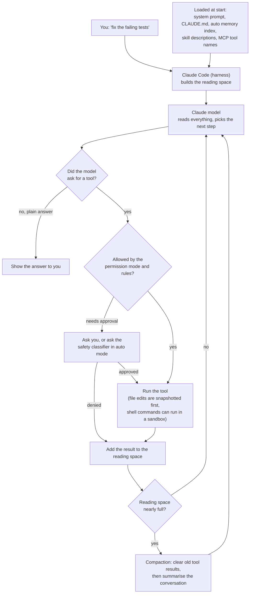
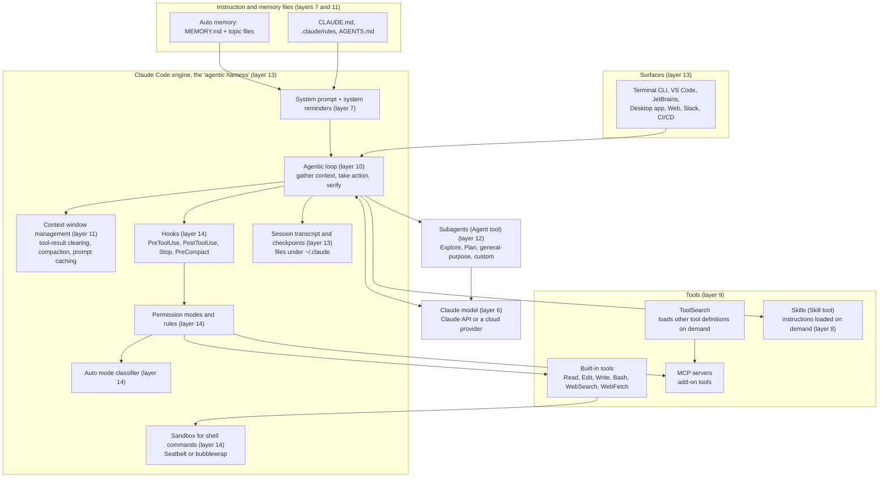

# Claude Code

> Claude Code is Anthropic's coding agent: a program that reads your project, edits files and runs commands for you, aimed at developers who want to hand over whole tasks instead of single lines.

*Last checked: October 2026. These apps change fast; check the linked sources for the current state.*

## At a glance

| | |
|---|---|
| Made by | Anthropic |
| Open source? | No. The public GitHub repo's licence file says "All rights reserved" and points to Anthropic's Commercial Terms of Service (closed, owner-keeps-all-rights licence, also called proprietary). The repo holds plug-ins, examples and scripts. The app's own source code is not published there. |
| Where it runs | Terminal (command-line program, CLI), VS Code and JetBrains editor plug-ins, a desktop app, the web at claude.ai/code, and the Claude phone app. Also inside Slack and automated build pipelines (CI/CD). |
| Which models it can use | Anthropic's Claude models. You can reach them through Anthropic directly or through Amazon Bedrock, Google Cloud or Microsoft Foundry. The docs describe no other model families. |
| Written in | Not published |
| Links | [Official site](https://www.claude.com/product/claude-code) · [GitHub repo](https://github.com/anthropics/claude-code) · [Docs](https://code.claude.com/docs/en/overview) |

## What it is for

You give it a job in plain words, such as "write tests for the login module, run them, and fix any failures". It then works through the job on its own: it searches the project, reads files, makes edits, runs commands, and checks the result.

A normal session starts by opening a terminal in your project folder and typing `claude`. You type a request. The agent shows each action as it goes. Depending on your settings it stops to ask before editing files or running commands. You can interrupt at any point, or type a correction while it is still working.

It is not limited to code. The docs say it can help with anything you can do from a command line: writing docs, running builds, searching files, working with git.

## The parts

How this app fills each slot from [What an agent is made of](../anatomy.md). If the makers have not published a detail, write "not published" instead of guessing.

| Part | How this app does it | Layer |
|---|---|---|
| Brain (model) | Anthropic's Claude models, run on Anthropic's servers or a supported cloud provider. You can switch model during a session with `/model`. | [6](../layers/06-running-the-model.md) |
| Job description (system prompt) | A built-in prompt covering behaviour, tool use, and safety rules. The docs describe what it covers, but the full text is not published in the docs. Your own instruction files (`CLAUDE.md`) are not part of it: they are added to the conversation as app-written notes (system reminders). | [7](../layers/07-talking-to-it.md) |
| Reference books (knowledge) | No search index is built ahead of time. Instruction files and saved notes load at the start, and the agent looks everything else up as it goes by searching file names and contents, reading files, and searching the web. | [8](../layers/08-giving-it-knowledge.md) |
| Hands (tools) | Built-in tools in five groups: file operations, search, running commands, web, and code intelligence (needs a plug-in). Plus tools for starting helper agents and asking you questions. More tools can be added through MCP servers. | [9](../layers/09-giving-it-hands.md) |
| Heartbeat (loop) | The docs describe three blended phases: gather context, take action, verify results. It repeats until the model replies without asking for a tool, or you interrupt. There is no step limit unless you set one. | [10](../layers/10-the-loop.md) |
| Notebook (context and memory) | Each session starts with an empty reading space (context window). When it fills, the app clears older tool results first, then summarises the conversation (compaction). Two things carry over between sessions: `CLAUDE.md` files you write, and notes the agent writes for itself (auto memory). | 11 |
| Body (harness) | The Claude Code program itself. The docs call it the "agentic harness": it supplies the tools, manages the reading space, checks permissions, saves the session to disk, and snapshots files before editing them (checkpoints). | 13 |

## How one request flows

> **Why this matters:** the model only ever asks. Every edit and command passes through a permission check that lives in ordinary program code, so the safety of the agent depends on the harness and your settings, not on the model behaving well.

## Component map

The names below are the ones Anthropic's docs use. The number on each block is the layer it belongs to.

> **Why this matters:** only one block is the model. Layers 7 to 14 are all ordinary program code and plain text files around it, and that is where most of the design effort (and most of the problems below) lives.

## Deep dive, part by part

The source is closed, so this section is built from the official docs, the Agent SDK docs (which describe the same engine), and Anthropic's engineering posts. Where those are silent, it says "not published".

### How the instructions are put together (prompt assembly)

Where it is described: [Explore the context window](https://code.claude.com/docs/en/context-window), [Modifying system prompts](https://code.claude.com/docs/en/agent-sdk/modifying-system-prompts), [memory](https://code.claude.com/docs/en/memory).

The docs' walkthrough shows this order at the start of a session:

1. **System prompt.** Built-in instructions for behaviour, tool use and formatting. Always first. You never see it, and its full text is not published in the docs.
2. **Auto memory index.** The top part of the agent's own notes file (`MEMORY.md`).
3. **Environment info.** Working folder, operating system, shell, and a snapshot of git status as a separate block.
4. **MCP tool names.** Names only. The full descriptions wait until needed.
5. **Skill descriptions.** One line per skill. The full text waits until used.
6. **Your personal `CLAUDE.md`,** then **the project `CLAUDE.md`.**
7. **Your message.**

Definitions of the core built-in tools (the name, purpose and inputs of each, called the tool schema) are sent with every request.

How instruction files are found and merged: the app loads `CLAUDE.md` and `CLAUDE.local.md` from the folder you started in and from every folder above it. Organisation-level and personal files load too. All of them are joined together, broadest first, so the file closest to your working folder is read last. Nothing overrides anything. Files in subfolders are not loaded at the start. They are added when the agent reads a file in that subfolder. A file can pull in other files with `@path`.

**The design choice.** `CLAUDE.md` content is not placed in the system prompt. It is delivered in the conversation as a system reminder, introduced by a line saying these instructions override default behaviour. The docs give one reason: the unchanging start of each request can be saved and reused by the model provider (prompt caching), which cuts cost and delay. Per-user text in the system prompt would break that reuse.

**What it costs.** The docs say plainly that `CLAUDE.md` is "context, not enforced configuration", and that instructions in a user message carry marginally less weight than in the system prompt. Long files reduce how well they are followed. If two files disagree, the model may pick either.

### The tools and how a tool request is carried out (tool execution)

Where it is described: [How the agent loop works](https://code.claude.com/docs/en/agent-sdk/agent-loop), [Configure permissions](https://code.claude.com/docs/en/agent-sdk/permissions), [tool search](https://code.claude.com/docs/en/agent-sdk/tool-search), [tools reference](https://code.claude.com/docs/en/tools-reference).

One tool request goes through these steps:

1. The model's reply contains one or more tool requests, each with a tool name and inputs.
2. The harness checks permission in a fixed order: hooks first, then deny rules, then ask rules, then the permission mode, then allow rules, and finally a prompt to you (or the classifier in auto mode).
3. If refused, the model receives the refusal as the tool's result and usually tries another way.
4. If allowed, the harness runs the tool. Read-only tools requested together can run at the same time. Tools that change things (edit, write, shell) run one after another.
5. The result goes back into the conversation as the next message. A result that is too large is saved to a file and replaced with a note giving the file path.
6. Hooks set to run after a tool fire, and anything they return is added to the conversation.

**Loading tools on demand (tool search).** With many add-on tools, sending every tool definition on every request wastes reading space. So the app holds them back. The model sees only tool names and a built-in tool called `ToolSearch`. When it needs something, it searches by name and description, and a few matching definitions are loaded. They stay loaded until the messages that found them are compacted away. Then the model must search again. Core built-in tools are always loaded.

**The design choice.** The stated reasons are that tool definitions eat reading space, and that models pick the wrong tool more often when many are loaded at once.

**What it costs.** Each search is an extra round trip to the model. Discovery depends on how well tools are named and described. On some cloud providers and gateways tool search is unavailable and the app falls back to loading everything up front.

### The loop and when it stops

Where it is described: [How Claude Code works](https://code.claude.com/docs/en/how-claude-code-works), [How the agent loop works](https://code.claude.com/docs/en/agent-sdk/agent-loop).

The cycle is the standard one from [Layer 10](../layers/10-the-loop.md): send everything to the model, run what it asks for, add the results, repeat. One round is called a turn. The loop ends when:

- **The model replies with no tool request.** This is the normal ending.
- **You interrupt.** Pressing `Esc` cancels the running tool. You can also type a message while it works, and it is read as soon as the current tool calls finish.
- **A limit you set is reached.** You can cap the number of turns or the money spent. By default there is no limit.
- **An error stops it.**

Two things can keep it going after the model wants to stop. A hook on the stop event can run your own check and block the ending until it passes. A goal condition can be re-checked after every turn by a separate evaluator.

**The design choice.** No default step limit. The model decides when the work is finished.

**What it costs.** The docs warn that an open-ended request can run long, and recommend a budget for unattended use. They also say the agent "stops when the work looks done", so without a test or other check it can run, you become the checker.

### Managing the reading space (context management)

Where it is described: [How Claude Code works](https://code.claude.com/docs/en/how-claude-code-works), [context window: what survives compaction](https://code.claude.com/docs/en/context-window), [Effective context engineering](https://www.anthropic.com/engineering/effective-context-engineering-for-ai-agents).

Nothing is forgotten inside a session by default. Every message, file read and command output piles up and is re-sent on each request. The app fights this in three tiers:

1. **Keep things out.** Tool definitions and skill text load on demand. Helper agents work in their own reading space. Oversized results go to a file.
2. **Clear old tool results.** As the limit nears, older tool outputs are removed first. Anthropic's write-up calls this the lightest form of compaction, because agents rarely need to re-read an old raw result.
3. **Summarise (compaction).** If that is not enough, older conversation is replaced with a summary written by the model. You can also run `/compact` yourself, with a hint about what to keep. According to the write-up, the summary aims to keep architectural decisions, unresolved bugs and implementation details, and drop repeated tool output.

After compaction the app rebuilds part of the picture from disk rather than from the summary:

| Thing | After compaction |
|---|---|
| System prompt | Still applies |
| Project-root `CLAUDE.md`, unscoped rules, auto memory | Read again from disk and re-added |
| Git status | A fresh snapshot is taken |
| Recently changed files | A small number are re-read. Large ones come back as a path only |
| Skills you used | Re-added, up to a size cap |
| Rules tied to file paths, `CLAUDE.md` files in subfolders | Gone until the agent next reads a matching file |
| Instructions you only typed in chat | Summarised with everything else. May be lost |

The original messages stay in the saved session file on disk. If one huge file or output refills the space right after each summary, the app stops trying after a few attempts and shows an error instead of looping.

**The design choice.** Summarise in place and re-inject the durable parts from files, instead of starting a new session.

**What it costs.** Summaries lose detail. Compaction is itself a large request, and it forces the saved-prefix cache to be rebuilt. The exact point at which auto-compaction starts is a setting. Its default is not something the pages listed here state as a fixed rule.

### Notes that outlive a session (memory)

Where it is described: [How Claude remembers your project](https://code.claude.com/docs/en/memory).

There is no database. Memory is plain text files.

- **Files you write (`CLAUDE.md`).** Found and merged as described above. Rules can also be split into a `.claude/rules/` folder, and each rule file can be limited to certain file paths so it loads only when the agent touches matching files. If a project has an `AGENTS.md` and no `CLAUDE.md`, the app reads that instead.
- **Files the agent writes (auto memory).** One folder per project on your machine, inside `~/.claude/projects/`. It holds an index file, `MEMORY.md`, plus one small file per topic. Only the top of the index loads at session start. The agent opens topic files with its ordinary file-reading tool when it thinks it needs them. The agent decides what is worth saving: your preferences, corrections, and project facts it cannot work out from the code.

**The design choice.** Plain files that both you and the agent can read, edit and delete. Anthropic's context engineering post describes the same idea as structured note-taking: the agent keeps notes outside the reading space and pulls them back in later.

**What it costs.** The index has a size limit and anything past it is not loaded. Notes do not follow you to another machine or to cloud sessions. Recall depends on the model choosing to open the right file. Like `CLAUDE.md`, memory is advice, not enforcement.

### The wrapper program (harness): processes, storage, screens

Where it is described: [Explore the .claude directory](https://code.claude.com/docs/en/claude-directory), [checkpointing](https://code.claude.com/docs/en/checkpointing), [subagents](https://code.claude.com/docs/en/sub-agents), [overview](https://code.claude.com/docs/en/overview).

**Processes.** The engine is a program on your machine (or on a cloud machine for web sessions). The Agent SDK ships the same program and runs it as a child process. The model runs elsewhere and is reached over the network. Local MCP servers are separate programs. Each subagent is a fresh conversation with its own system prompt, and only its final report returns to the main one. Two built-in subagents, Explore and Plan, are read-only. In auto mode a second model is called to review actions.

**Storage.** All plain files:

| What | Where |
|---|---|
| Full conversation record (transcript), one line per event (JSONL) | `~/.claude/projects/<project>/<session>.jsonl` |
| Subagent transcripts and oversized tool results | Folders next to that session file |
| Pre-edit file snapshots for checkpoints | `~/.claude/file-history/<session>/` |
| Auto memory | `~/.claude/projects/<project>/memory/` |
| Settings | `~/.claude/settings.json`, project `.claude/settings.json`, private `.claude/settings.local.json`, plus organisation-managed settings |
| Team-shared MCP servers | `.mcp.json` in the project |

Old session data is deleted after a retention period you can change. Memory files are excluded from that clean-up.

**Checkpoints.** A checkpoint is made for each prompt you send. Before a file-editing tool changes a file, the old contents are saved. Rewinding can restore code, conversation, or both.

**Screens.** Terminal, editor plug-ins, desktop, web and phone all drive the same loop. Code can run on your machine, on a cloud machine, or on your machine while you steer from a browser.

**The design choice.** One engine with thin front ends, and state kept as readable local files.

**What it costs.** The docs warn that transcripts are plain text and contain anything that passed through a tool, including file contents and command output. Checkpoints do not cover changes made by shell commands, most subagent edits, or anything on a remote system.

## Problems it faces

Evidence comes from the docs' own warnings, Anthropic's engineering posts, and the public issue tracker. Issue reports are users' accounts, not confirmed diagnoses.

| Problem | Why it happens (which layer) | What this app does about it | What is still unsolved |
|---|---|---|---|
| Quality drops as the reading space fills | Layer 11. Models recall less accurately as context grows ("context rot") | `/clear`, subagents, on-demand loading, compaction | The docs call this the one constraint most best practices are based on. It is managed, not removed |
| Detail lost after compaction | Layer 11. A summary cannot keep everything | Re-injects root `CLAUDE.md` and memory from disk. Compact instructions. Transcript kept on disk | Chat-only instructions and path-scoped rules can vanish. Reports: [#19471](https://github.com/anthropics/claude-code/issues/19471), [#29890](https://github.com/anthropics/claude-code/issues/29890) |
| Instruction files not followed | Layer 7. `CLAUDE.md` is advice in the conversation, not a rule | Hooks for hard rules. `/doctor` suggests trims. Guidance to keep files short | No guarantee of compliance. Report: [#33603](https://github.com/anthropics/claude-code/issues/33603) |
| Permission fatigue | Layer 14. Asking every time trains people to click yes | Allow rules, sandbox, auto mode | The classifier misses some risky actions (see below) |
| Hostile text in tool results (prompt injection) | Layers 9 and 14. Anything the agent reads can contain instructions | Permission checks, web fetch in a separate context, trust prompts for new folders and MCP servers | Docs: "no system is completely immune". Anthropic does not security-audit MCP servers |
| Cost and usage limits | Layers 10 and 11. Every turn re-sends the whole conversation. Subagents add their own requests | Prompt caching, `/usage` breakdown, cheaper models for subagents | Heavily reported: [#16157](https://github.com/anthropics/claude-code/issues/16157), [#38335](https://github.com/anthropics/claude-code/issues/38335) |
| Add-on tools eating reading space | Layer 9. Each tool definition takes space | Tool search defers definitions | Falls back to loading everything on some providers and gateways. Report: [#13717](https://github.com/anthropics/claude-code/issues/13717) |
| Sandbox gaps | Layer 14. The sandbox wraps shell commands only | File tools are covered by permission rules. Settings can forbid unsandboxed retries | If the sandbox cannot start, the default is to warn and run without it. Past reports: [#34315](https://github.com/anthropics/claude-code/issues/34315), [#52325](https://github.com/anthropics/claude-code/issues/52325) |
| Undo does not cover everything | Layer 13. Only file-edit tools are snapshotted | Checkpoints, plus advice to use git | Shell commands, most subagent edits and remote actions cannot be rewound |
| Stops early with plausible but wrong work | Layer 10. The model decides when it is done | Stop hooks, goal conditions, review by a fresh subagent | Needs a check the agent can run. Without one, you are the check |
| Harness changes quietly lower quality | Layers 7 and 13. Small prompt or setting changes shift behaviour | Anthropic's April 2026 postmortem lists fixes: reverted changes, stricter prompt review, gradual rollouts | Users cannot inspect the closed harness or its system prompt |

**The reading space is the bottleneck.** Anthropic's own best-practices page says the context window "fills up fast, and performance degrades as it fills". Every part of the design above is a response to this: loading on demand, clearing tool results, compaction, subagents. Compaction then creates its own problem, because the summary drops things. The app softens this by re-reading durable files from disk, but anything you only said in chat is at the mercy of the summary. The issue tracker has repeated reports of rules and working knowledge disappearing after compaction.

**Instructions are advice.** The docs state that `CLAUDE.md` is context the model "tries to follow" with "no guarantee of strict compliance", and that an over-long file causes rules to get lost. The official answer is to move anything that must always happen into a hook, which is ordinary code that fires every time. That works, but it means a beginner's natural approach (write the rule down in the instruction file) is the weaker one.

**Safety against convenience.** Anthropic reported that users approved 93% of permission prompts, which means the prompts were mostly being clicked through. Their answers are the sandbox and auto mode. But the auto mode write-up also reports that the full classifier missed 17% of real overly eager actions in their test set, and says it is not a replacement for careful human review on high-stakes systems. It lists real incidents that motivated it, such as deleting remote git branches and attempting migrations against a production database. So the trade is explicit: fewer interruptions, in exchange for a reviewer that is fast but imperfect.

A separate case is worth knowing about. In April 2026 Anthropic published a postmortem after users reported the agent seemed forgetful and repetitive. The causes were all in the harness, not the model: a lower default reasoning setting, a caching bug that kept clearing the model's earlier reasoning, and a system prompt line that limited response length. This shows how much of an agent's behaviour comes from layers 7 to 13.

## If you were building your own

**Worth copying:**

- **Plain files for instructions and memory.** You can read, edit and version them, and so can the agent with tools it already has. No database to build.
- **Load in two stages.** Give the model a one-line description first and the full text or tool definition only when it asks. This is the cheapest way to support many skills and tools.
- **Clear old tool results before summarising, and re-read durable files after.** Clearing is cheap and loses little. Re-reading from disk means your most important instructions do not depend on the summary.
- **A fixed permission order in code, with hooks first.** Hooks, then deny, then ask, then mode, then allow. Because it is deterministic, you can reason about what will and will not run.
- **Helper agents that return only a summary.** Research that reads many files stays out of the main reading space.
- **Snapshot before every edit.** It makes "try it and rewind" safe and is simple to build.

**Think twice:**

- **No default step or budget limit.** The docs themselves recommend setting a budget for unattended agents. In your own agent, start with a limit.
- **Putting rules in advice files.** It is easy, but the model may ignore them. If a rule must hold, enforce it in code.
- **A second model as the safety reviewer.** It removes most prompts, but it adds a model call per checked action and still misses some cases.
- **Helper agents by default.** Each one sends its own requests. The docs note that teams of agents use several times the tokens of a single session.
- **Plain-text transcripts.** Simple and inspectable, but secrets that pass through a tool end up on disk.

## What makes it different

**1. One engine, many front ends (surfaces).** The terminal, editor plug-ins, desktop app, web and phone all connect to the same underlying program. The docs state the reason: the interface decides how you see the agent, but the loop underneath is identical. The same engine is also offered as a code library (the Agent SDK) for building your own agents.

**2. Extras load only when needed.** Skills, MCP tools and subagents are all designed around saving reading space, as the deep dive above describes. The docs give the reason: too much loaded context adds noise that makes the agent less effective.

**3. A second model can act as the reviewer (auto mode).** A separate checking model (the classifier) reviews actions before they run. By design it does not see the main model's reasoning or the tool outputs, so hostile text the agent read cannot talk the reviewer round.

**4. File edits can be rewound (checkpoints).** This is separate from git and survives resuming a session.

## Adding to it

- **Instruction files (`CLAUDE.md`).** Plain text the agent reads at the start of every session. See the deep dive for how they merge.
- **Saved notes (auto memory).** Notes the agent writes for itself, kept per project on your machine.
- **Saved routines (skills).** Text files holding knowledge or a step-by-step workflow. You start one by typing `/name` (a slash command), or the agent loads one when it fits the task.
- **Add-on tools (MCP servers).** Small programs that connect the agent to outside services, such as an issue tracker or a database, using an open standard (Model Context Protocol, MCP).
- **Helper agents (subagents).** Separate workers with their own reading space and instructions. You can define your own in a text file.
- **Scripts at fixed moments (hooks).** Your own command runs when a set event happens, such as before a tool runs or after a file edit. A hook always fires, so the docs recommend hooks for rules that must hold every time.
- **Bundles (plugins).** A plugin packages skills, hooks, subagents and MCP servers into one installable unit. Collections of plugins are shared through a catalogue (marketplace).

## Staying safe

**Permission modes.** A mode sets what the agent may do without asking. The docs list six:

| Mode | What runs without asking |
|---|---|
| Manual (`default`) | Reading only |
| `acceptEdits` | Reading, file edits, and common file commands such as `mkdir` and `mv` |
| `plan` | Reading and exploring. The agent proposes a plan and does not edit your source files |
| `auto` | Everything, with the classifier checking in the background |
| `dontAsk` | Reading and tools you pre-approved. Anything else is refused |
| `bypassPermissions` | Everything. The docs say to use it only in isolated containers and virtual machines |

Which mode a session starts in depends on the surface, the version and your settings. You can also write allow and deny rules for specific tools and commands in a settings file. Writes to a small set of protected paths, such as the app's own configuration, are not auto-approved in most modes.

**What it can touch by default.** Files in the folder you started it in and its subfolders, plus any command you could run yourself in that terminal. Files elsewhere need your permission.

**Locked-down box for commands (sandbox).** The sandbox limits which files and network addresses a shell command can reach, enforced by the operating system. It uses Seatbelt on macOS and bubblewrap on Linux and WSL2. Native Windows is not supported. Inside it, commands can write to the working folder and a temporary folder, and no network addresses are pre-allowed. Anthropic's write-up explains why both limits are needed: without the network limit a hijacked agent could send your files out, and without the file limit it could escape the box.

## Words to know

| Word | Plain English |
|---|---|
| CLI | A program you use by typing commands in a terminal (command-line interface) |
| CI/CD | Automated pipelines that build, test and ship code |
| Proprietary | Owned and closed: you may use it under the owner's terms but not copy or change the source |
| Harness | The ordinary program around the model that runs the loop, tools and permission checks |
| Surface | One of the places you can use the app: terminal, editor, desktop, web, phone |
| Agent SDK | A code library that lets developers build their own agents on the same engine |
| API | The doorway one program uses to call another over the network. The Claude API is how the app reaches the model |
| Gateway | A company's own relay that sits between the app and the model provider |
| Token | The small chunk of text a model reads and is billed by. Roughly a short word or part of one |
| System prompt | Built-in standing instructions the model reads before the conversation |
| System reminder | A note the app itself adds to the conversation, such as your `CLAUDE.md` content |
| Context window | The limited reading space the model can see in one call |
| Context rot | The drop in a model's accuracy as its reading space gets fuller |
| Prompt caching | The model provider saving the unchanged start of a request so repeats cost less |
| Turn | One round of the loop: the model asks for tools, they run, the results go back |
| Compaction | Shrinking a full reading space by clearing old tool results and summarising the conversation |
| Session | One saved conversation with the agent, tied to a folder |
| Transcript | The saved record of a session on disk |
| JSONL | A text file format with one small data record per line |
| `CLAUDE.md` | A text file of standing instructions that you write for the agent |
| `AGENTS.md` | A similar instruction file used by other coding agents |
| Auto memory | Notes the agent writes for itself and reloads in later sessions |
| Tool | An action the model may ask for, such as read a file or run a command |
| Tool schema | The description of a tool sent to the model: its name, purpose and inputs |
| Code intelligence | Editor-style help such as jump to definition and live type errors |
| MCP | Model Context Protocol, an open standard for plugging outside tools into an agent |
| MCP server | A small program that offers tools to the agent over MCP |
| Tool search | Loading a tool's full definition only when the agent needs it |
| Skill | A saved routine or reference text the agent loads on demand |
| Slash command | Something you start by typing `/` and a name, such as `/compact` |
| Subagent | A helper agent with its own reading space that returns a summary |
| Hook | Your own script that the app runs at a fixed moment, every time |
| Plugin | A bundle of skills, hooks, subagents and MCP servers |
| Marketplace | A catalogue that plugins are installed from |
| Permission mode | The setting that decides what the agent may do without asking |
| Permission rule | A line in settings that always allows, always refuses, or always asks about a tool or command |
| Classifier | A second model that checks actions before they run in auto mode |
| Prompt injection | Hostile text hidden in something the agent reads, written to hijack its instructions |
| Protected paths | Files the app will not let the agent change without extra approval |
| Checkpoint | A snapshot of a file taken before the agent edits it, so you can rewind |
| Sandbox | A locked-down box that limits what a command can read, write or connect to |
| Seatbelt / bubblewrap | The operating system features that enforce the sandbox on macOS / Linux |
| WSL2 | A way to run Linux inside Windows |
| Postmortem | A written account of what went wrong and what was changed afterwards |

## Sources

Every factual claim on the page should trace to one of these. Official docs and the source code first.

Official docs:

- [Claude Code overview](https://code.claude.com/docs/en/overview): what it is, where it runs.
- [How Claude Code works](https://code.claude.com/docs/en/how-claude-code-works): the loop, tool groups, sessions, context handling, checkpoints.
- [Explore the context window](https://code.claude.com/docs/en/context-window): load order at session start, what survives compaction.
- [How Claude remembers your project](https://code.claude.com/docs/en/memory): `CLAUDE.md` discovery and merging, `AGENTS.md`, auto memory.
- [Extend Claude Code](https://code.claude.com/docs/en/features-overview): skills, subagents, MCP, hooks, plugins, context cost of each.
- [Tools reference](https://code.claude.com/docs/en/tools-reference): the built-in tools.
- [Connect to tools via MCP](https://code.claude.com/docs/en/mcp): add-on tools, large outputs, security warning.
- [Subagents](https://code.claude.com/docs/en/sub-agents): built-in helper agents and what they load.
- [Checkpointing](https://code.claude.com/docs/en/checkpointing): how rewind works and its limits.
- [Explore the .claude directory](https://code.claude.com/docs/en/claude-directory): where sessions, snapshots and memory are stored.
- [Choose a permission mode](https://code.claude.com/docs/en/permission-modes): the six modes, the classifier, protected paths.
- [Configure the sandboxed Bash tool](https://code.claude.com/docs/en/sandboxing): what the sandbox covers.
- [Security](https://code.claude.com/docs/en/security): prompt injection safeguards and their limits.
- [Best practices](https://code.claude.com/docs/en/best-practices): context limits, failure patterns, verification.
- [Manage costs effectively](https://code.claude.com/docs/en/costs): why usage climbs, subagent and team costs.
- [Enterprise deployment overview](https://code.claude.com/docs/en/third-party-integrations): model access through cloud providers.
- Agent SDK docs (same engine): [How the agent loop works](https://code.claude.com/docs/en/agent-sdk/agent-loop), [Configure permissions](https://code.claude.com/docs/en/agent-sdk/permissions), [Tool search](https://code.claude.com/docs/en/agent-sdk/tool-search), [Modifying system prompts](https://code.claude.com/docs/en/agent-sdk/modifying-system-prompts).

Anthropic engineering posts:

- [Effective context engineering for AI agents](https://www.anthropic.com/engineering/effective-context-engineering-for-ai-agents): context rot, compaction, note-taking, subagents.
- [Writing effective tools for agents](https://www.anthropic.com/engineering/writing-tools-for-agents): tool descriptions and output limits.
- [Claude Code sandboxing](https://www.anthropic.com/engineering/claude-code-sandboxing): why the sandbox exists and how it is built.
- [Claude Code auto mode](https://www.anthropic.com/engineering/claude-code-auto-mode): approval rates, classifier design, measured miss rate.
- [April 2026 postmortem](https://www.anthropic.com/engineering/april-23-postmortem): three harness changes that lowered quality.

Repo and issue tracker:

- [anthropics/claude-code on GitHub](https://github.com/anthropics/claude-code) and its [LICENSE.md](https://github.com/anthropics/claude-code/blob/main/LICENSE.md).
- Issues cited as user reports: [#19471](https://github.com/anthropics/claude-code/issues/19471), [#29890](https://github.com/anthropics/claude-code/issues/29890), [#33603](https://github.com/anthropics/claude-code/issues/33603), [#16157](https://github.com/anthropics/claude-code/issues/16157), [#38335](https://github.com/anthropics/claude-code/issues/38335), [#13717](https://github.com/anthropics/claude-code/issues/13717), [#34315](https://github.com/anthropics/claude-code/issues/34315), [#52325](https://github.com/anthropics/claude-code/issues/52325).
- [Claude Code product site](https://www.claude.com/product/claude-code).
