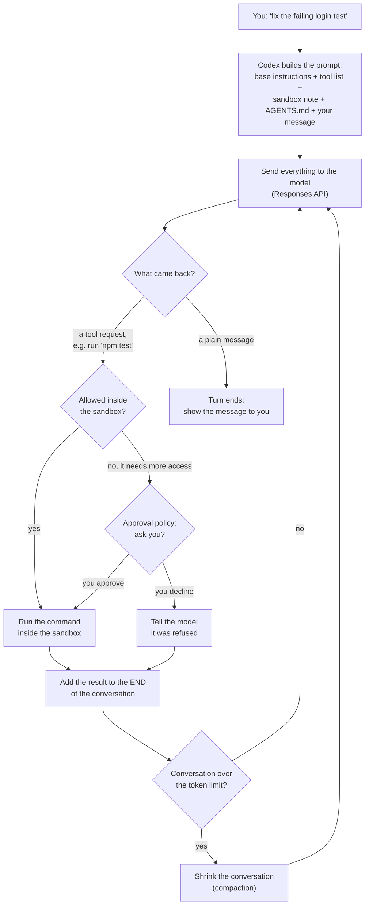
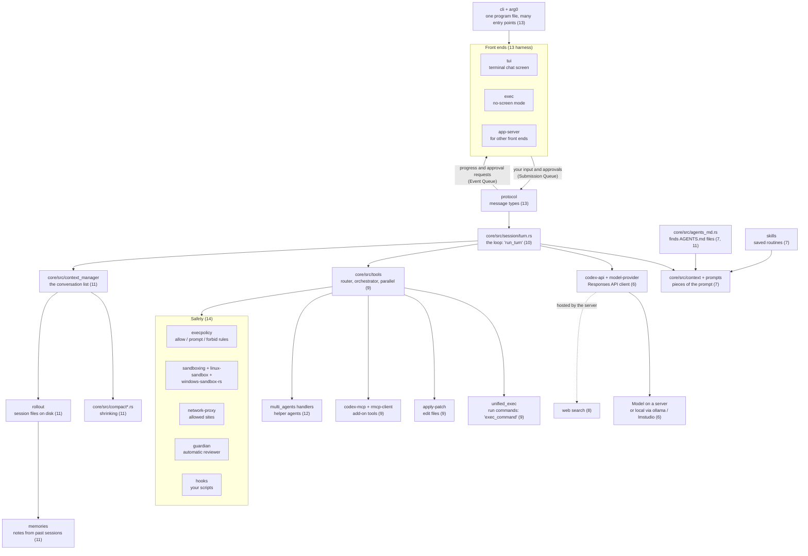
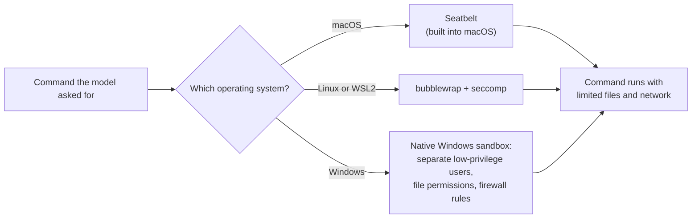

# Codex CLI

> Codex CLI is OpenAI's open-source coding agent that runs in your terminal, for developers who want an agent to read, edit and run code on their own machine inside a locked-down box.

*Last checked: October 2026. These apps change fast; check the linked sources for the current state.*

## At a glance

| | |
|---|---|
| Made by | OpenAI |
| Open source? | Yes, Apache-2.0 licence |
| Where it runs | Terminal on macOS, Linux and Windows. The same "Codex" name also covers an editor plug-in, a desktop app and a cloud agent |
| Which models it can use | OpenAI's models by default. Other providers work only if they speak the same request format (Responses API), including local models through Ollama or LM Studio |
| Written in | Mostly Rust |
| Links | [Docs](https://learn.chatgpt.com/docs/codex/cli) · [source code](https://github.com/openai/codex) · [engineering write-up](https://openai.com/index/unrolling-the-codex-agent-loop/) |

The old docs address `developers.openai.com/codex` still works. It now forwards to `learn.chatgpt.com/docs`.

## What it is for

You open a terminal in a project folder and type `codex`. You describe a job in plain words, such as "find out why the login test fails and fix it". The agent reads files, runs commands, edits code, and tells you what it did.

A normal session is a back-and-forth chat. Inside each of your messages the agent may take many steps on its own: run the tests, read an error, open a file, change it, run the tests again. You sign in with a ChatGPT plan or with an API key.

This page covers the terminal app (CLI, short for command-line interface). OpenAI uses the name "Codex" for a family of products: this CLI, an editor plug-in (for VS Code, Cursor and Windsurf), a desktop app, and Codex Web, a cloud agent that works on a remote copy of your code. OpenAI says the same core program sits under all of them.

## The parts

How this app fills each slot from [What an agent is made of](../anatomy.md). Where the makers have not published a detail, the table says "not published".

| Part | How this app does it | Layer |
|---|---|---|
| Brain (model) | An OpenAI model, reached over the internet through the request format called the Responses API. You can point it at another address that speaks the same format, or run with `--oss` to use a local model through Ollama or LM Studio. Endpoints that only speak the older Chat Completions format are not supported | [6](../layers/06-running-the-model.md) |
| Job description (system prompt) | Built from several pieces: base instructions bundled into the CLI for each model, a note describing the sandbox and approval rules, your optional `developer_instructions`, the contents of your `AGENTS.md` files, and a short note about the current folder and shell | [7](../layers/07-talking-to-it.md) |
| Reference books (knowledge) | No separate document store is described. The agent learns about your code by running commands and reading files. It can also search the web. By default web search uses a saved copy of results kept by OpenAI (cached mode) and not live pages. Whether it builds a search index of your code: not published | [8](../layers/08-giving-it-knowledge.md) |
| Hands (tools) | The source code's tool folder includes: run a shell command, edit files by applying a patch (`apply_patch`), keep a plan, view an image, ask the user a question, start helper agents, and call add-on tools from MCP servers. Web search is supplied by the Responses API | [9](../layers/09-giving-it-hands.md) |
| Heartbeat (loop) | Send the prompt, get back either a tool request or a plain message. Run the tool, add the result to the end, send again. A plain message to the user ends the turn. A fixed step limit: not published | [10](../layers/10-the-loop.md) |
| Notebook (context and memory) | The full conversation is re-sent on every call. When it grows past a token limit, Codex shrinks it automatically (compaction). `AGENTS.md` files hold standing notes. An optional memories feature, off by default, saves notes from past sessions under `~/.codex/memories/` | 11 |
| Body (harness) | A Rust program that runs the loop, draws the terminal screen, checks approvals, and starts every command inside an operating-system sandbox | 13 |

## How one request flows



> **Why this matters:** two separate checks sit between the model and your computer. The sandbox is a hard wall enforced by the operating system. The approval policy only decides when to stop and ask you before going past that wall.

OpenAI's write-up adds two details. Codex re-sends the whole conversation on every call and keeps nothing on the server (stateless requests). New items only go on the end, so the old prompt is always an exact beginning (prefix) of the new one, which lets the server reuse earlier work (prompt caching).

## Component map

The Rust code lives in the `codex-rs` folder. It is split into many small packages (crates). The names below are the real folder names. The number in brackets is the layer each one belongs to.



> **Why this matters:** only one box is the model. Everything else is ordinary code you could write yourself. The safety boxes are not inside the loop. They sit between the tool code and your computer, so no tool request reaches the machine without passing them.

## Deep dive, part by part

### How the instructions are put together (prompt assembly)

**Where it lives:** [`core/src/context/`](https://github.com/openai/codex/tree/main/codex-rs/core/src/context) (one file per piece), [`prompts/templates/`](https://github.com/openai/codex/tree/main/codex-rs/prompts/templates) (the bundled text), [`core/src/agents_md.rs`](https://github.com/openai/codex/blob/main/codex-rs/core/src/agents_md.rs).

Each request to the Responses API has three fields: `instructions`, `tools` and `input`. OpenAI's write-up gives the order the model finally sees:

1. A system message written by the server. Codex does not control it.
2. The tool list (`tools`).
3. The base instructions (`instructions`). These are bundled in the CLI per model, or come from your own file if you set `model_instructions_file`.
4. The `input` list, which Codex fills in this order:
   1. A developer message describing the sandbox mode and approval policy.
   2. Optional: your `developer_instructions` from `config.toml`.
   3. Optional: a user message holding your `AGENTS.md` text, global file first, then project root, then nested folders. A list of available skills is added here.
   4. A user message describing the environment: current folder and shell.
   5. Your actual message.

Each item has a role. The write-up lists them from most to least weight: `system`, `developer`, `user`, `assistant`. That is why the sandbox rules are sent as `developer` and your `AGENTS.md` as `user`.

The write-up describes the order at the time it was published. The source has since split these pieces into many small files (for example `environment_context.rs`, `user_instructions.rs`), and added more, such as plugin and memory notes.

**Design choice:** things that never change go first, things that change go last. If a setting changes mid-session, Codex adds a new message at the end instead of editing the old one.

**What it costs:** out-of-date messages stay in the conversation and use up reading space. Your `AGENTS.md` text has a size cap, and once the cap is reached no more files are added.

### The tools and how a tool request is carried out (tool execution)

**Where it lives:** [`core/src/tools/`](https://github.com/openai/codex/tree/main/codex-rs/core/src/tools) and [`apply-patch/`](https://github.com/openai/codex/tree/main/codex-rs/apply-patch/src).

**What a tool definition looks like.** Most tools are a name, a description and a list of typed inputs (a JSON schema). The command tool is called `exec_command`. A simplified view of what [`shell_spec.rs`](https://github.com/openai/codex/blob/main/codex-rs/core/src/tools/handlers/shell_spec.rs) builds:

```json
{
  "type": "function",
  "name": "exec_command",
  "parameters": {
    "cmd": "the command to run (required)",
    "workdir": "folder to run it in",
    "yield_time_ms": "how long to wait for output before returning",
    "sandbox_permissions": "ask to run outside the sandbox, with a reason shown to you"
  }
}
```

The model's request arrives as an item of type `function_call` with a name, the inputs and a call ID. The result goes back as a `function_call_output` item carrying the same call ID, so the model can match answer to question ([`protocol/src/models.rs`](https://github.com/openai/codex/blob/main/codex-rs/protocol/src/models.rs)).

**How a request is carried out.** The header comment of [`orchestrator.rs`](https://github.com/openai/codex/blob/main/codex-rs/core/src/tools/orchestrator.rs) states the sequence:

1. **Approval.** Decide whether to skip, ask, or forbid, using the approval policy and your command rules (`execpolicy`).
2. **Select sandbox.** Pick the sandbox for this operating system.
3. **Attempt.** Run the command inside it.
4. **Retry on denial.** If the sandbox blocked it and the policy allows, ask you, then run again with wider access.

Tools marked as safe to run side by side run together. The others run one at a time ([`parallel.rs`](https://github.com/openai/codex/blob/main/codex-rs/core/src/tools/parallel.rs)).

**How command output is cut down (truncation).** Two steps:

- While the command runs, output goes into a fixed-size holding area. It keeps the first half and the last half and drops the middle ([`head_tail_buffer.rs`](https://github.com/openai/codex/blob/main/codex-rs/core/src/unified_exec/head_tail_buffer.rs)). Errors usually sit at the end and the command echo at the start, so both survive.
- When the result is added to the conversation, it is cut again to a token budget (`tool_output_token_limit`). A line is added so the model knows: `Warning: truncated output (original token count: ...)` ([`output-truncation`](https://github.com/openai/codex/blob/main/codex-rs/utils/output-truncation/src/lib.rs)). The full output is still saved in the session file on disk.

A command that is still running after the wait time returns a session ID. The model can check back or type into it with a second tool, `write_stdin`.

**The patch format.** `apply_patch` is not a JSON tool. The model writes raw text that must follow a small grammar ([`apply_patch.lark`](https://github.com/openai/codex/blob/main/codex-rs/core/assets/tools/apply_patch.lark)):

```text
*** Begin Patch
*** Update File: src/cart.ts
@@ function total()
-  return round(price * tax) - discount
+  return round((price - discount) * tax)
*** End Patch
```

There are three actions: `Add File`, `Delete File` and `Update File` (with an optional `Move to`). Lines start with `+` (add), `-` (remove) or a space (unchanged context). There are no line numbers.

**How a patch is applied.**

1. Parse the text into file changes (hunks). The parser is a little more forgiving than the grammar about stray spaces.
2. Check safety ([`safety.rs`](https://github.com/openai/codex/blob/main/codex-rs/core/src/safety.rs)): auto-approve if every file is inside the writable folders, ask you if not, reject if forbidden.
3. For each update, find the old lines in the real file. It tries an exact match first, then ignores spaces at line ends, then ignores spaces at both ends ([`seek_sequence.rs`](https://github.com/openai/codex/blob/main/codex-rs/apply-patch/src/seek_sequence.rs)).
4. If the lines are found, write the change. If not, the error goes back to the model as the tool result, and it can try again.

**Design choice:** find the place by surrounding text, not by line number. Models are poor at counting lines but good at quoting code.

**What it costs:** the patch fails when the file no longer matches what the model remembers. See [Problems it faces](#problems-it-faces).

### The loop and when it stops

**Where it lives:** `run_turn` in [`core/src/session/turn.rs`](https://github.com/openai/codex/blob/main/codex-rs/core/src/session/turn.rs).

One pass of the loop:

1. Collect any message you typed while the agent was busy and add it to the conversation.
2. Run your hooks.
3. Send the conversation to the model. The reply arrives piece by piece (a stream), so text can be shown as it is written.
4. Run every tool the model asked for and record the results.
5. Count tokens. Decide: does the model need another pass? That is true if it asked for a tool, or if you typed something new.
6. If another pass is needed and the token limit is reached, shrink the conversation first, then go to step 1.
7. If no other pass is needed, run the "stop" hooks, then end the turn.

**The exact stop conditions in the source:**

| What ends the turn | Detail |
|---|---|
| A plain reply | The model sent a message, asked for no tool, and you have no waiting input |
| You interrupt | The turn is marked aborted |
| A hook says stop | A "stop" hook can end the turn. It can also do the opposite and push the agent to keep going |
| The usage limit is reached | Your plan's allowance is used up |
| The reading space is full and shrinking did not help | A "context window exceeded" error |
| The connection keeps failing | Retries are capped by a per-provider setting |

**A fixed cap on the number of steps: none found in the loop.** A comment in the code says: "as long as compaction works well in getting us way below the token limit, we shouldn't worry about being in an infinite loop."

**Design choice:** trust the model to decide when it is done, and bound the run by tokens and usage limits instead of a step count.

**What it costs:** a stuck agent keeps spending until an outside limit stops it.

### Managing the reading space (context management)

**Where it lives:** [`core/src/context_manager/history.rs`](https://github.com/openai/codex/blob/main/codex-rs/core/src/context_manager/history.rs) and [`core/src/compact.rs`](https://github.com/openai/codex/blob/main/codex-rs/core/src/compact.rs).

The conversation is one growing list. The whole list is sent on every call. Three things keep it from overflowing:

1. **Trimming tool output on the way in.** Described above.
2. **Automatic shrinking (compaction).** After each model call Codex compares the token count with a limit. The limit comes from `model_auto_compact_token_limit`, or a default for the model. The check runs before a turn starts and between steps inside a turn.
3. **Emergency shrinking.** If the server answers "context window exceeded", Codex compacts and tries again.

The compaction call takes one of two paths, chosen in `run_auto_compact`:

- **Server path.** If the provider supports it, Codex calls the Responses API's compact endpoint. It gets back a shorter list, including one unreadable (encrypted) item that holds the model's understanding of what came before.
- **Local path.** Otherwise Codex asks the model to write a summary. The bundled [prompt](https://github.com/openai/codex/blob/main/codex-rs/prompts/templates/compact/prompt.md) calls it a "handoff summary for another LLM" and asks for progress, decisions, constraints and next steps. The new conversation is: your recent messages (up to a token budget), then the summary. If the summary request itself is too big, Codex drops the oldest item and retries.

After shrinking, the standing instructions are put back in. Mid-turn they are placed just above your last real message, because, as a source comment says, the model is trained to see the summary as the last item.

**Design choice:** keep your own words, summarise the agent's work.

**What it costs:** file contents, command output and intermediate reasoning are replaced by a short summary. The new list no longer starts the same way, so the server's saved work (cache) is lost at that point.

### Notes that outlive a session (memory)

There are three separate mechanisms.

1. **`AGENTS.md`.** Notes you write by hand. [`agents_md.rs`](https://github.com/openai/codex/blob/main/codex-rs/core/src/agents_md.rs) finds the project root by walking up until it sees a marker (by default `.git`), then collects every `AGENTS.md` from the root down to your folder. It never looks above the root.
2. **Session files (rollouts).** Every session is saved as a file with one JSON record per line (`.jsonl`) under `~/.codex/sessions/YYYY/MM/DD/`, named `rollout-<time>-<id>.jsonl` ([`rollout/src/recorder.rs`](https://github.com/openai/codex/blob/main/codex-rs/rollout/src/recorder.rs)). This is what `codex resume` and `codex fork` read. It is a record, not something the model sees in a new session.
3. **Memories.** Off by default. The [memories README](https://github.com/openai/codex/blob/main/codex-rs/memories/README.md) describes two phases that run in the background when a session starts. Phase 1 picks old, idle session files, sends each to a model, and gets back a detailed note and a short summary, with secrets removed. Phase 2 merges those into files under `~/.codex/memories/`. It does not run for helper agents.

**Design choice:** rules you must rely on go in a file you control. Automatic notes are a separate, optional layer.

**What it costs:** memories need extra model calls. The docs warn not to treat them as the only source of rules that must always apply.

### The wrapper program (harness): processes, storage, screens

**One program file, many jobs.** Codex ships as a single executable. It checks the name it was started under ([`arg0`](https://github.com/openai/codex/blob/main/codex-rs/arg0/src/lib.rs)). Started as `codex-linux-sandbox`, it acts as the Linux sandbox helper. Started as `apply_patch`, it applies a patch.

**Screens.** The terminal screen (`tui`), the no-screen mode (`exec`) and the server for other front ends (`app-server`) all sit on the same `core`. They talk to it through two message lines defined in [`protocol.rs`](https://github.com/openai/codex/blob/main/codex-rs/protocol/src/protocol.rs): requests going in (Submission Queue) and events coming out (Event Queue).

**How an approval request travels.**

1. The orchestrator decides a command needs your OK.
2. `core` puts an `ExecApprovalRequest` event (or `ApplyPatchApprovalRequest` for an edit) on the Event Queue.
3. The screen shows the prompt.
4. Your answer goes back on the Submission Queue as an `ExecApproval` with a decision. The decisions in the source include: approved, approved for the whole session, approved and saved as a rule for this command prefix, denied, and abort.
5. The orchestrator continues. Approvals are remembered, so the retry does not ask twice.

If the optional automatic reviewer is on, a second agent (called `guardian` in the source) answers step 3 instead of you.

**How the sandbox is started for one command.** The [`sandboxing`](https://github.com/openai/codex/blob/main/codex-rs/sandboxing/src/manager.rs) crate rewrites the command before it runs:

- **macOS:** the command is wrapped as `/usr/bin/sandbox-exec` plus a generated rules file. Only that exact path is trusted, in case another `sandbox-exec` is earlier on the search path.
- **Linux:** Codex starts itself again as `codex-linux-sandbox`, which sets up `bubblewrap` and `seccomp` and then runs the command ([README](https://github.com/openai/codex/blob/main/codex-rs/linux-sandbox/README.md)). WSL1 is not supported.
- **Windows:** the command runs under a restricted token or a separate sandbox user.

**How Codex knows the sandbox blocked something.** It guesses. [`denial.rs`](https://github.com/openai/codex/blob/main/codex-rs/sandboxing/src/denial.rs) says: "We don't have a fully deterministic way to tell if our command failed because of the sandbox". It checks exit codes and looks for phrases such as "operation not permitted" in the output.

**Storage.** Everything is under `~/.codex/`: `config.toml`, `sessions/`, `memories/`, your global `AGENTS.md`.

**What it costs:** this is a large codebase. Three sandboxes for three operating systems is three sets of bugs.

## Problems it faces

| Problem | Why it happens (which layer) | What this app does about it | What is still unsolved |
|---|---|---|---|
| The sandbox blocks commands that need the network, such as installing packages | 14 safety: network is off by default in `workspace-write` | A setting to turn network on, a proxy with allowed sites, and a per-command request for more access | Reports that the setting did not take effect on macOS ([#10390](https://github.com/openai/codex/issues/10390), open) and that the Linux helper was missing from one install method ([#21785](https://github.com/openai/codex/issues/21785), open) |
| Too many approval prompts | 14 safety and 13 harness: every blocked command becomes a question | "Approve for session", saved command-prefix rules, an automatic reviewer | Recurs across releases: [#14936](https://github.com/openai/codex/issues/14936) (closed as fixed), [#10187](https://github.com/openai/codex/issues/10187) (reopened) |
| Detail is lost after compaction | 11 context: a summary replaces the real history | Keeps your recent messages, re-adds standing instructions, hooks before and after compaction | Reports of forgotten rules and repeated work: [#25792](https://github.com/openai/codex/issues/25792), [#29356](https://github.com/openai/codex/issues/29356) (both open) |
| Compacting over and over without progress | 10 loop and 11 context: no step cap, so the loop relies on compaction working | A fix on the server side | [#14120](https://github.com/openai/codex/issues/14120) (closed, "It was a server-side issue") |
| Patches fail to apply | 9 tools: the patch must match the file's current text | Three levels of looser matching, error sent back so the model retries | Mixed line endings ([#9914](https://github.com/openai/codex/issues/9914), open), failures on Windows ([#48612](https://github.com/openai/codex/issues/48612), open) |
| Saved server work is lost (cache miss), raising cost | 6 model and 7 prompt: caching needs an identical beginning | Append-only prompt, fixed tool order ([PR #2611](https://github.com/openai/codex/pull/2611) fixed a tool-order bug) | Reports of unexplained misses: [#30425](https://github.com/openai/codex/issues/30425), [#47885](https://github.com/openai/codex/issues/47885) (both open) |
| Usage limits run out sooner than expected | 10 loop: every step re-sends the conversation, and there is no step cap | The loop stops on a usage-limit error | [#1985](https://github.com/openai/codex/issues/1985) (closed), [#44685](https://github.com/openai/codex/issues/44685) (open). How usage is counted: not published |
| Add-on tools run outside the sandbox | 9 tools and 14 safety: MCP servers are separate programs | Tells the server which sandbox mode is active, if the server supports that | By design. A maintainer on [#7635](https://github.com/openai/codex/issues/7635): "MCP servers are not run in the codex sandbox." See also [#32919](https://github.com/openai/codex/issues/32919) (open) |
| Windows lags behind | 14 safety: each system needs its own sandbox | A native Windows sandbox now exists, with WSL2 as the other route | [#2860](https://github.com/openai/codex/issues/2860): before the sandbox existed, every command needed approval |
| Text the agent reads can carry instructions (prompt injection) | 8 knowledge and 9 tools: web pages and files enter the same reading space as your instructions | Cached web search by default, network off by default, protected folders | The docs say to treat web results as untrusted. No complete fix is claimed |

**The sandbox and approvals pull against each other.** A tight sandbox makes the agent safe to leave alone, but real work needs the network: installing packages, pushing code. Every blocked command turns into either a failure the model must work around or a question for you. The only way to stop all questions is `--yolo`, which removes the protection altogether. The detection is also a guess based on error text, so a command can fail for an unrelated reason and be treated as a sandbox denial, or the reverse.

**Compaction trades memory for room.** The loop has no step cap, so long jobs are possible only because the conversation is shrunk again and again. Each shrink keeps your messages and a summary, and drops the file contents and command output the agent had read. Users report the agent forgetting project rules or redoing finished work afterwards. This is a limit of the method, not one bug: a summary cannot hold everything.

**The safety boundary has a hole where add-on tools plug in.** The operating-system sandbox covers commands Codex starts. An MCP server is a separate program started outside it, so anything that server can do, the agent can do. OpenAI states this is by design. If you add an MCP server with wide access, the sandbox no longer describes what the agent can reach.

## If you were building your own

**Worth copying:**

- **Only ever add to the end of the prompt.** It keeps the server's cache usable, which the write-up says turns the cost of a long session from growing with the square of its length into growing in a straight line.
- **Keep the head and tail of long output, drop the middle.** It is a few lines of code and keeps the two parts the model most needs.
- **Send tool errors back to the model as the tool result.** A failed patch or blocked command becomes information the model can act on.
- **Separate "what is possible" from "when to ask".** Two small settings are easier to reason about than one long list of modes.
- **Save every session as a plain file, one record per line.** It gives you resume, debugging and a source for later notes almost for free.

**Think twice:**

- **Writing your own operating-system sandbox.** Codex needs separate code for three systems, and the issue tracker shows each one produces its own bugs. Running the whole agent inside a container is far less work and may be enough.
- **A custom patch format.** It suits models trained on it. With another model, a simpler "replace this exact text with that text" tool is easier to get right.
- **No step limit.** Codex relies on compaction and usage limits. A small project should start with a hard cap, as [Layer 10](../layers/10-the-loop.md) advises.
- **Detecting failures by matching words in output.** It works most of the time and is wrong some of the time. Prefer a clear signal from the tool where you can get one.

## What makes it different

**1. The operating system enforces the limits (sandbox).** Many agents rely on asking permission before each action. Codex also runs commands inside a box that the operating system itself polices. This covers every program a command starts, such as git, package managers and test runners. OpenAI describes the sandbox as the boundary that lets the agent work on its own without full access to your machine.

**2. Two separate dials: what is possible, and when to ask (sandbox mode and approval policy).** The sandbox mode sets the hard limits. The approval policy sets when the agent must stop and ask to go beyond them. You can change one without the other.

**3. It is built to keep the server's saved work reusable (prompt caching).** The team avoids editing earlier parts of the conversation. Changing the tool list or the model mid-session breaks this and costs more.

**4. The whole harness is open source.** The loop, the sandbox code and the bundled instructions are in the public repository, so you can read exactly what is sent to the model.

## Adding to it

- **Instruction files (`AGENTS.md`).** Plain text notes Codex reads before it starts work. It looks in `~/.codex/` for personal notes, then in each folder from the project root down to where you are. Files are joined in that order, so the nearest folder has the last word. A file named `AGENTS.override.md` takes the place of `AGENTS.md` at the same level. The combined size is capped at 32 KiB by default.
- **Add-on tools (MCP servers).** Set up in `~/.codex/config.toml` or with `codex mcp add`. Codex supports servers that run as a local program (STDIO) and servers reached by web address (streamable HTTP).
- **Saved routines (skills).** A folder with a `SKILL.md` file holding a name, a description and instructions. Codex looks in `.agents/skills` in your project and home folder. At first only names and descriptions are loaded. The full instructions load when the skill is picked. You can call one by name with `$skill`, or Codex can pick one that matches the job.
- **Bundles (plugins).** A way to share several skills and MCP server connections together.
- **Helper agents (subagents).** Codex can start extra agents that work in parallel and report back. Built-in roles are `default`, `worker` and `explorer`. You normally have to ask for them. You can define your own in `.codex/agents/` as TOML files. They inherit the parent's sandbox setting, and they use more tokens than a single agent.
- **Scripts at set moments (hooks).** Your own scripts that run at points in the loop, such as before a tool runs or when a session starts.
- **Custom prompts.** Saved prompts in `~/.codex/prompts/` called as slash commands. The docs mark these as deprecated and tell you to use skills.
- **Running without a chat (`codex exec`).** Runs one job with no interactive screen, for scripts and automated pipelines.

## Staying safe

**Sandbox modes** (what is technically possible):

| Mode | What commands can do |
|---|---|
| `read-only` | Read files. Edits and commands need your approval |
| `workspace-write` | Read files, edit inside the project folder, run routine local commands. Network is off by default |
| `danger-full-access` | No file or network limits |

**Approval policy** (when it stops to ask): `on-request` runs anything the sandbox allows and asks before going beyond it. `never` does not ask at all.

**Defaults.** In a folder tracked by version control, Codex suggests `workspace-write` with `on-request`. In a folder that is not tracked, it suggests `read-only`. A single flag, `--yolo`, turns off both the sandbox and approvals. The docs label it dangerous.

**Protected folders.** Even in a writable mode, `.git`, `.agents` and `.codex` inside the project stay read-only.

**How the sandbox is built on each system**, as far as the docs state:



> **Why this matters:** the limits are not a polite request to the model. They are applied by the operating system to the command itself, so a confused or tricked model still cannot write outside the allowed folders.

The stronger Windows setup ("elevated") uses dedicated low-privilege user accounts, file permission boundaries and firewall rules. A weaker fallback ("unelevated") uses a restricted token and file permission lists (ACLs). Linux falls back to a bundled helper if `bubblewrap` is not installed. Start-up details are in the deep dive above.

**Limits of the sandbox.** OpenAI's write-up says the sandbox applies to the shell tool Codex provides. Tools from MCP servers are not sandboxed by Codex and must enforce their own limits.

**Tricked by text it reads (prompt injection).** The docs say to treat web results as untrusted. Cached web search is the default partly to lower this risk. With full access turned on, web search switches to live results, which raises it.

## Words to know

| Word | Plain English |
|---|---|
| CLI | Command-line interface: a program you use by typing in a terminal |
| Open source / Apache-2.0 | The code is public. Apache-2.0 is a permissive licence that allows use and changes |
| Responses API | OpenAI's request format for sending a prompt and tools to a model and getting a reply |
| Harness | The ordinary program around the model that runs the loop and the tools |
| Agent loop | Ask the model, run the tool it asked for, show it the result, repeat |
| Turn | Everything from one of your messages to the agent's final reply, with many steps in between |
| Token | A small chunk of text. Models count their reading space in tokens |
| Context window | The limited amount of text the model can read in one call |
| Compaction | Replacing a long conversation with a shorter stand-in so it fits again |
| Stateless | The server keeps nothing between calls, so everything is sent again each time |
| Prompt caching / prefix | The server reusing work from an earlier call when the start (prefix) of the prompt is identical. A cache miss is when it cannot |
| Sandbox / sandbox mode | A locked-down box for running commands, with limited file and network access. The mode sets how tight it is |
| Approval policy | The setting for when the agent must stop and ask you |
| Seatbelt, bubblewrap, seccomp | Seatbelt is the sandbox framework built into macOS. bubblewrap and seccomp are Linux tools that isolate a program and limit what it can ask the system to do |
| WSL2 | A way to run Linux inside Windows |
| ACL / restricted token | An ACL (access control list) says who may read or write a file. A restricted token is a Windows way to run a program with fewer rights than your own account |
| `AGENTS.md` | A text file of standing instructions for the agent |
| `config.toml` | Codex's settings file. TOML is a simple settings file format |
| MCP | Model Context Protocol: a shared standard for plugging add-on tools into an agent |
| STDIO / streamable HTTP | Two ways to connect an MCP server: as a local program, or over a web address |
| Skill | A saved routine: a folder of instructions the agent loads when needed |
| Plugin | A shareable bundle of skills and tool connections |
| Subagent | A helper agent started by the main agent to do one part of the job |
| Hook | Your own script that runs at a set moment in the loop |
| Patch | A description of exact line changes to make to a file |
| Cached web search | Search answered from a saved copy of results, not from live pages |
| Prompt injection | Text in a file or web page that tries to give the agent instructions |
| Deprecated | Still works, but the makers advise against it and may remove it |
| Rust / crate | Rust is a programming language for fast, low-level programs. A crate is one package of Rust code |
| Executable / exit code | An executable is a program file the computer can run. An exit code is the number a command returns to say whether it worked |
| JSON, JSON schema, JSONL | JSON is a common text format for data. A JSON schema describes which fields are allowed. JSONL is a file with one JSON record per line |
| Role (`system`, `developer`, `user`, `assistant`) | A label on each message saying who it is from and how much weight it carries |
| Call ID | A tag that links a tool request to its result |
| Stream / truncation | A stream is a reply that arrives piece by piece. Truncation is cutting text short to fit a limit |
| Grammar | A strict set of rules for what a piece of text may look like |
| Hunk | One block of changes inside a patch |
| Rollout | Codex's name for the saved record of one session |
| Submission Queue / Event Queue | Two lines of messages: requests going into the core, and events coming out |
| `execpolicy` | Your own rules saying which commands are allowed, need a prompt, or are forbidden |
| Proxy | A go-between program that network traffic passes through, so it can be filtered |
| Usage limit | The cap on how much you can use under your plan |
| Guardian | The source code's name for the automatic reviewer agent |
| Container | A sealed-off mini system for running programs, a common ready-made sandbox |

## Sources

Every factual claim on the page should trace to one of these. Official docs and the source code first.

- [openai/codex on GitHub](https://github.com/openai/codex): licence, install, sign-in, the product family. Languages are in the repository's language breakdown.
- [Tool handlers in the source code](https://github.com/openai/codex/tree/main/codex-rs/core/src/tools/handlers): the built-in tools.
- [The `codex-rs` folder](https://github.com/openai/codex/tree/main/codex-rs): the crate names used in the component map. Individual source files are linked where they are discussed in the deep dive.
- [openai/codex issue tracker](https://github.com/openai/codex/issues): the user reports linked in "Problems it faces". These are reports from users, not confirmed defects, unless a maintainer reply is quoted.
- [OpenAI: Unrolling the Codex agent loop](https://openai.com/index/unrolling-the-codex-agent-loop/): the loop, how the prompt is built, stateless requests, prompt caching, compaction, which tools are sandboxed, local models.
- [Codex CLI docs](https://learn.chatgpt.com/docs/codex/cli), [command reference](https://learn.chatgpt.com/docs/developer-commands?surface=cli), [non-interactive mode](https://learn.chatgpt.com/docs/non-interactive-mode): overview, features, `codex exec` and other commands.
- [Sandboxing](https://learn.chatgpt.com/docs/sandboxing): sandbox modes and the per-system mechanisms.
- [Agent approvals and security](https://learn.chatgpt.com/docs/agent-approvals-security): approval policies, defaults, protected folders, web search modes, automatic reviewer.
- [Windows sandbox](https://learn.chatgpt.com/docs/windows/windows-sandbox): elevated and unelevated modes.
- [AGENTS.md guide](https://learn.chatgpt.com/docs/agent-configuration/agents-md): discovery order, override files, size cap.
- [MCP](https://learn.chatgpt.com/docs/extend/mcp?surface=cli), [skills](https://learn.chatgpt.com/docs/build-skills), [plugins](https://learn.chatgpt.com/docs/plugins), [subagents](https://learn.chatgpt.com/docs/agent-configuration/subagents), [hooks](https://learn.chatgpt.com/docs/hooks), [custom prompts](https://learn.chatgpt.com/docs/custom-prompts), [memories](https://learn.chatgpt.com/docs/customization/memories?surface=cli): extension points and the optional saved-notes feature.
- [Models](https://learn.chatgpt.com/docs/models) and [config reference](https://learn.chatgpt.com/docs/config-file/config-reference): model providers, compaction and web search settings.
