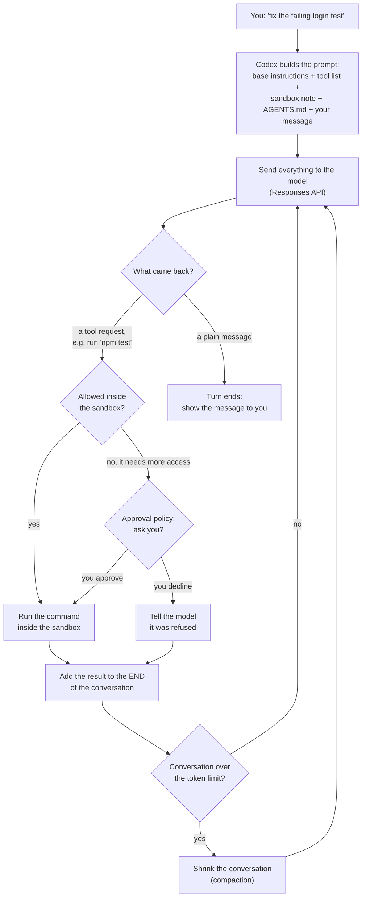
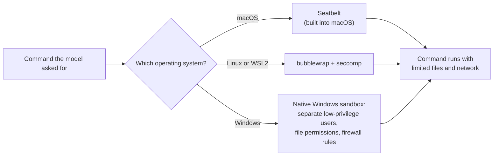

# Codex CLI

> Codex CLI is OpenAI's open-source coding agent that runs in your terminal, for developers who want an agent to read, edit and run code on their own machine inside a locked-down box.

*Last checked: October 2026. These apps change fast; check the linked sources for the current state.*

## At a glance

| | |
|---|---|
| Made by | OpenAI |
| Open source? | Yes, Apache-2.0 licence |
| Where it runs | Terminal on macOS, Linux and Windows. The same "Codex" name also covers an editor plug-in, a desktop app and a cloud agent |
| Which models it can use | OpenAI's models by default. Other providers work only if they speak the same request format (Responses API), including local models through Ollama or LM Studio |
| Written in | Mostly Rust |
| Links | [Docs](https://learn.chatgpt.com/docs/codex/cli) · [source code](https://github.com/openai/codex) · [engineering write-up](https://openai.com/index/unrolling-the-codex-agent-loop/) |

The old docs address `developers.openai.com/codex` still works. It now forwards to `learn.chatgpt.com/docs`.

## What it is for

You open a terminal in a project folder and type `codex`. You describe a job in plain words, such as "find out why the login test fails and fix it". The agent reads files, runs commands, edits code, and tells you what it did.

A normal session is a back-and-forth chat. Inside each of your messages the agent may take many steps on its own: run the tests, read an error, open a file, change it, run the tests again. You sign in with a ChatGPT plan or with an API key.

This page covers the terminal app (CLI, short for command-line interface). OpenAI uses the name "Codex" for a family of products: this CLI, an editor plug-in (for VS Code, Cursor and Windsurf), a desktop app, and Codex Web, a cloud agent that works on a remote copy of your code. OpenAI says the same core program sits under all of them.

## The parts

How this app fills each slot from [What an agent is made of](../anatomy.md). Where the makers have not published a detail, the table says "not published".

| Part | How this app does it | Layer |
|---|---|---|
| Brain (model) | An OpenAI model, reached over the internet through the request format called the Responses API. You can point it at another address that speaks the same format, or run with `--oss` to use a local model through Ollama or LM Studio. Endpoints that only speak the older Chat Completions format are not supported | [6](../layers/06-running-the-model.md) |
| Job description (system prompt) | Built from several pieces: base instructions bundled into the CLI for each model, a note describing the sandbox and approval rules, your optional `developer_instructions`, the contents of your `AGENTS.md` files, and a short note about the current folder and shell | [7](../layers/07-talking-to-it.md) |
| Reference books (knowledge) | No separate document store is described. The agent learns about your code by running commands and reading files. It can also search the web. By default web search uses a saved copy of results kept by OpenAI (cached mode) and not live pages. Whether it builds a search index of your code: not published | [8](../layers/08-giving-it-knowledge.md) |
| Hands (tools) | The source code's tool folder includes: run a shell command, edit files by applying a patch (`apply_patch`), keep a plan, view an image, ask the user a question, start helper agents, and call add-on tools from MCP servers. Web search is supplied by the Responses API | [9](../layers/09-giving-it-hands.md) |
| Heartbeat (loop) | Send the prompt, get back either a tool request or a plain message. Run the tool, add the result to the end, send again. A plain message to the user ends the turn. A fixed step limit: not published | [10](../layers/10-the-loop.md) |
| Notebook (context and memory) | The full conversation is re-sent on every call. When it grows past a token limit, Codex shrinks it automatically (compaction). `AGENTS.md` files hold standing notes. An optional memories feature, off by default, saves notes from past sessions under `~/.codex/memories/` | 11 |
| Body (harness) | A Rust program that runs the loop, draws the terminal screen, checks approvals, and starts every command inside an operating-system sandbox | 13 |

## How one request flows

> **Why this matters:** two separate checks sit between the model and your computer. The sandbox is a hard wall enforced by the operating system. The approval policy only decides when to stop and ask you before going past that wall.

Two details from OpenAI's write-up are worth knowing:

- **Nothing is remembered on the server.** Codex re-sends the whole conversation every call (stateless requests). OpenAI says it does this to keep requests simple and to support customers who do not want their data stored.
- **New things only go on the end.** The old prompt is always an exact beginning (prefix) of the new one. That lets the server reuse work it already did (prompt caching), which makes long sessions cheaper and faster.

## What makes it different

**1. The operating system enforces the limits (sandbox).** Many agents rely on asking permission before each action. Codex also runs commands inside a box that the operating system itself polices. This covers every program a command starts, such as git, package managers and test runners. OpenAI describes the sandbox as the boundary that lets the agent work on its own without full access to your machine.

**2. Two separate dials: what is possible, and when to ask (sandbox mode and approval policy).** The sandbox mode sets the hard limits. The approval policy sets when the agent must stop and ask to go beyond them. You can change one without the other.

**3. It is built to keep the server's saved work reusable (prompt caching).** The team avoids editing earlier parts of the conversation. If you change the sandbox setting or folder mid-session, Codex adds a new message to the end, so the earlier part still matches. Changing the tool list or the model mid-session breaks this and costs more.

**4. Shrinking is done by the server (compaction endpoint).** Early versions asked the model to write a summary. Codex now calls a dedicated address on the Responses API that returns a smaller list of items. One item is an unreadable (encrypted) blob that preserves the model's understanding of the earlier conversation.

**5. The whole harness is open source.** The loop, the sandbox code and the bundled instructions are in the public repository, so you can read exactly what is sent to the model.

## Adding to it

- **Instruction files (`AGENTS.md`).** Plain text notes Codex reads before it starts work. It looks in `~/.codex/` for personal notes, then in each folder from the project root down to where you are. Files are joined in that order, so the nearest folder has the last word. A file named `AGENTS.override.md` takes the place of `AGENTS.md` at the same level. The combined size is capped at 32 KiB by default.
- **Add-on tools (MCP servers).** Set up in `~/.codex/config.toml` or with `codex mcp add`. Codex supports servers that run as a local program (STDIO) and servers reached by web address (streamable HTTP).
- **Saved routines (skills).** A folder with a `SKILL.md` file holding a name, a description and instructions. Codex looks in `.agents/skills` in your project and home folder. At first only names and descriptions are loaded. The full instructions load when the skill is picked. You can call one by name with `$skill`, or Codex can pick one that matches the job.
- **Bundles (plugins).** A way to share several skills and MCP server connections together.
- **Helper agents (subagents).** Codex can start extra agents that work in parallel and report back. Built-in roles are `default`, `worker` and `explorer`. You normally have to ask for them. You can define your own in `.codex/agents/` as TOML files. They inherit the parent's sandbox setting, and they use more tokens than a single agent.
- **Scripts at set moments (hooks).** Your own scripts that run at points in the loop, such as before a tool runs or when a session starts.
- **Custom prompts.** Saved prompts in `~/.codex/prompts/` called as slash commands. The docs mark these as deprecated and tell you to use skills.
- **Running without a chat (`codex exec`).** Runs one job with no interactive screen, for scripts and automated pipelines.

## Staying safe

**Sandbox modes** (what is technically possible):

| Mode | What commands can do |
|---|---|
| `read-only` | Read files. Edits and commands need your approval |
| `workspace-write` | Read files, edit inside the project folder, run routine local commands. Network is off by default |
| `danger-full-access` | No file or network limits |

**Approval policy** (when it stops to ask): `on-request` runs anything the sandbox allows and asks before going beyond it. `never` does not ask at all.

**Defaults.** In a folder tracked by version control, Codex suggests `workspace-write` with `on-request`. In a folder that is not tracked, it suggests `read-only`. A single flag, `--yolo`, turns off both the sandbox and approvals. The docs label it dangerous.

**Protected folders.** Even in a writable mode, `.git`, `.agents` and `.codex` inside the project stay read-only.

**How the sandbox is built on each system**, as far as the docs state:

> **Why this matters:** the limits are not a polite request to the model. They are applied by the operating system to the command itself, so a confused or tricked model still cannot write outside the allowed folders.

- **macOS:** Seatbelt, a sandbox framework built into macOS.
- **Linux and WSL2:** `bubblewrap` together with `seccomp`. Codex falls back to a bundled helper if `bubblewrap` is not installed.
- **Windows:** a native sandbox when run in PowerShell. The stronger "elevated" setup uses dedicated low-privilege user accounts, file permission boundaries and firewall rules. A weaker "unelevated" fallback uses a restricted token and file permission lists (ACLs).

**Limits of the sandbox.** OpenAI's write-up says the sandbox applies to the shell tool Codex provides. Tools from MCP servers are not sandboxed by Codex and must enforce their own limits.

**Tricked by text it reads (prompt injection).** The docs say to treat web results as untrusted. Cached web search is the default partly to lower this risk. With full access turned on, web search switches to live results, which raises it.

**Automatic reviewer.** An optional setting sends approval requests to a second reviewer agent, which checks for things like data being sent out or destructive commands.

## Words to know

| Word | Plain English |
|---|---|
| CLI | Command-line interface: a program you use by typing in a terminal |
| Open source / Apache-2.0 | The code is public. Apache-2.0 is a permissive licence that allows use and changes |
| Rust | A programming language used for fast, low-level programs |
| Responses API | OpenAI's request format for sending a prompt and tools to a model and getting a reply |
| Harness | The ordinary program around the model that runs the loop and the tools |
| Agent loop | Ask the model, run the tool it asked for, show it the result, repeat |
| Turn | Everything from one of your messages to the agent's final reply, with many steps in between |
| Token | A small chunk of text. Models count their reading space in tokens |
| Context window | The limited amount of text the model can read in one call |
| Compaction | Replacing a long conversation with a shorter stand-in so it fits again |
| Stateless | The server keeps nothing between calls, so everything is sent again each time |
| Prefix | The beginning part of something. Here, the old prompt is the start of the new one |
| Prompt caching | The server reusing work from an earlier call when the start of the prompt is identical |
| Sandbox | A locked-down box for running commands, with limited file and network access |
| Sandbox mode | The setting for how tight the sandbox is |
| Approval policy | The setting for when the agent must stop and ask you |
| Seatbelt | The sandbox framework built into macOS |
| bubblewrap / seccomp | Linux tools that isolate a program and limit what it can ask the system to do |
| WSL2 | A way to run Linux inside Windows |
| ACL | Access control list: a list of who may read or write a file |
| Restricted token | A Windows way to run a program with fewer rights than your own account |
| `AGENTS.md` | A text file of standing instructions for the agent |
| `config.toml` | Codex's settings file. TOML is a simple settings file format |
| MCP | Model Context Protocol: a shared standard for plugging add-on tools into an agent |
| STDIO / streamable HTTP | Two ways to connect an MCP server: as a local program, or over a web address |
| Skill | A saved routine: a folder of instructions the agent loads when needed |
| Plugin | A shareable bundle of skills and tool connections |
| Subagent | A helper agent started by the main agent to do one part of the job |
| Hook | Your own script that runs at a set moment in the loop |
| Patch | A description of exact line changes to make to a file |
| Cached web search | Search answered from a saved copy of results, not from live pages |
| Prompt injection | Text in a file or web page that tries to give the agent instructions |
| Deprecated | Still works, but the makers advise against it and may remove it |

## Sources

Every factual claim on the page should trace to one of these. Official docs and the source code first.

- [openai/codex on GitHub](https://github.com/openai/codex): licence, install, sign-in, the product family. Languages are in the repository's language breakdown.
- [Tool handlers in the source code](https://github.com/openai/codex/tree/main/codex-rs/core/src/tools/handlers): the built-in tools.
- [OpenAI: Unrolling the Codex agent loop](https://openai.com/index/unrolling-the-codex-agent-loop/): the loop, how the prompt is built, stateless requests, prompt caching, compaction, which tools are sandboxed, local models.
- [Codex CLI docs](https://learn.chatgpt.com/docs/codex/cli): overview and features.
- [Sandboxing](https://learn.chatgpt.com/docs/sandboxing): sandbox modes and the per-system mechanisms.
- [Agent approvals and security](https://learn.chatgpt.com/docs/agent-approvals-security): approval policies, defaults, protected folders, web search modes, automatic reviewer.
- [Windows sandbox](https://learn.chatgpt.com/docs/windows/windows-sandbox): elevated and unelevated modes.
- [AGENTS.md guide](https://learn.chatgpt.com/docs/agent-configuration/agents-md): discovery order, override files, size cap.
- [MCP](https://learn.chatgpt.com/docs/extend/mcp?surface=cli), [skills](https://learn.chatgpt.com/docs/build-skills), [plugins](https://learn.chatgpt.com/docs/plugins), [subagents](https://learn.chatgpt.com/docs/agent-configuration/subagents), [hooks](https://learn.chatgpt.com/docs/hooks), [custom prompts](https://learn.chatgpt.com/docs/custom-prompts): extension points.
- [Memories](https://learn.chatgpt.com/docs/customization/memories?surface=cli): the optional saved-notes feature.
- [Models](https://learn.chatgpt.com/docs/models) and [config reference](https://learn.chatgpt.com/docs/config-file/config-reference): model providers, compaction and web search settings.
- [Command reference](https://learn.chatgpt.com/docs/developer-commands?surface=cli) and [non-interactive mode](https://learn.chatgpt.com/docs/non-interactive-mode): `codex exec` and other commands.
