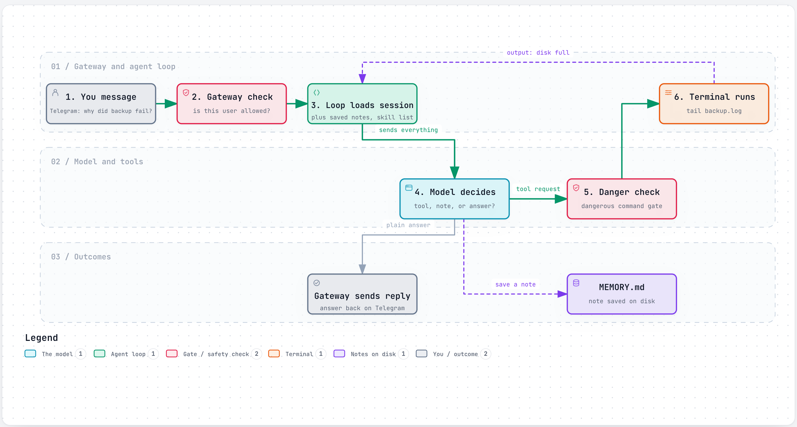
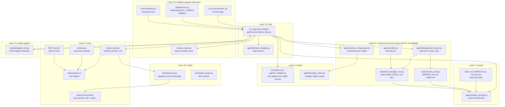
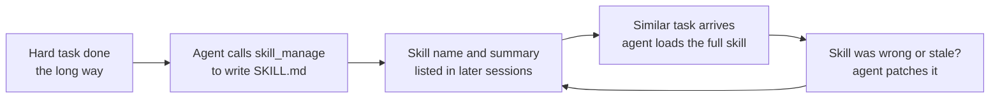

# Hermes Agent

> An open-source personal agent from Nous Research that you leave running on a computer or server, talk to from a terminal or a chat app, and that keeps notes and writes its own how-to guides as it works.

*Last checked: October 2026. These apps change fast; check the linked sources for the current state.*

Not to be confused with the **Hermes language models** from the same lab. Those are models (brains). Hermes Agent is the program around a model, and it can use many different models.

## At a glance

| | |
|---|---|
| Made by | Nous Research |
| Open source? | Yes, MIT licence |
| Where it runs | Terminal (CLI), plus chat apps such as Telegram, Discord, Slack, WhatsApp, Signal and email through a background program (gateway). It can live on your laptop or on a server |
| Which models it can use | Many. Nous Portal, OpenRouter, OpenAI, Anthropic, Google and others, plus models on your own machine (Ollama, vLLM, llama.cpp, LM Studio) through any OpenAI-compatible address |
| Written in | Python for the core. TypeScript for the richer terminal screen, desktop app and web dashboard |
| Links | [Docs](https://hermes-agent.nousresearch.com/docs/) · [Source code](https://github.com/NousResearch/hermes-agent) |

## What it is for

Most coding agents live inside one project folder and stop when you close the window. Hermes Agent is built to be a long-running helper. You install it once, pick a model, and then give it jobs: research something, run commands, edit files, browse a website, or do a task every morning.

A normal session looks like a chat. You type in the terminal, or you message it from your phone. It works through the job with its tools and replies. Conversations are saved, so you can pick one up later.

The part its makers stress is what happens between sessions. The agent saves short notes about you and your setup, and when it works out a multi-step method it can save that method as a reusable guide (skill). Next time, it loads the guide instead of working it out again.

## The parts

How this app fills each slot from [What an agent is made of](../anatomy.md). Where the makers have not published a detail, the table says "not published".

| Part | How this app does it | Layer |
|---|---|---|
| Brain (model) | You choose. Set up with `hermes model`, switch mid-chat with `/model`. A list of backup models (fallback providers) is tried if the main one fails. The docs state a minimum context window size for tool use | [6](../layers/06-running-the-model.md) |
| Job description (system prompt) | Built once per session in three ordered blocks: identity (`SOUL.md`) and tool guidance, then project instruction files (`.hermes.md`, `AGENTS.md`, `CLAUDE.md` or `.cursorrules`, first match wins), then the skill list, memory and the date. See the deep dive below | [7](../layers/07-talking-to-it.md) |
| Reference books (knowledge) | No built-in document index is described. Knowledge comes from web search, reading files, skills loaded when needed, and a keyword search over its own past conversations (`session_search`) | [8](../layers/08-giving-it-knowledge.md) |
| Hands (tools) | Grouped into switchable sets (toolsets): web search, terminal and files, a browser, images and speech, memory, scheduling, delegating to helper agents, and tools from add-on servers (MCP) | [9](../layers/09-giving-it-hands.md) |
| Heartbeat (loop) | A standard agent loop in the `AIAgent` class. Several tool requests in one reply can run at the same time. A step limit (iteration budget) stops it and makes it return a summary | [10](../layers/10-the-loop.md) |
| Notebook (context and memory) | Two small note files, `MEMORY.md` and `USER.md`, pasted into the prompt at the start of each session. All chats are stored in a SQLite database with text search. When the reading space fills up, the middle of the chat is replaced by a summary | 11 |
| Body (harness) | A Python program with two front doors: the terminal app and the gateway, a background process that connects chat apps and runs scheduled jobs | 13 |

## How one request flows

You message the agent on Telegram: "Check why the backup script failed last night."

<a href="https://alwintwk.github.io/how-ai-agents-work/diagrams/apps-hermes-agent-loop.html">
  <picture>
    <source media="(prefers-color-scheme: dark)" srcset="../diagrams/apps-hermes-agent-loop.dark.png">
    
  </picture>
</a>

Click the diagram for the interactive version (zoom, dark mode, trace a path).

> **Why this matters:** the middle of this picture is the same loop as [Layer 10](../layers/10-the-loop.md). What Hermes adds is on the edges: a doorkeeper in front (the gateway) and a notebook behind (notes and skills) that outlives the conversation.

## Component map

The names below are the real folder, file and class names in the source repository.

> **Why this matters:** every door (terminal, chat apps, scheduled jobs) leads to the same `AIAgent` class. The makers call this a "narrow waist": one small core, with new abilities added at the edges as skills, plug-ins and add-on servers. If you build your own agent, this is the shape to aim for: one loop, many ways in.

## Deep dive, part by part

### How the instructions are put together (prompt assembly)

Lives in [`agent/system_prompt.py`](https://github.com/NousResearch/hermes-agent/blob/main/agent/system_prompt.py). The function `build_system_prompt_parts` builds three blocks and joins them in this order:

1. **Stable block.** Identity first: your `SOUL.md` if it exists, otherwise a default identity. Then tool-use guidance (some of it only added for certain model families), any skills you pinned to always load, and platform hints such as "you are replying on Telegram".
2. **Context block.** A caller-supplied system message if there is one, then the project instruction file (`.hermes.md`, `AGENTS.md`, `CLAUDE.md` or `.cursorrules`, first match wins), then workspace details.
3. **Volatile block.** The skill index (name and summary of each skill), then `MEMORY.md`, then `USER.md`, then any external memory block and plug-in sections, the profile name, and a date line.

The result is built once per session and stored on the agent. It is only rebuilt after context compression.

**Design choice:** order by how often things change. The repository's developer guide says prompt caching is "sacred": the model provider can reuse its work on any unchanged start of the prompt, so the least-changing text goes first. The date line contains the day but not the time for the same reason.

**What it costs:** changes do not take effect right away. A note saved to `MEMORY.md` mid-session is on disk but the model does not see it in the prompt until the next session or the next compression. Installing a skill mid-session is deferred the same way unless you ask for it now and pay for a cache miss.

### The tools and how a tool request is carried out (tool execution)

Three files do the work: [`tools/registry.py`](https://github.com/NousResearch/hermes-agent/blob/main/tools/registry.py), [`toolsets.py`](https://github.com/NousResearch/hermes-agent/blob/main/toolsets.py) and [`model_tools.py`](https://github.com/NousResearch/hermes-agent/blob/main/model_tools.py).

1. **Registering.** Each tool file calls `registry.register()` when Python loads it. It hands over the tool's description for the model (schema), the function that does the work (handler), the group it belongs to (toolset), and an optional availability check (for example "is the API key set?").
2. **Choosing.** `toolsets.py` holds one shared list of core tools used by the terminal and every chat platform, plus named groups. Enabled groups are resolved into a set of tool names, and the registry returns the descriptions for those names. That list is sent to the model on every call.
3. **Dispatching.** When the model asks for a tool, `handle_function_call` runs. It first repairs wrong argument types (a model often sends the text `"42"` where a number is wanted). It runs plug-in hooks, which can block the call. Then `registry.dispatch` looks up the handler by name and calls it.
4. **Errors become text.** Any exception is caught and returned to the model as an error message, cut to a fixed length. The loop never crashes because a tool did.
5. **Special cases.** Four tools (`todo_list`, `memory`, `session_search`, `delegate_task`) are handled inside the loop itself, because they need the agent's own state.
6. **Oversized output.** [`tools/tool_result_storage.py`](https://github.com/NousResearch/hermes-agent/blob/main/tools/tool_result_storage.py) saves a very large result to a file and gives the model a short preview plus the file path.

Terminal commands pass through the approval gate before reaching one of the backends in `tools/environments/`.

**Design choice:** tools register themselves, so adding a tool means adding one file. The core list is kept short on purpose.

**What it costs:** every tool description is sent on every model call, so each new core tool is paid for on every turn. The makers ran a tracked effort to shrink this fixed cost ([issue 95681](https://github.com/NousResearch/hermes-agent/issues/95681)).

### The loop and when it stops

Lives in [`agent/conversation_loop.py`](https://github.com/NousResearch/hermes-agent/blob/main/agent/conversation_loop.py), reached through the `AIAgent` class in `run_agent.py`. One user message runs like this:

1. Add the user message to the record. Reuse the stored system prompt.
2. Check whether the record is too big. If so, compress first.
3. Call the model. The call can be interrupted if you send a new message.
4. If the reply asks for tools, run them. Several requests in one reply run at the same time, except tools that need to ask you something. Results go back in the original order.
5. Go to step 2.

The loop stops when one of these happens:

- **Plain answer.** The reply has no tool request. Before accepting it, a few "stop gates" ([`agent/turn_stop_gates.py`](https://github.com/NousResearch/hermes-agent/blob/main/agent/turn_stop_gates.py)) may push back. For example, if the agent edited code and never ran anything to check it, the gate adds a reminder and the loop continues.
- **Step budget used up.** [`agent/iteration_budget.py`](https://github.com/NousResearch/hermes-agent/blob/main/agent/iteration_budget.py) is a counter with `consume` and `refund`. Each model call consumes one step. When none remain, the agent asks the model for a summary of work so far and returns that. Each helper agent gets its own smaller budget.
- **Interrupt.** You send a new message or stop it.
- **Empty or broken reply.** A recovery ladder retries, nudges the model, tries a backup model, and finally gives up with a clear marker.

Two extra guards watch for a stuck loop. [`agent/tool_guardrails.py`](https://github.com/NousResearch/hermes-agent/blob/main/agent/tool_guardrails.py) notices the same tool call with the same arguments and the same result several times in a row and warns the model. `agent/repetition_guard.py` stops a reply that is mostly one repeated fragment.

**Design choice:** a step counter per agent, plus cheap pattern checks, instead of trying to judge progress.

**What it costs:** a counter cannot tell useful steps from wasted ones. Parent and children each have their own budget, so the total can exceed the parent's limit.

### Managing the reading space (context management)

Lives in [`agent/context_compressor.py`](https://github.com/NousResearch/hermes-agent/blob/main/agent/context_compressor.py). When the record passes a set share of the model's context window, `compress` runs:

1. **Prune first.** Old tool results are cut down. The tool requests themselves are left alone.
2. **Protect the head.** The system prompt and the first exchange are kept.
3. **Protect the tail.** The most recent messages are kept, measured by a token budget, not a fixed count.
4. **Summarise the middle.** Everything between is sent in one call to a cheaper helper model (auxiliary model). The summary follows a template: goal, constraints, progress, decisions, files, next steps.
5. **Repair.** A tool request whose result was removed (or the reverse) is cleaned up, because model services reject unmatched pairs.

The gateway has a second, later threshold as a safety net for sessions that grew between messages.

**Design choice:** lossy summarising, done rarely. A rolling variant that summarises a little every turn exists but is off by default, because each pass changes the start of the prompt and breaks caching.

**What it costs:** details in the middle are gone for good unless the agent searches its saved sessions. Compression needs a second model that works. The code carries guards for when it does not: a wait period after a failed summary (cooldown) and a counter that stops compressing when it keeps not helping (anti-thrash guard).

### Notes that outlive a session (memory)

There are three stores, each for a different kind of thing.

**Facts: `MEMORY.md` and `USER.md`.** Handled by [`tools/memory_tool.py`](https://github.com/NousResearch/hermes-agent/blob/main/tools/memory_tool.py). The model calls the `memory` tool with `add`, `replace` or `remove`. Writes go to disk at once. Each file has a character limit. A write that would exceed it returns an error telling the model to merge or remove entries. New content is scanned before it is saved.

**Methods: skills.** Handled by [`tools/skill_manager_tool.py`](https://github.com/NousResearch/hermes-agent/blob/main/tools/skill_manager_tool.py). `skill_manage` can `create`, `patch` or `delete` a skill folder. It checks the name, the header fields and the size, writes the file safely, and can run a security scan on the result. Skills that shipped with the app, came from a catalogue, or that you pinned are protected from the automatic reviewer.

**History: the session database.** Every message is stored in SQLite. `session_search` runs a keyword search over it.

**What triggers a save.** Two ways:

1. During a turn, the model may decide by itself to call `memory` or `skill_manage`.
2. After a turn, [`agent/background_review.py`](https://github.com/NousResearch/hermes-agent/blob/main/agent/background_review.py) may run. The agent counts loop steps since the last skill save and user turns since the last memory save. When a counter passes its setting, a copy of the agent (fork) is started in the background. It replays the conversation and is asked one question: should any skill or memory be saved or updated? Its review prompt tells it to prefer patching a skill that was in use over creating a new one. The copy may only use the skill and memory tools plus read-only file tools. The main conversation is not touched.

A third piece, [`agent/curator.py`](https://github.com/NousResearch/hermes-agent/blob/main/agent/curator.py), tidies up. When it is turned on, the agent has been idle, and enough time has passed, it marks unused agent-written skills as stale and later moves them to an archive. It never deletes.

**Design choice:** separate "what is true" (small, always in the prompt) from "how to do it" (large, loaded on demand) from "what was said" (searchable, never loaded whole).

**What it costs:** the review copy is extra model calls on top of your real ones. Nothing checks that a self-written skill is correct. A wrong skill is loaded with the same authority as a right one until someone patches it.

### The wrapper program (harness): processes, storage, screens

- **Processes.** The terminal app (`cli.py`, `hermes_cli/`) runs the agent in your shell. The gateway (`gateway/run.py`) is a long-running process: each platform adapter turns an incoming chat message into a common shape, checks the sender is allowed, finds the right session, runs a turn, and sends the reply. The gateway also runs the scheduler tick for [`cron/`](https://github.com/NousResearch/hermes-agent/tree/main/cron) jobs.
- **Storage.** Everything lives under `~/.hermes/`: `config.yaml`, secret keys in `.env`, `memories/`, `skills/`, `cron/jobs.json`, and the SQLite file `state.db`. [`hermes_state.py`](https://github.com/NousResearch/hermes-agent/blob/main/hermes_state.py) stores sessions and messages, tags each session with where it came from (terminal, Telegram and so on), and links a session to its parent when compression splits it.
- **Screens.** Besides the plain terminal app, the repository has a richer terminal screen (TUI, in `ui-tui/`), a desktop app (`apps/desktop/`) and a web dashboard (`web/`). These are written in TypeScript and talk to the same Python core.
- **Profiles.** You can keep several separate homes, each with its own memory, skills and settings.

**Design choice:** plain files for anything a person might edit, a single-file database for chat history, and one process that stays up for messaging and schedules.

**What it costs:** scheduled jobs and chat only work while the gateway is running. The codebase is large: session storage alone is split across many `hermes_state_*.py` files, much of it repair and recovery code.

## Problems it faces

Evidence comes from the makers' own security policy and developer guide, from guards in the source, and from the public issue tracker. Issue reports are users' accounts; a closed issue means the makers shipped a change.

| Problem | Why it happens (which layer) | What this app does about it | What is still unsolved |
|---|---|---|---|
| Self-written skills pile up, overlap, or are wrong | Layer 11. The reviewer is told to be active, and nothing tests a skill | Review prompt prefers patching; curator archives unused skills; optional human approval of writes | Blocking near-duplicates is an open request ([67582](https://github.com/NousResearch/hermes-agent/issues/67582)). Correctness checks: not published |
| The background reviewer does damage or burns tokens | Layers 11 and 12. An unattended copy of the agent holds write tools | Tool allowlist for the copy; memory tool withheld from skill-only reviews; an input budget | It once deleted memory entries unreviewed ([105921](https://github.com/NousResearch/hermes-agent/issues/105921)) and replayed very large contexts ([93057](https://github.com/NousResearch/hermes-agent/issues/93057)). Related reports remain open ([126685](https://github.com/NousResearch/hermes-agent/issues/126685)) |
| Memory files fill up | Layer 11. Hard size limit by design | Error instead of silent loss; duplicate entries refused | Models merge badly under pressure ([20595](https://github.com/NousResearch/hermes-agent/issues/20595), [76035](https://github.com/NousResearch/hermes-agent/issues/76035)) |
| Compression fails or loops | Layer 11. It depends on a second model call and on token estimates | Cooldown, anti-thrash counter, emergency path | Reported: an endless "summarizing" loop ([98722](https://github.com/NousResearch/hermes-agent/issues/98722)); images mis-counted so compression switched off ([92699](https://github.com/NousResearch/hermes-agent/issues/92699)) |
| Runaway or repeating loops | Layer 10 | Step budget; repeated-call notice; repetition check | Work can be lost when the budget ends a scheduled job ([61631](https://github.com/NousResearch/hermes-agent/issues/61631)) |
| Smaller or local models fail at tool calls | Layers 6 and 9. The loop assumes the model emits well-formed tool requests | Argument repair; a minimum context size; extra guidance for some model families | Open reports of tool calls printed as plain text and never run ([107125](https://github.com/NousResearch/hermes-agent/issues/107125), [56360](https://github.com/NousResearch/hermes-agent/issues/56360)) |
| High fixed cost per call | Layers 7 and 9. Prompt and every tool description are sent each call | Prompt caching; short core tool list; a tracked reduction effort ([95681](https://github.com/NousResearch/hermes-agent/issues/95681)) | Cache rules make mid-session changes slow to apply |
| Poisoned text from chats, web pages, skills | Layer 14 | Scanners, approval gate, allowlists, credential filtering | The makers state these are not real barriers (see below) |

**Self-written skills are unverified.** The "self-improving" loop is a model writing instructions for its future self. If it learned the wrong lesson, that lesson is now a file that later sessions trust. The app limits the damage (prefer patching, archive unused skills, protect skills you own), but it does not test that a skill works. The background review prompt also pushes towards action, saying a pass that does nothing is a missed chance. That favours a growing library. Turning on `skills.write_approval` puts a person back in the loop.

**Compression is the fragile point of long sessions.** Everything else in the loop is simple. Compression is not: it needs an accurate token count, a second model that answers, and a rewritten record the model service still accepts. The size of `context_compressor.py` and the issues above show how many ways that goes wrong. When it fails, the session either overflows or stalls.

**The in-app safety checks are not a wall.** The project's [security policy](https://github.com/NousResearch/hermes-agent/blob/main/SECURITY.md) says so directly: the only real barrier against a misbehaving model is the operating system. The approval gate, the scanners and output redaction are described as aids that catch honest mistakes. A container backend confines shell and file tools only. Code execution, MCP child programs, plug-ins and skills still run in the agent's own process. The policy says that running the default local backend while reading untrusted input (open web, inbound email, shared chat channels) is outside the supported setup. For that case it recommends putting the whole agent inside a container.

## If you were building your own

**Worth copying:**

- **Build the system prompt once, ordered by how often each part changes.** It makes prompt caching work and makes the agent's behaviour stable within a session.
- **A tool registry where each tool registers itself with an availability check.** Adding a tool is one file, and tools with missing keys never reach the model.
- **Turn every tool failure into text for the model.** The loop survives, and the model can try something else.
- **Notes with a hard size limit that return an error when full.** It forces the model to tidy up, and you always know the cost of the notes.
- **Save huge tool output to a file and show a preview.** One bad command cannot fill the reading space.

**Think twice:**

- **Letting the agent write its own instructions unattended.** It is the headline feature and the source of several problems above. Start with human approval on.
- **A background review after turns.** It adds model calls you did not ask for, and it is a second agent with write access that nobody is watching.
- **Using a model to approve risky commands.** The makers themselves treat it as a convenience, not a barrier. If the input is untrusted, use a real sandbox.
- **Supporting many platforms and model services early.** Much of this codebase is adapters and repair code. Each one is a thing to keep working.

## What makes it different

**1. It writes its own how-to guides (self-authored skills).** The model can create, patch and delete its own `SKILL.md` files, and a background review prompts it to do so (details in the deep dive above). The docs call this the agent's memory for methods (procedural memory). "Self-improving" here does not mean the model is retrained. Only its saved text files change.

> **Why this matters:** nothing here is machine learning. It is an agent editing its own instruction files, which you can open, read, and fix by hand.

**2. Small, fixed-size notes (bounded memory).** `MEMORY.md` and `USER.md` have hard size limits. When a file is full, the memory tool returns an error and the agent must merge or delete entries first. The makers chose this so the notes stay short and cheap to send. The notes are read once at session start and then frozen, so the start of the prompt stays identical between turns and the model provider can reuse it (prompt caching).

**3. One agent, many doors (messaging gateway).** The gateway is a long-running process that connects to chat platforms, keeps a session per conversation, and delivers replies. The same agent, memory and skills are reachable from the terminal and from your phone.

**4. The commands can run somewhere else (terminal backends).** The `terminal` tool can run commands on your own machine, in a Docker container, on a remote server over SSH, or on hosted services (Modal, Daytona, Vercel Sandbox, Singularity). The agent's brain and the place its commands run are separate choices.

## Adding to it

- **Instruction files.** Put a `.hermes.md` or `AGENTS.md` in a project. Edit `SOUL.md` to change the agent's personality.
- **Saved routines (skills).** Write your own, let the agent write them, or install from a catalogue (skills hub) with `hermes skills install`. Skills follow the open agentskills.io format. Only the name and summary of each skill are loaded up front; the full text is fetched when needed (progressive disclosure). A skill can be called as a slash command, like `/skill-name`.
- **Add-on tool servers (MCP).** List servers under `mcp_servers` in `~/.hermes/config.yaml`. Local servers run as child programs (stdio); remote ones are reached over HTTP. Tools are renamed `mcp_<server>_<tool>`, and you can allow or block tools per server.
- **Helper agents (subagents).** The `delegate_task` tool starts child agents with a blank conversation and their own terminal. Several can run side by side. Only each child's final summary returns to the parent.
- **Scheduled jobs (cron).** Ask in plain words ("every weekday at 9am, send me...") or use `hermes cron create`. The gateway checks for due jobs, runs each in a fresh session with no history, and delivers the result to a chat platform or a file. The gateway must be running.
- **Plug-ins and hooks.** A plug-in can add tools, slash commands, skills, or a new chat platform. Hooks run your code at set moments, such as after a tool call. Plug-ins are off until you enable them.

## Staying safe

- **Dangerous-command check.** Before a terminal command runs on your machine, it is matched against a list of risky patterns, such as recursive deletes or piping a download into a shell. In the default "smart" mode a second model call judges the risk and either allows, blocks, or asks you. In "manual" mode it always asks. Your choices are: once, this session, always, or deny.
- **Skip-all mode (YOLO mode).** `--yolo` or `/yolo` turns the prompts off. A short list of catastrophic commands (hardline blocklist) stays blocked even then.
- **Locked-down box (sandbox).** With the Docker, Singularity, Modal, Daytona or Vercel Sandbox backends, the dangerous-command check is skipped, because the container is treated as the safety wall. The Docker backend drops extra privileges and limits processes. On the default local backend there is no box: commands run as you.
- **Undo for files (checkpoints).** Before file edits and destructive commands, Hermes snapshots the folder into a separate hidden git store. `/rollback` restores it. Your project's own `.git` is not touched.
- **Who may talk to it.** The gateway refuses everyone by default. You add user IDs to an allowlist, or approve a one-time code a new user sends (DM pairing).
- **Poisoned text (prompt injection).** Project instruction files, scheduled-job prompts and catalogue skills are scanned for patterns like "ignore previous instructions" and hidden characters. Web tools refuse private network addresses (SSRF protection). MCP child programs only receive a short safe list of environment variables, so API keys are not passed along.
- **Review of self-written skills.** Optional. With `skills.write_approval` on, skill writes wait in a pending folder for you to approve.

How well the scanners catch real attacks is not published. Treat them as one layer, not a guarantee.

## Words to know

| Word | Plain English |
|---|---|
| CLI | A program you use by typing in a terminal |
| Gateway | The background program that connects the agent to chat apps and runs scheduled jobs |
| OpenAI-compatible endpoint | A web address that accepts requests in the same shape OpenAI's does, so many tools can talk to it |
| Fallback provider | A backup model service tried when the main one fails |
| Toolset | A named group of tools you can switch on or off together |
| Skill | A saved how-to guide (a `SKILL.md` file) the agent loads when a task matches |
| Procedural memory | Memory of how to do something, as opposed to facts |
| Progressive disclosure | Showing only a short summary first and loading the full text when needed |
| Bounded memory | Saved notes with a hard size limit |
| Prompt caching | The model provider reusing work on an unchanged start of the prompt, which cuts cost |
| Context compression | Replacing the middle of a long chat with a summary to free reading space |
| Iteration budget | The maximum number of loop steps before the agent must stop |
| SQLite | A small database stored in a single file |
| Full-text search (FTS5) | Keyword search over stored text, built into SQLite |
| Terminal backend | The place commands actually run: your machine, a container, or a remote server |
| Container (Docker) | A boxed-off mini system that runs programs apart from the rest of your computer |
| Sandbox | A locked-down box for running commands |
| SSH | A secure way to run commands on another computer |
| MCP (Model Context Protocol) | A shared standard for plugging extra tool servers into an agent |
| stdio | Talking to a child program through its text input and output |
| Adapter | A small piece of code that translates one outside service (a chat app, a model provider) into the shape the core expects |
| Token | The small chunk of text a model counts in; reading space and cost are measured in tokens |
| Exception | An error raised by code while it runs |
| Registry | One central list where every tool is recorded by name |
| Schema (JSON Schema) | The written description of a tool's name and inputs that the model reads |
| Handler | The function that actually does a tool's work |
| Auxiliary model | A second, usually cheaper model used for side jobs such as summarising |
| Fork | A copy of the running agent started to do a side job |
| Background review | The after-turn copy that decides whether to save a note or skill |
| Curator | The tidy-up job that archives agent-written skills nobody uses |
| Stop gate | A check that can refuse a 'done' answer and send the agent back to work |
| Cooldown | A wait period after a failure before trying again |
| Anti-thrash guard | A counter that stops an action being retried when it keeps not helping |
| Narrow waist | A design with one small core that everything else plugs into |
| Profile | A separate home folder with its own memory, skills and settings |
| TUI | A richer, full-screen interface inside the terminal |
| Subagent | A helper agent started by the main agent for one sub-task |
| Cron | Running a job on a schedule |
| Hook | Your own code that runs at a set moment in the agent's work |
| Plug-in | An add-on package that adds tools, commands or platforms |
| Environment variable | A named setting passed to a program, often used for secret keys |
| Allowlist | A list of who or what is permitted; everything else is refused |
| DM pairing | Approving a new chat user by a one-time code they send |
| YOLO mode | A setting that skips permission prompts |
| Hardline blocklist | Commands that are refused no matter what setting is on |
| Checkpoint | A saved snapshot of files you can roll back to |
| Prompt injection | Text hidden in a file or web page that tries to give the agent orders |
| SSRF | Tricking a program into fetching addresses inside a private network |

## Sources

Every factual claim on the page should trace to one of these. Official docs and the source code first.

- [Source repository and README](https://github.com/NousResearch/hermes-agent): maker, platforms, model choice, self-written skills, memory nudges.
- [Licence file](https://github.com/NousResearch/hermes-agent/blob/main/LICENSE): MIT.
- [Docs home](https://hermes-agent.nousresearch.com/docs/)
- [Architecture](https://hermes-agent.nousresearch.com/docs/developer-guide/architecture): Python layout, prompt layers, gateway, session database.
- [Agent loop](https://hermes-agent.nousresearch.com/docs/developer-guide/agent-loop): turn steps, parallel tools, step limit, fallback.
- [Context compression and caching](https://hermes-agent.nousresearch.com/docs/developer-guide/context-compression-and-caching)
- [Providers](https://hermes-agent.nousresearch.com/docs/integrations/providers): supported models, local models, minimum context size.
- [Tools](https://hermes-agent.nousresearch.com/docs/user-guide/features/tools): tool groups and terminal backends.
- [Memory](https://hermes-agent.nousresearch.com/docs/user-guide/features/memory)
- [Skills](https://hermes-agent.nousresearch.com/docs/user-guide/features/skills): `skill_manage`, skills hub, scanning, write approval.
- [Context files](https://hermes-agent.nousresearch.com/docs/user-guide/features/context-files)
- [MCP](https://hermes-agent.nousresearch.com/docs/user-guide/features/mcp)
- [Delegation](https://hermes-agent.nousresearch.com/docs/user-guide/features/delegation): subagents.
- [Cron](https://hermes-agent.nousresearch.com/docs/user-guide/features/cron): scheduled jobs.
- [Plug-ins](https://hermes-agent.nousresearch.com/docs/user-guide/features/plugins) and [hooks](https://hermes-agent.nousresearch.com/docs/user-guide/features/hooks)
- [Messaging gateway](https://hermes-agent.nousresearch.com/docs/user-guide/messaging/)
- [Security](https://hermes-agent.nousresearch.com/docs/user-guide/security): approvals, YOLO mode, containers, allowlists, scanning.
- [Checkpoints and rollback](https://hermes-agent.nousresearch.com/docs/user-guide/checkpoints-and-rollback)
- [Developer guide in the repository (AGENTS.md)](https://github.com/NousResearch/hermes-agent/blob/main/AGENTS.md): the caching rule and the 'narrow waist' design.
- [Security policy (SECURITY.md)](https://github.com/NousResearch/hermes-agent/blob/main/SECURITY.md): what counts as a real barrier and what does not.
- Source files read for the deep dive: [system_prompt.py](https://github.com/NousResearch/hermes-agent/blob/main/agent/system_prompt.py), [registry.py](https://github.com/NousResearch/hermes-agent/blob/main/tools/registry.py), [toolsets.py](https://github.com/NousResearch/hermes-agent/blob/main/toolsets.py), [model_tools.py](https://github.com/NousResearch/hermes-agent/blob/main/model_tools.py), [tool_result_storage.py](https://github.com/NousResearch/hermes-agent/blob/main/tools/tool_result_storage.py), [conversation_loop.py](https://github.com/NousResearch/hermes-agent/blob/main/agent/conversation_loop.py), [turn_stop_gates.py](https://github.com/NousResearch/hermes-agent/blob/main/agent/turn_stop_gates.py), [iteration_budget.py](https://github.com/NousResearch/hermes-agent/blob/main/agent/iteration_budget.py), [tool_guardrails.py](https://github.com/NousResearch/hermes-agent/blob/main/agent/tool_guardrails.py), [context_compressor.py](https://github.com/NousResearch/hermes-agent/blob/main/agent/context_compressor.py), [memory_tool.py](https://github.com/NousResearch/hermes-agent/blob/main/tools/memory_tool.py), [skill_manager_tool.py](https://github.com/NousResearch/hermes-agent/blob/main/tools/skill_manager_tool.py), [background_review.py](https://github.com/NousResearch/hermes-agent/blob/main/agent/background_review.py), [curator.py](https://github.com/NousResearch/hermes-agent/blob/main/agent/curator.py), [hermes_state.py](https://github.com/NousResearch/hermes-agent/blob/main/hermes_state.py), [delegate_tool.py](https://github.com/NousResearch/hermes-agent/blob/main/tools/delegate_tool.py), [approval.py](https://github.com/NousResearch/hermes-agent/blob/main/tools/approval.py).
- Issue tracker reports: [20595](https://github.com/NousResearch/hermes-agent/issues/20595), [56360](https://github.com/NousResearch/hermes-agent/issues/56360), [61631](https://github.com/NousResearch/hermes-agent/issues/61631), [67582](https://github.com/NousResearch/hermes-agent/issues/67582), [76035](https://github.com/NousResearch/hermes-agent/issues/76035), [92699](https://github.com/NousResearch/hermes-agent/issues/92699), [93057](https://github.com/NousResearch/hermes-agent/issues/93057), [95681](https://github.com/NousResearch/hermes-agent/issues/95681), [98722](https://github.com/NousResearch/hermes-agent/issues/98722), [105921](https://github.com/NousResearch/hermes-agent/issues/105921), [107125](https://github.com/NousResearch/hermes-agent/issues/107125), [126685](https://github.com/NousResearch/hermes-agent/issues/126685).
- [Nous Research on Hugging Face](https://huggingface.co/NousResearch): the separate Hermes language models.
