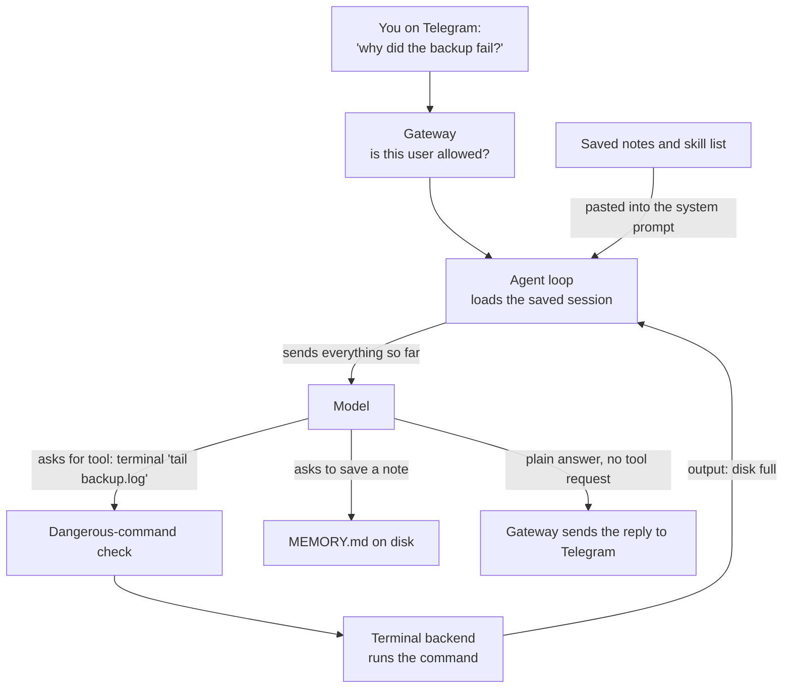
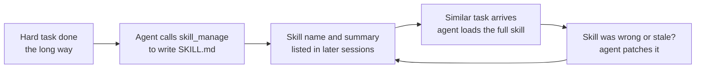

# Hermes Agent

> An open-source personal agent from Nous Research that you leave running on a computer or server, talk to from a terminal or a chat app, and that keeps notes and writes its own how-to guides as it works.

*Last checked: October 2026. These apps change fast; check the linked sources for the current state.*

Not to be confused with the **Hermes language models** from the same lab. Those are models (brains). Hermes Agent is the program around a model, and it can use many different models.

## At a glance

| | |
|---|---|
| Made by | Nous Research |
| Open source? | Yes, MIT licence |
| Where it runs | Terminal (CLI), plus chat apps such as Telegram, Discord, Slack, WhatsApp, Signal and email through a background program (gateway). It can live on your laptop or on a server |
| Which models it can use | Many. Nous Portal, OpenRouter, OpenAI, Anthropic, Google and others, plus models on your own machine (Ollama, vLLM, llama.cpp, LM Studio) through any OpenAI-compatible address |
| Written in | Mainly Python |
| Links | [Docs](https://hermes-agent.nousresearch.com/docs/) · [Source code](https://github.com/NousResearch/hermes-agent) |

## What it is for

Most coding agents live inside one project folder and stop when you close the window. Hermes Agent is built to be a long-running helper. You install it once, pick a model, and then give it jobs: research something, run commands, edit files, browse a website, or do a task every morning.

A normal session looks like a chat. You type in the terminal, or you message it from your phone. It works through the job with its tools and replies. Conversations are saved, so you can pick one up later.

The part its makers stress is what happens between sessions. The agent saves short notes about you and your setup, and when it works out a multi-step method it can save that method as a reusable guide (skill). Next time, it loads the guide instead of working it out again.

## The parts

How this app fills each slot from [What an agent is made of](../anatomy.md). Where the makers have not published a detail, the table says "not published".

| Part | How this app does it | Layer |
|---|---|---|
| Brain (model) | You choose. Set up with `hermes model`, switch mid-chat with `/model`. A list of backup models (fallback providers) is tried if the main one fails. The docs state a minimum context window size for tool use | [6](../layers/06-running-the-model.md) |
| Job description (system prompt) | Built in ordered layers: identity, tool guidance and the skill list first, then project instruction files (`.hermes.md`, `AGENTS.md`, `CLAUDE.md` or `.cursorrules`, first match wins), then memory and the time. A personality file (`SOUL.md`) is always loaded. The full prompt text is in the source code | [7](../layers/07-talking-to-it.md) |
| Reference books (knowledge) | No built-in document index is described. Knowledge comes from web search, reading files, skills loaded when needed, and a keyword search over its own past conversations (`session_search`) | [8](../layers/08-giving-it-knowledge.md) |
| Hands (tools) | Grouped into switchable sets (toolsets): web search, terminal and files, a browser, images and speech, memory, scheduling, delegating to helper agents, and tools from add-on servers (MCP) | [9](../layers/09-giving-it-hands.md) |
| Heartbeat (loop) | A standard agent loop in the `AIAgent` class. Several tool requests in one reply can run at the same time. A step limit (iteration budget) stops it and makes it return a summary | [10](../layers/10-the-loop.md) |
| Notebook (context and memory) | Two small note files, `MEMORY.md` and `USER.md`, pasted into the prompt at the start of each session. All chats are stored in a SQLite database with text search. When the reading space fills up, the middle of the chat is replaced by a summary | 11 |
| Body (harness) | A Python program with two front doors: the terminal app and the gateway, a background process that connects chat apps and runs scheduled jobs | 13 |

## How one request flows

You message the agent on Telegram: "Check why the backup script failed last night."

> **Why this matters:** the middle of this picture is the same loop as [Layer 10](../layers/10-the-loop.md). What Hermes adds is on the edges: a doorkeeper in front (the gateway) and a notebook behind (notes and skills) that outlives the conversation.

## What makes it different

**1. It writes its own how-to guides (self-authored skills).** A skill is a folder holding a `SKILL.md` file with sections such as "When to Use", "Procedure" and "Pitfalls". Hermes has a tool, `skill_manage`, that lets the model create a skill, patch it, or delete it. The docs describe this as the agent's memory for methods (procedural memory). The model is prompted to save a skill after a multi-step job worth repeating, and to patch a skill when it finds a mistake in it. This is what "self-improving" means here: the model itself is not retrained. Only its saved text files get better.

> **Why this matters:** nothing here is machine learning. It is an agent editing its own instruction files, which you can open, read, and fix by hand.

**2. Small, fixed-size notes (bounded memory).** `MEMORY.md` and `USER.md` have hard size limits. When a file is full, the memory tool returns an error and the agent must merge or delete entries first. The makers chose this so the notes stay short and cheap to send. The notes are read once at session start and then frozen, so the start of the prompt stays identical between turns and the model provider can reuse it (prompt caching).

**3. One agent, many doors (messaging gateway).** The gateway is a long-running process that connects to chat platforms, keeps a session per conversation, and delivers replies. The same agent, memory and skills are reachable from the terminal and from your phone.

**4. The commands can run somewhere else (terminal backends).** The `terminal` tool can run commands on your own machine, in a Docker container, on a remote server over SSH, or on hosted services (Modal, Daytona, Vercel Sandbox, Singularity). The agent's brain and the place its commands run are separate choices.

## Adding to it

- **Instruction files.** Put a `.hermes.md` or `AGENTS.md` in a project. Edit `SOUL.md` to change the agent's personality.
- **Saved routines (skills).** Write your own, let the agent write them, or install from a catalogue (skills hub) with `hermes skills install`. Skills follow the open agentskills.io format. Only the name and summary of each skill are loaded up front; the full text is fetched when needed (progressive disclosure). A skill can be called as a slash command, like `/skill-name`.
- **Add-on tool servers (MCP).** List servers under `mcp_servers` in `~/.hermes/config.yaml`. Local servers run as child programs (stdio); remote ones are reached over HTTP. Tools are renamed `mcp_<server>_<tool>`, and you can allow or block tools per server.
- **Helper agents (subagents).** The `delegate_task` tool starts child agents with a blank conversation and their own terminal. Several can run side by side. Only each child's final summary returns to the parent.
- **Scheduled jobs (cron).** Ask in plain words ("every weekday at 9am, send me...") or use `hermes cron create`. The gateway checks for due jobs, runs each in a fresh session with no history, and delivers the result to a chat platform or a file. The gateway must be running.
- **Plug-ins and hooks.** A plug-in can add tools, slash commands, skills, or a new chat platform. Hooks run your code at set moments, such as after a tool call. Plug-ins are off until you enable them.

## Staying safe

- **Dangerous-command check.** Before a terminal command runs on your machine, it is matched against a list of risky patterns, such as recursive deletes or piping a download into a shell. In the default "smart" mode a second model call judges the risk and either allows, blocks, or asks you. In "manual" mode it always asks. Your choices are: once, this session, always, or deny.
- **Skip-all mode (YOLO mode).** `--yolo` or `/yolo` turns the prompts off. A short list of catastrophic commands (hardline blocklist) stays blocked even then.
- **Locked-down box (sandbox).** With the Docker, Singularity, Modal, Daytona or Vercel Sandbox backends, the dangerous-command check is skipped, because the container is treated as the safety wall. The Docker backend drops extra privileges and limits processes. On the default local backend there is no box: commands run as you.
- **Undo for files (checkpoints).** Before file edits and destructive commands, Hermes snapshots the folder into a separate hidden git store. `/rollback` restores it. Your project's own `.git` is not touched.
- **Who may talk to it.** The gateway refuses everyone by default. You add user IDs to an allowlist, or approve a one-time code a new user sends (DM pairing).
- **Poisoned text (prompt injection).** Project instruction files, scheduled-job prompts and catalogue skills are scanned for patterns like "ignore previous instructions" and hidden characters. Web tools refuse private network addresses (SSRF protection). MCP child programs only receive a short safe list of environment variables, so API keys are not passed along.
- **Review of self-written skills.** Optional. With `skills.write_approval` on, skill writes wait in a pending folder for you to approve.

How well the scanners catch real attacks is not published. Treat them as one layer, not a guarantee.

## Words to know

| Word | Plain English |
|---|---|
| CLI | A program you use by typing in a terminal |
| Gateway | The background program that connects the agent to chat apps and runs scheduled jobs |
| OpenAI-compatible endpoint | A web address that accepts requests in the same shape OpenAI's does, so many tools can talk to it |
| Fallback provider | A backup model service tried when the main one fails |
| Toolset | A named group of tools you can switch on or off together |
| Skill | A saved how-to guide (a `SKILL.md` file) the agent loads when a task matches |
| Procedural memory | Memory of how to do something, as opposed to facts |
| Progressive disclosure | Showing only a short summary first and loading the full text when needed |
| Bounded memory | Saved notes with a hard size limit |
| Prompt caching | The model provider reusing work on an unchanged start of the prompt, which cuts cost |
| Context compression | Replacing the middle of a long chat with a summary to free reading space |
| Iteration budget | The maximum number of loop steps before the agent must stop |
| SQLite | A small database stored in a single file |
| Full-text search (FTS5) | Keyword search over stored text, built into SQLite |
| Terminal backend | The place commands actually run: your machine, a container, or a remote server |
| Container (Docker) | A boxed-off mini system that runs programs apart from the rest of your computer |
| Sandbox | A locked-down box for running commands |
| SSH | A secure way to run commands on another computer |
| MCP (Model Context Protocol) | A shared standard for plugging extra tool servers into an agent |
| stdio | Talking to a child program through its text input and output |
| Subagent | A helper agent started by the main agent for one sub-task |
| Cron | Running a job on a schedule |
| Hook | Your own code that runs at a set moment in the agent's work |
| Plug-in | An add-on package that adds tools, commands or platforms |
| Environment variable | A named setting passed to a program, often used for secret keys |
| Allowlist | A list of who or what is permitted; everything else is refused |
| DM pairing | Approving a new chat user by a one-time code they send |
| YOLO mode | A setting that skips permission prompts |
| Hardline blocklist | Commands that are refused no matter what setting is on |
| Checkpoint | A saved snapshot of files you can roll back to |
| Prompt injection | Text hidden in a file or web page that tries to give the agent orders |
| SSRF | Tricking a program into fetching addresses inside a private network |

## Sources

Every factual claim on the page should trace to one of these. Official docs and the source code first.

- [Source repository and README](https://github.com/NousResearch/hermes-agent): maker, platforms, model choice, self-written skills, memory nudges.
- [Licence file](https://github.com/NousResearch/hermes-agent/blob/main/LICENSE): MIT.
- [Docs home](https://hermes-agent.nousresearch.com/docs/)
- [Architecture](https://hermes-agent.nousresearch.com/docs/developer-guide/architecture): Python layout, prompt layers, gateway, session database.
- [Agent loop](https://hermes-agent.nousresearch.com/docs/developer-guide/agent-loop): turn steps, parallel tools, step limit, fallback.
- [Context compression and caching](https://hermes-agent.nousresearch.com/docs/developer-guide/context-compression-and-caching)
- [Providers](https://hermes-agent.nousresearch.com/docs/integrations/providers): supported models, local models, minimum context size.
- [Tools](https://hermes-agent.nousresearch.com/docs/user-guide/features/tools): tool groups and terminal backends.
- [Memory](https://hermes-agent.nousresearch.com/docs/user-guide/features/memory)
- [Skills](https://hermes-agent.nousresearch.com/docs/user-guide/features/skills): `skill_manage`, skills hub, scanning, write approval.
- [Context files](https://hermes-agent.nousresearch.com/docs/user-guide/features/context-files)
- [MCP](https://hermes-agent.nousresearch.com/docs/user-guide/features/mcp)
- [Delegation](https://hermes-agent.nousresearch.com/docs/user-guide/features/delegation): subagents.
- [Cron](https://hermes-agent.nousresearch.com/docs/user-guide/features/cron): scheduled jobs.
- [Plug-ins](https://hermes-agent.nousresearch.com/docs/user-guide/features/plugins) and [hooks](https://hermes-agent.nousresearch.com/docs/user-guide/features/hooks)
- [Messaging gateway](https://hermes-agent.nousresearch.com/docs/user-guide/messaging/)
- [Security](https://hermes-agent.nousresearch.com/docs/user-guide/security): approvals, YOLO mode, containers, allowlists, scanning.
- [Checkpoints and rollback](https://hermes-agent.nousresearch.com/docs/user-guide/checkpoints-and-rollback)
- [Nous Research on Hugging Face](https://huggingface.co/NousResearch): the separate Hermes language models.
