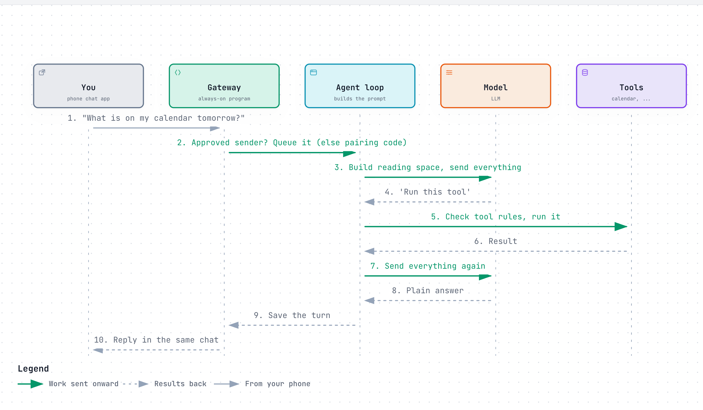
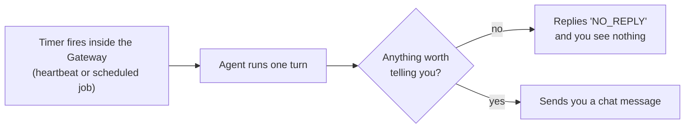
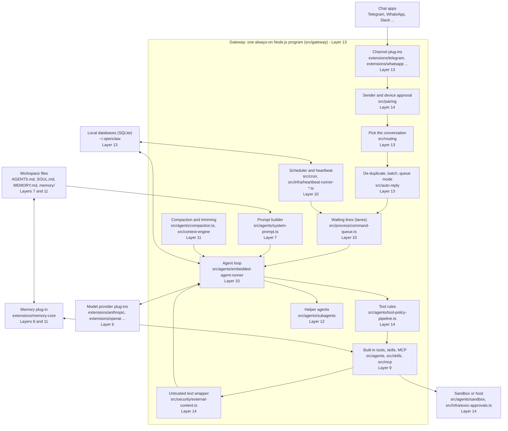
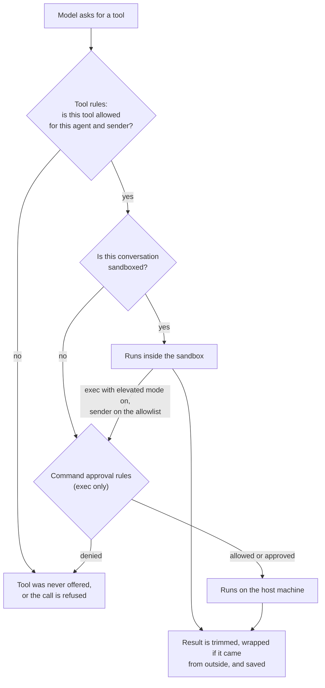

# OpenClaw

> An open-source personal assistant that you run on your own computer and talk to through the chat apps you already use. It is for people who are comfortable installing and looking after a small server program.

*Last checked: October 2026. These apps change fast; check the linked sources for the current state.*

## At a glance

| | |
|---|---|
| Made by | Started by Peter Steinberger and a community of contributors. Now looked after by the OpenClaw Foundation, a non-profit that employs the core team. Earlier names: Clawdbot, then Moltbot. |
| Open source? | Yes, MIT licence |
| Where it runs | A background program on your own machine or server (macOS, Linux, Windows). You reach it from phone chat apps, a web page, a terminal, and companion apps for desktop and phone. |
| Which models it can use | Many. Hosted providers (Anthropic, OpenAI, Google, OpenRouter and others) and models running on your own machine (for example through Ollama). |
| Written in | Mostly TypeScript, running on Node.js. The companion apps use Swift and Kotlin. |
| Links | [Official site](https://openclaw.ai) · [source code](https://github.com/openclaw/openclaw) · [docs](https://docs.openclaw.ai) |

## What it is for

Most agent apps wait in a terminal or an editor until you open them. OpenClaw is built to stay switched on. You install it on a computer that is always running, connect it to a chat app such as Telegram or WhatsApp, and then message it like you would message a person.

The jobs people give it are everyday errands: sort an inbox, check a calendar, look something up on the web, run a command on the home machine, remind me about something tomorrow. The answer comes back in the same chat.

A normal session is not really a "session" at all. You send a message from your phone. The always-on program wakes the agent, the agent works through the job with its tools, and a reply arrives in the chat. It can also wake itself on a timer and message you first.

## The parts

How this app fills each slot from [What an agent is made of](../anatomy.md). Where the makers have not published a detail, the table says "not published".

| Part | How this app does it | Layer |
|---|---|---|
| Brain (model) | You choose it. Models are written as `provider/model`. You set one main model and a list of backups to try if the main one fails (fallbacks). The docs advise using the strongest current model you can for any agent that has tools. | [6](../layers/06-running-the-model.md) |
| Job description (system prompt) | Built fresh by OpenClaw from several plain text files in the agent's working folder (workspace): `AGENTS.md` for instructions, `SOUL.md` for personality and limits, `IDENTITY.md`, `USER.md`, and `MEMORY.md` if it exists. Each file has a size cap, and the agent is told when a file was cut short. | [7](../layers/07-talking-to-it.md) |
| Reference books (knowledge) | Its own saved notes, searched with the `memory_search` tool. When set up, that search mixes meaning-based matching (vector search) with keyword matching. It also has web search and web page fetching tools. | [8](../layers/08-giving-it-knowledge.md) |
| Hands (tools) | Run commands (`exec`), read and change files (`read`, `write`, `edit`), search and fetch the web (`web_search`, `web_fetch`), drive a web browser (`browser`), send chat messages (`message`), schedule jobs (`cron`), start helper agents (`sessions_spawn`), and control paired devices (`nodes`). Add-ons can bring more. | [9](../layers/09-giving-it-hands.md) |
| Heartbeat (loop) | OpenClaw's own built-in loop. Each conversation gets its own waiting line (queue), so only one run at a time touches a conversation. A run ends when the model gives a plain answer, when it is cancelled, or when a time limit is hit. A maximum step count is not published. | [10](../layers/10-the-loop.md) |
| Notebook (context and memory) | The full conversation record is kept on disk in a local database. When the reading space fills up, older turns are replaced by a summary (compaction). Just before that, a silent turn reminds the agent to save anything important to its notes. Long-term notes are plain Markdown files: `MEMORY.md` and dated files in `memory/`. | 11 |
| Body (harness) | The Gateway: one long-running program that holds the chat app connections, the conversations, the tools, and the scheduler. Everything else (terminal, web page, phone apps) connects to it. | 13 |

## How one request flows

<a href="https://alwintwk.github.io/how-ai-agents-work/diagrams/apps-openclaw-request.html">
  <picture>
    <source media="(prefers-color-scheme: dark)" srcset="../diagrams/apps-openclaw-request.dark.png">
    
  </picture>
</a>

Click the diagram for the interactive version (zoom, dark mode, trace a path).

> **Why this matters:** the sender check happens before the model sees a single word. An unapproved stranger's message never becomes a turn. That gate is ordinary code, not the model's judgement, which is why it can be trusted more than any instruction in the prompt.

The same loop runs when nobody sent a message at all:

> **Why this matters:** an agent that can start its own turns is useful, and it is also an agent that acts while you are not watching. Every safety setting below matters more because of this.

## Component map

These are the real folders and files in the source code. The number on each block is the layer it belongs to.

> **Why this matters:** the model (layer 6) is one small box at the edge. Almost everything else is layer 13 and layer 14: ordinary code that moves messages, stores things, and checks rules. If you build your own agent, expect the same split. The loop is short. The plumbing and the safety checks are most of the work.

## Deep dive, part by part

### How the instructions are put together (prompt assembly)

OpenClaw writes its own system prompt on every run. There is no fixed prompt file. The work is in [`src/agents/system-prompt.ts`](https://github.com/openclaw/openclaw/blob/main/src/agents/system-prompt.ts), and the [System prompt](https://docs.openclaw.ai/concepts/system-prompt) page describes it.

1. **Fixed sections come first.** Short blocks on how to use tools, when to act, how to message, the working folder, the sandbox state, and so on.
2. **A short skills list.** Each skill is one entry with a name, a description and a file path, inside an `<available_skills>` block. The full `SKILL.md` is not included. The model opens it with the `read` tool when needed.
3. **The workspace files, in a fixed order.** The order is one list in [`workspace-bootstrap-policy.ts`](https://github.com/openclaw/openclaw/blob/main/src/agents/workspace-bootstrap-policy.ts): `AGENTS.md`, `SOUL.md`, `IDENTITY.md`, `USER.md`, `BOOTSTRAP.md` (new workspaces only), then `MEMORY.md` (if it exists). The docs call these bootstrap files.
4. **Size caps.** Each file is cut at a per-file limit (`agents.defaults.bootstrapMaxChars`, 20,000 characters when checked). All files together are cut at a total limit (`bootstrapTotalMaxChars`, 60,000 characters when checked). A cut file gets a marker, and the prompt gains a short notice telling the model to read the file directly.
5. **Changing details go last.** The date, the chat app in use and other per-turn facts sit below a marked line. Everything above the line stays the same between turns, so the model provider can reuse its saved copy of that part (prompt cache).
6. **Helpers get less.** A helper agent gets a smaller prompt and only `AGENTS.md`.

**The design choice:** the prompt tells the model to get on with the job. It does not ask the model to police itself. The docs put it this way: "Risk is enforced at runtime, not in prompt prose."

**What it costs:** every turn pays for those files again. A long `MEMORY.md` is silently shortened in the model's view until you tidy it. And the agent can edit the same files that shape its next prompt, so a trick that works once can be written down and kept. An early bug report showed exactly this risk ([issue 8776](https://github.com/openclaw/openclaw/issues/8776), now closed).

### The tools and how a tool request is carried out (tool execution)

Three separate controls decide what happens. The docs have a page just to tell them apart: [Sandbox vs tool policy vs elevated](https://docs.openclaw.ai/gateway/sandbox-vs-tool-policy-vs-elevated).

1. **Which tools exist (tool policy).** Before the model is called, the tool list is filtered. [`tool-policy-pipeline.ts`](https://github.com/openclaw/openclaw/blob/main/src/agents/tool-policy-pipeline.ts) applies the rules in a set order: the base profile, the per-provider profile, the global allow list, the per-agent allow list, group rules, then per-sender rules. Two rules of thumb from the docs: deny always wins, and a non-empty allow list blocks everything not on it.
2. **Where tools run (sandbox).** The setting `agents.defaults.sandbox.mode` is `off`, `non-main` (only group chats and side conversations) or `all`. When on, file and command tools run inside a container or a remote box. A second, tighter tool list applies there. The Gateway itself never moves.
3. **The escape hatch (elevated mode).** A sandboxed agent can run a command on the host only if elevated mode is enabled in config and the sender is on its allowlist. It affects `exec` only. It cannot bring back a tool the rules removed.
4. **Asking a person (exec approvals).** Host commands pass through [exec approvals](https://docs.openclaw.ai/tools/exec-approvals): block all, allow only listed commands, or allow everything, combined with ask never, ask when not listed, or ask always. On an approval-capable chat app the request shows up as buttons.
5. **Add-on checks (hooks).** A plug-in can inspect or block a call with a `before_tool_call` handler.
6. **The result comes back.** Results are trimmed for size. Text from outside (web pages, email, files) is wrapped in begin and end markers that carry a random id, with a warning line, by [`external-content.ts`](https://github.com/openclaw/openclaw/blob/main/src/security/external-content.ts). The random id stops a hostile page from faking the end marker.

**The design choice:** the model is assumed to be trickable, so the limits live in code. The [trust model](https://docs.openclaw.ai/gateway/security/trust-model) states the order: identity first, scope next, model last.

**What it costs:** three overlapping controls are hard to reason about. The rules filter tools by name only. If `exec` is allowed, banning `write` does not make the agent read-only, because a shell command can write files. And every extra rule is code that can have bugs: see the approval and allowlist advisories under "Problems it faces".

### The loop and when it stops

The steps are in the [Agent loop](https://docs.openclaw.ai/concepts/agent-loop), [Messages](https://docs.openclaw.ai/concepts/messages) and [Command queue](https://docs.openclaw.ai/concepts/queue) pages.

1. **Route.** The message's source (which chat app, which person or group) is turned into a conversation id (session key). Direct messages share one main conversation by default. Each group gets its own.
2. **De-duplicate and batch.** Chat apps sometimes deliver a message twice after a reconnect, so recently seen message ids are remembered and skipped. Quick-fire messages from one sender can be joined into one turn after a short quiet wait (debounce).
3. **Decide what to do if the agent is busy.** This is the queue mode. The default, `steer`, feeds the new message into the run that is already going. `followup` waits for the next turn. `collect` joins waiting messages into one turn. `interrupt` stops the current run.
4. **Wait in line.** [`command-queue.ts`](https://github.com/openclaw/openclaw/blob/main/src/process/command-queue.ts) keeps named waiting lines (lanes). A run first waits in its conversation's lane, which lets one run through at a time. Then it waits in a shared `main` lane that caps how many conversations run at once. Scheduled jobs and helper agents have their own lanes so they do not block replies.
5. **Run.** [`embedded-agent-runner`](https://github.com/openclaw/openclaw/tree/main/src/agents/embedded-agent-runner) builds the prompt, calls the model, runs the tools it asks for, and repeats. Before a run may save anything, it claims the conversation. A run that has been replaced cannot save stale data.

A run stops when one of these happens:

| Stop condition | Detail |
|---|---|
| The model gives a plain answer | The normal end. If a reply is required and the model ends on a tool result, OpenClaw makes one more tool-free pass to get an answer. |
| The model answers `NO_REPLY` | Allowed only on turns where a reply is optional, such as a check-in. The token is removed before sending. |
| Someone cancels | `/stop`, an interrupt, or a client abort. |
| The whole-run time limit | `agents.defaults.timeoutSeconds`. When checked, the default was 48 hours, and `0` means no limit. |
| The model goes quiet | A request with no output for a set time is aborted (two minutes for hosted models and five for self-hosted, when checked). |
| A scheduled job's own limit | The scheduler puts a shorter limit on its runs. |
| A maximum number of steps | Not published. The documented limits are all time-based. |

**The design choice:** limits are by time, not by step count, because a personal assistant may legitimately work on something for hours. One run per conversation removes a whole class of clashes.

**What it costs:** a long time limit is a long window in which a confused agent can keep spending. The project had to add "stuck session" detection to free lanes that stop making progress. A closed report describes an agent that kept retrying a denied command and ignored stop requests ([issue 69386](https://github.com/openclaw/openclaw/issues/69386)).

### Managing the reading space (context management)

Two mechanisms, described in [Session pruning](https://docs.openclaw.ai/concepts/session-pruning) and [Compaction](https://docs.openclaw.ai/concepts/compaction).

**Trimming old tool output (pruning).** Only tool results are touched. Normal chat text is left alone. Large old results first keep their start and end with the middle removed. If the reading space is still too full, old results are replaced by a short placeholder. The last few turns are never trimmed. The saved record on disk is not changed. Pruning is switched on automatically for Anthropic accounts and is off for other providers unless you set it.

**Summarising old turns (compaction).** The code is in [`src/agents/compaction.ts`](https://github.com/openclaw/openclaw/blob/main/src/agents/compaction.ts).

1. It triggers when the conversation nears the model's limit, or when the provider rejects a request as too long. In the second case OpenClaw compacts and retries.
2. Just before, a silent turn runs (memory flush). The check is in [`memory-flush.ts`](https://github.com/openclaw/openclaw/blob/main/src/auto-reply/reply/memory-flush.ts): it fires when the token count crosses a threshold a little below the compaction point, and only once per compaction. The instructions in [`flush-plan.ts`](https://github.com/openclaw/openclaw/blob/main/extensions/memory-core/src/flush-plan.ts) tell the agent to add notes to today's `memory/YYYY-MM-DD.md` only, and to treat `MEMORY.md`, `SOUL.md` and `AGENTS.md` as read-only.
3. Older turns are summarised by a model call. A recent tail is kept word for word. A tool request and its result are never split.
4. The summary is checked. If no valid summary is produced, nothing is written and the original history stays.
5. The full history stays on disk. Only the model's view changes.

You can force it with `/compact`, and `/context list` shows what is using the space.

**The design choice:** let the agent choose what to save before the summary throws detail away.

**What it costs:** a summary always loses something. Each compaction is an extra model call, and the flush is another. Early versions had reports of empty or "Summary unavailable" results ([issue 2851](https://github.com/openclaw/openclaw/issues/2851), [issue 6083](https://github.com/openclaw/openclaw/issues/6083), both closed).

### Notes that outlive a session (memory)

See [Memory](https://docs.openclaw.ai/concepts/memory) and [Memory search](https://docs.openclaw.ai/concepts/memory-search). The code is the plug-in [`extensions/memory-core`](https://github.com/openclaw/openclaw/tree/main/extensions/memory-core).

- **Three kinds of file.** `USER.md` holds stable preferences. `MEMORY.md` holds a short, curated list of lasting facts. `memory/YYYY-MM-DD.md` files hold detailed daily notes.
- **What is loaded when.** `USER.md` and `MEMORY.md` go into the prompt. Daily notes do not. They cost nothing until the agent searches them with `memory_search` or opens one with `memory_get`.
- **How search is indexed.** Notes are cut into small pieces. Each piece is turned into a list of numbers that captures its meaning (embedding) by an outside or local model. The search runs two ways at once: by meaning (vector search) and by exact words (keyword search, BM25). The two scores are merged. Dated notes count for less as they age. Near-duplicate results are thinned out. If no embedding model is set up, it falls back to keywords only.
- **Background tidying (dreaming).** A background job moves useful material from daily notes into `MEMORY.md`.

**The design choice:** the docs say "there is no hidden state". You can open, edit and back up everything the agent remembers.

**What it costs:** a note is plain text with no proof of where it came from. The docs warn that memory "does not enforce policy". If a hostile web page gets a line saved, later turns read it as trusted. A request to tag notes by source is still open ([issue 7707](https://github.com/openclaw/openclaw/issues/7707)), and the project has published advisories about memory features widening access ([GHSA-62qm-6fjj-6g23](https://github.com/openclaw/openclaw/security/advisories/GHSA-62qm-6fjj-6g23)).

### The wrapper program (harness): processes, storage, screens

**Processes.** One long-running Node.js program, the Gateway, described in [Gateway architecture](https://docs.openclaw.ai/concepts/architecture). It holds the chat connections and offers one live two-way connection (WebSocket) for everything else. The terminal tool, the web page (Control UI), the desktop and phone apps, and paired devices are all clients of it. There is one Gateway per machine.

**Storage.** Everything lives under `~/.openclaw`, listed in [Secrets, storage, and logs](https://docs.openclaw.ai/gateway/security/secrets-and-storage).

| Path | What it holds |
|---|---|
| `openclaw.json` | Settings. May include access tokens. |
| `credentials/` | Chat app logins and the approved-sender lists. |
| `state/openclaw.sqlite` | Shared state in a single-file database (SQLite): scheduled jobs, run history, command approvals. |
| `agents/<id>/agent/openclaw-agent.sqlite` | One agent's conversations, the full record of each (transcript), and model logins. |
| `workspace/` | The instruction and memory files. |

The [Agent runtime](https://docs.openclaw.ai/concepts/agent) page says transcripts moved from line-by-line text files (JSONL) to SQLite. Some docs pages still mention the old files.

**How self-started turns work.** The scheduler runs inside the Gateway, so nothing fires while the Gateway is off. Jobs are saved in the shared database and survive restarts ([How automations work](https://docs.openclaw.ai/automation/cron-jobs/how-it-works)). A job either drops an event into your main conversation or runs in a fresh one. The heartbeat is one of these jobs, created by the system for each agent. Its prompt is sent as an ordinary user message. A check-in is skipped if the agent is already busy or it is outside your set active hours.

**The design choice:** one process and local files keep setup simple and keep your data on your machine.

**What it costs:** one process is one thing that can fail, and it must run for weeks. Open reports describe memory use that grows for days until the program is killed ([issue 91588](https://github.com/openclaw/openclaw/issues/91588)), a database side file that grows without limit ([issue 143524](https://github.com/openclaw/openclaw/issues/143524)), and saving work that blocks everything else ([issue 119720](https://github.com/openclaw/openclaw/issues/119720)).

## Problems it faces

| Problem | Why it happens (which layer) | What this app does about it | What is still unsolved |
|---|---|---|---|
| Hidden instructions in content the agent reads (prompt injection) | Layers 9 and 14. Tool results enter the same reading space as your instructions. | Wraps outside text in marked blocks, advises strong models, offers sandbox, tool rules and a tool-less "reader" agent. | The [docs](https://docs.openclaw.ai/gateway/security/prompt-injection) say it is not solved. |
| Everyone who can message the agent shares its powers | Layers 13 and 14. One Gateway is one trust group. | Pairing, allowlists, separate conversations per sender. | Not built to separate people who distrust each other ([trust model](https://docs.openclaw.ai/gateway/security/trust-model)). Sender checks have had bugs ([GHSA-58qx-6m8p-wh2j](https://github.com/openclaw/openclaw/security/advisories/GHSA-58qx-6m8p-wh2j)). |
| Approval and sandbox rules can be bypassed by bugs | Layer 14. Judging a shell command by its text is hard. | Published and fixed advisories, for example [GHSA-ghpx-6xwq-2w4w](https://github.com/openclaw/openclaw/security/advisories/GHSA-ghpx-6xwq-2w4w), [GHSA-74gc-hg2m-79p9](https://github.com/openclaw/openclaw/security/advisories/GHSA-74gc-hg2m-79p9), [GHSA-575v-8hfq-m3mc](https://github.com/openclaw/openclaw/security/advisories/GHSA-575v-8hfq-m3mc). | The docs call approvals "guardrails", not isolation. The sandbox is off by default. |
| Third-party skills and plug-ins | Layer 9. A skill is instructions the agent follows. A plug-in is code inside the Gateway. | Docs say treat them as untrusted code. An install policy can block installs. | Plug-ins share the Gateway's full access. Related advisory: [GHSA-7vrr-rp4x-4g76](https://github.com/openclaw/openclaw/security/advisories/GHSA-7vrr-rp4x-4g76). Counts of harmful skills in the public catalogue: not published in the sources checked. |
| Secrets in plain files | Layer 13. Logins and transcripts sit on disk where the agent's tools can reach. | File permissions, always-on masking of secrets in logs, a `secrets` tool. | Open roadmap issue on keys reaching the model ([issue 11829](https://github.com/openclaw/openclaw/issues/11829)). |
| Cost of always-on check-ins | Layer 10. Each heartbeat is a full model call. | Options for a lighter prompt, a fresh conversation per check-in, active hours. | A check-in that finds nothing still costs ([issue 81186](https://github.com/openclaw/openclaw/issues/81186), closed). |
| Full reading space and lossy summaries | Layer 11. | Pruning, compaction, memory flush. | Summaries lose detail by nature. |
| Lost, stuck or repeated runs | Layers 10 and 12. | One run per conversation, de-duplication, stuck-run recovery. | Helper results can be lost on the way back ([issue 44925](https://github.com/openclaw/openclaw/issues/44925), open). |
| Poisoned memory | Layer 11. Notes carry no proof of origin. | Only `MEMORY.md` and `USER.md` are recalled automatically. | Source tagging is an open request ([issue 7707](https://github.com/openclaw/openclaw/issues/7707)). |
| Weaker models are easier to trick | Layer 6. | Docs say not to give tools to small or old models. | Local models are the cheapest and the most at risk. |
| A Gateway reachable from the internet | Layer 13. | Listens on the local machine only by default. Refuses connections without a login. An [exposure checklist](https://docs.openclaw.ai/gateway/security/exposure-runbook). | Depends on the owner not opening it up carelessly. Counts of exposed installs: not published in the sources checked. |

**Prompt injection is the central problem.** The agent's job is to read things other people wrote, and it holds real powers. Those two facts cannot both be true without risk. OpenClaw's answer is to assume the model will sometimes be fooled and to limit the damage in code. The project is open about the limit of this: its trust model lists "prompt-injection-only chains" without a rule bypass as not a vulnerability, by design. In plain words, if the agent is allowed to run commands and a web page talks it into running a bad one, that is treated as the expected risk of the settings you chose.

**The safety code is itself a large target.** The project's [advisory list](https://github.com/openclaw/openclaw/security/advisories) is long. Many entries share one shape: a rule that should have applied (a sender allowlist, a command approval, a sandbox limit) was skipped on one particular path, such as one chat app or one kind of scheduled job. That is the cost of supporting many chat apps and many ways to start a turn. Each new path needs every check applied again.

**Always-on means always paying and always running.** A chat app closes when you close it. This program runs for weeks, calls a model on a timer, and keeps growing its stored history. The open reports about memory growth and database growth, and the closed one about idle check-in cost, are all the same problem: things that do not matter in a short session add up in a process that never ends.

## If you were building your own

**Worth copying:**

- **Check the sender in code before the model sees anything.** It is cheap, and it cannot be talked out of its decision.
- **One run per conversation, in a waiting line.** A simple queue keyed by conversation id removes most clashes over shared state.
- **A small always-loaded memory file plus searchable notes.** You pay for the short file every turn and for the long notes only when they are needed.
- **Let the agent save notes before you summarise.** It is one extra turn, and it keeps the detail the agent thinks matters.
- **List skills by name and path, and load the full text on demand.** The prompt stays small as the number of skills grows.
- **Wrap outside text in markers with a random id.** It does not stop injection, but it stops the simplest fake "end of content" tricks.

**Think twice:**

- **Running tools on the host by default.** It is convenient on day one. It also means the first successful trick has your whole user account. Starting sandboxed and opening up is safer than the reverse.
- **Plug-ins inside the main program.** Fast and simple, but one bad add-on has everything.
- **Many chat apps and many ways to start a turn.** Each one is a new path that must repeat every safety check. Start with one.
- **Check-in turns on a timer.** Useful, but each one is a model call whether or not there is news. Decide what a check-in is for before you switch it on.
- **Time limits without a step limit.** A limit on the number of steps is the simplest guard against a loop that repeats itself. Layer 10 uses one for that reason.

## What makes it different

**1. It lives in your chat apps, not in a window you open (channels).** The Gateway connects to messaging services directly. Telegram and a built-in web chat ship with it. Many more, such as WhatsApp, Slack, Discord, Signal, iMessage and Microsoft Teams, are official add-ons. The makers chose this so the assistant is reachable wherever you already are.

**2. One always-on program owns everything (Gateway).** Chat connections, conversations, tools and the scheduler all sit in a single long-running process on your machine. The docs describe one Gateway per host. Your data, notes and passwords stay on hardware you control instead of on a company's server.

**3. It can wake itself up (heartbeat and scheduled jobs).** A heartbeat is a regular check-in turn in your main conversation. If there is nothing to report, the agent answers `NO_REPLY` and you see nothing. Scheduled jobs (cron) are separate: they are saved, survive restarts, and can run in a fresh conversation of their own. The aim is an assistant that brings things to you, not only one that answers.

**4. Its personality and memory are files you can open (workspace files).** There is no hidden database of "what it knows about you". The instructions, the persona and the long-term notes are Markdown files in one folder. You can read them, edit them, and put them under version control.

## Adding to it

- **Instruction files.** Edit `AGENTS.md`, `SOUL.md` and `USER.md` in the workspace to change how it behaves.
- **Saved routines (skills).** A skill is a folder with a `SKILL.md` file that teaches the agent how and when to do a task. Only a short list of skills goes into the prompt. The agent reads the full file when it needs it. Skills can live in the workspace, in your home folder, or come bundled. A public catalogue called ClawHub lets people share them.
- **Plug-ins.** Larger add-ons that can bring new chat apps, model providers, tools and skills. They load inside the Gateway program itself.
- **Add-on tools (MCP servers).** OpenClaw keeps a list of outside MCP servers and offers their tools to the agent. It can also do the reverse and act as an MCP server (`openclaw mcp serve`), so another agent app can read and answer your chats.
- **Helper agents (subagents).** The agent can start a background run in its own conversation with `sessions_spawn`. The helper reports back when it finishes.
- **Paired devices (nodes).** A phone or second computer can join the Gateway and offer its own abilities, such as a camera or screen.

## Staying safe

This is the part to read twice. OpenClaw's design is the risky combination: it is always on, it can hold access to your accounts and your machine, and it reads text written by other people. The project's own security docs say this plainly.

The reasons are set out under "Problems it faces" above. This section is the practical checklist.

**What protects you by default**

- **Stranger check (pairing).** On chat apps that allow direct messages, an unknown sender gets a short code and their message is not processed until you approve it, for example with `openclaw pairing approve <channel> <code>`.
- **Local-only listening.** A normal install only accepts connections from the same machine (loopback). New devices must be approved before they can connect.

**What does not protect you by default**

- **The sandbox is off.** Unless you turn it on, tools in your main conversation run directly on your computer. When on, tool runs move into a container or a remote box. The Gateway itself always stays on the host.
- **Command approval is loose on the host.** The docs state that the Gateway and node hosts default to running commands without asking. Stricter modes exist: block all, allow only listed commands (allowlist), or ask every time.
- **Add-ons are code you are trusting.** The docs say to treat third-party skills as untrusted code and read them before enabling. Plug-ins run inside the Gateway, so a bad one has the Gateway's full access.

**What the docs tell you to do**

- Run `openclaw security audit` to find settings that have drifted from the safe defaults.
- Turn on the sandbox, and limit risky tools such as `exec`, `browser` and `web_fetch` to agents that really need them.
- Use the strongest current model for any agent that has tools. Weaker models are easier to trick.
- Use a separate agent with no tools to read and summarise untrusted content, then pass only the summary on.
- Read the exposure checklist in the docs before making the Gateway reachable from outside your machine.

A sensible beginner setup: a spare machine or a dedicated user account, the sandbox on, accounts with as little access as the job needs, and nothing you could not afford to lose.

## Words to know

| Word | Plain English |
|---|---|
| Gateway | The always-on program that holds the chat connections, conversations, tools and scheduler |
| Channel | One connected chat app, such as Telegram or WhatsApp |
| Workspace | The folder holding the agent's instruction files and notes |
| Fallback | A backup model tried when the main one fails |
| Queue | A waiting line, so runs in one conversation happen one at a time |
| Heartbeat | A regular self-started check-in turn |
| Cron | A scheduler that runs jobs at set times |
| Compaction | Replacing older turns with a summary to free up reading space |
| Vector search | Finding text by meaning instead of exact words |
| Skill | A folder with a `SKILL.md` file that teaches the agent a routine |
| Plug-in | A larger add-on loaded into the Gateway, able to add chat apps, models and tools |
| MCP server | A separate program that offers tools to an agent in a standard way |
| Subagent | A helper agent started by the main agent for a side job |
| Node | A paired phone or computer that lends its abilities to the Gateway |
| Pairing | An approval step before a new sender or device is allowed in |
| Allowlist | A list of the only senders or commands that are permitted |
| Loopback | A network address that only the same machine can reach |
| Sandbox | A locked-down box for running tools, so mistakes do less damage |
| Prompt injection | Instructions hidden in content the agent reads, written to hijack it |
| Session | One conversation the Gateway keeps a record for |
| Session key | The id that says which conversation a message belongs to |
| Transcript | The full saved record of a conversation |
| Lane | A named waiting line with a cap on how many runs go at once |
| Debounce | Waiting a moment so several quick messages become one turn |
| Queue mode | What happens to a new message while the agent is busy: steer, followup, collect or interrupt |
| Bootstrap files | The workspace files placed into the prompt |
| Prompt cache | The provider's saved copy of the unchanged start of a prompt, reused to save cost |
| Tool policy | The rules that decide which tools an agent is offered |
| Elevated mode | A setting that lets a sandboxed agent run a command on the host |
| Exec approvals | Rules for when a host command needs a person to say yes |
| Hook | A place where add-on code can run at a set moment, such as before a tool call |
| Pruning | Trimming old tool output from the model's view |
| Memory flush | A silent turn that lets the agent save notes before compaction |
| Embedding | A list of numbers that stands for the meaning of a piece of text |
| BM25 | A standard way to score exact-word matches |
| Dreaming | A background job that moves useful daily notes into long-term memory |
| WebSocket | A connection that stays open so both sides can send at any time |
| SQLite | A database stored in a single file |
| JSONL | A text file with one record per line |
| Control UI | The Gateway's built-in web page |
| Timeout | A time limit after which something is stopped |
| Advisory | A published notice of a fixed security bug |
| Token | A small piece of text the model counts and charges by. Also a secret string that proves who you are (access token) |
| Container | A sealed-off mini computer inside your computer, used here as the sandbox |

## Sources

Every factual claim on the page should trace to one of these. Official docs and the source code first.

- [OpenClaw source code and README](https://github.com/openclaw/openclaw): what it is, makers, earlier names, platforms, default safety notes.
- [Licence file](https://github.com/openclaw/openclaw/blob/main/LICENSE): MIT, held by the OpenClaw Foundation.
- [Official site](https://openclaw.ai) and [OpenClaw Foundation](https://openclaw.org): who looks after the project.
- [Gateway architecture](https://docs.openclaw.ai/concepts/architecture): the Gateway, connections, device approval.
- [Chat channels](https://docs.openclaw.ai/channels) and [Pairing](https://docs.openclaw.ai/channels/pairing): supported chat apps, the stranger check.
- [Models](https://docs.openclaw.ai/concepts/models) and [Model providers](https://docs.openclaw.ai/concepts/model-providers): model choice and fallbacks.
- [Agent runtime](https://docs.openclaw.ai/concepts/agent), [Agent loop](https://docs.openclaw.ai/concepts/agent-loop) and [System prompt](https://docs.openclaw.ai/concepts/system-prompt): the loop, queues, workspace files.
- [Memory](https://docs.openclaw.ai/concepts/memory) and [Compaction](https://docs.openclaw.ai/concepts/compaction): notes files, memory tools, summarising.
- [Heartbeat](https://docs.openclaw.ai/gateway/heartbeat) and [Scheduled jobs](https://docs.openclaw.ai/automation/cron-jobs): self-started turns.
- [Tools](https://docs.openclaw.ai/tools), [Skills](https://docs.openclaw.ai/tools/skills), [Plug-ins](https://docs.openclaw.ai/tools/plugin), [MCP](https://docs.openclaw.ai/cli/mcp), [Sub-agents](https://docs.openclaw.ai/tools/subagents): built-in tools and ways to extend.
- [Security overview](https://docs.openclaw.ai/gateway/security), [Trust model](https://docs.openclaw.ai/gateway/security/trust-model), [Prompt injection](https://docs.openclaw.ai/gateway/security/prompt-injection), [Running the security audit](https://docs.openclaw.ai/gateway/security/running-the-audit): the project's own account of its risks.
- [Sandboxing](https://docs.openclaw.ai/gateway/sandboxing), [What gets sandboxed](https://docs.openclaw.ai/gateway/sandboxing/what-gets-sandboxed), [Sandbox vs tool policy vs elevated](https://docs.openclaw.ai/gateway/sandbox-vs-tool-policy-vs-elevated), [Elevated mode](https://docs.openclaw.ai/tools/elevated) and [Exec approvals](https://docs.openclaw.ai/tools/exec-approvals): where tools run and who may approve.
- [Messages](https://docs.openclaw.ai/concepts/messages), [Command queue](https://docs.openclaw.ai/concepts/queue) and [Session management](https://docs.openclaw.ai/concepts/session): routing, de-duplication, queue modes, lanes.
- [Session pruning](https://docs.openclaw.ai/concepts/session-pruning) and [Memory search](https://docs.openclaw.ai/concepts/memory-search): trimming tool output, how notes are indexed.
- [How automations work](https://docs.openclaw.ai/automation/cron-jobs/how-it-works): the scheduler, job storage, run limits.
- [Secrets, storage, and logs](https://docs.openclaw.ai/gateway/security/secrets-and-storage), [Network exposure](https://docs.openclaw.ai/gateway/security/network-exposure) and [Exposure checklist](https://docs.openclaw.ai/gateway/security/exposure-runbook): what is on disk, how the Gateway listens.
- Source files read for the deep dive: [`system-prompt.ts`](https://github.com/openclaw/openclaw/blob/main/src/agents/system-prompt.ts), [`workspace-bootstrap-policy.ts`](https://github.com/openclaw/openclaw/blob/main/src/agents/workspace-bootstrap-policy.ts), [`tool-policy-pipeline.ts`](https://github.com/openclaw/openclaw/blob/main/src/agents/tool-policy-pipeline.ts), [`external-content.ts`](https://github.com/openclaw/openclaw/blob/main/src/security/external-content.ts), [`command-queue.ts`](https://github.com/openclaw/openclaw/blob/main/src/process/command-queue.ts), [`memory-flush.ts`](https://github.com/openclaw/openclaw/blob/main/src/auto-reply/reply/memory-flush.ts), [`flush-plan.ts`](https://github.com/openclaw/openclaw/blob/main/extensions/memory-core/src/flush-plan.ts), [`compaction.ts`](https://github.com/openclaw/openclaw/blob/main/src/agents/compaction.ts).
- [Published security advisories](https://github.com/openclaw/openclaw/security/advisories) and the [issue tracker](https://github.com/openclaw/openclaw/issues): evidence for "Problems it faces". Individual advisories and issues are linked where they are used.
