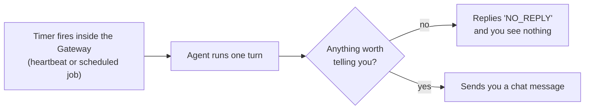

# OpenClaw

> An open-source personal assistant that you run on your own computer and talk to through the chat apps you already use. It is for people who are comfortable installing and looking after a small server program.

*Last checked: October 2026. These apps change fast; check the linked sources for the current state.*

## At a glance

| | |
|---|---|
| Made by | Started by Peter Steinberger and a community of contributors. Now looked after by the OpenClaw Foundation, a non-profit that employs the core team. Earlier names: Clawdbot, then Moltbot. |
| Open source? | Yes, MIT licence |
| Where it runs | A background program on your own machine or server (macOS, Linux, Windows). You reach it from phone chat apps, a web page, a terminal, and companion apps for desktop and phone. |
| Which models it can use | Many. Hosted providers (Anthropic, OpenAI, Google, OpenRouter and others) and models running on your own machine (for example through Ollama). |
| Written in | Mostly TypeScript, running on Node.js. The companion apps use Swift and Kotlin. |
| Links | [Official site](https://openclaw.ai) · [source code](https://github.com/openclaw/openclaw) · [docs](https://docs.openclaw.ai) |

## What it is for

Most agent apps wait in a terminal or an editor until you open them. OpenClaw is built to stay switched on. You install it on a computer that is always running, connect it to a chat app such as Telegram or WhatsApp, and then message it like you would message a person.

The jobs people give it are everyday errands: sort an inbox, check a calendar, look something up on the web, run a command on the home machine, remind me about something tomorrow. The answer comes back in the same chat.

A normal session is not really a "session" at all. You send a message from your phone. The always-on program wakes the agent, the agent works through the job with its tools, and a reply arrives in the chat. It can also wake itself on a timer and message you first.

## The parts

How this app fills each slot from [What an agent is made of](../anatomy.md). Where the makers have not published a detail, the table says "not published".

| Part | How this app does it | Layer |
|---|---|---|
| Brain (model) | You choose it. Models are written as `provider/model`. You set one main model and a list of backups to try if the main one fails (fallbacks). The docs advise using the strongest current model you can for any agent that has tools. | [6](../layers/06-running-the-model.md) |
| Job description (system prompt) | Built fresh by OpenClaw from several plain text files in the agent's working folder (workspace): `AGENTS.md` for instructions, `SOUL.md` for personality and limits, `IDENTITY.md`, `USER.md`, and `MEMORY.md` if it exists. Each file has a size cap, and the agent is told when a file was cut short. | [7](../layers/07-talking-to-it.md) |
| Reference books (knowledge) | Its own saved notes, searched with the `memory_search` tool. When set up, that search mixes meaning-based matching (vector search) with keyword matching. It also has web search and web page fetching tools. | [8](../layers/08-giving-it-knowledge.md) |
| Hands (tools) | Run commands (`exec`), read and change files (`read`, `write`, `edit`), search and fetch the web (`web_search`, `web_fetch`), drive a web browser (`browser`), send chat messages (`message`), schedule jobs (`cron`), start helper agents (`sessions_spawn`), and control paired devices (`nodes`). Add-ons can bring more. | [9](../layers/09-giving-it-hands.md) |
| Heartbeat (loop) | OpenClaw's own built-in loop. Each conversation gets its own waiting line (queue), so only one run at a time touches a conversation. A run ends when the model gives a plain answer, when it is cancelled, or when a time limit is hit. A maximum step count is not published. | [10](../layers/10-the-loop.md) |
| Notebook (context and memory) | The full conversation record is kept on disk in a local database. When the reading space fills up, older turns are replaced by a summary (compaction). Just before that, a silent turn reminds the agent to save anything important to its notes. Long-term notes are plain Markdown files: `MEMORY.md` and dated files in `memory/`. | 11 |
| Body (harness) | The Gateway: one long-running program that holds the chat app connections, the conversations, the tools, and the scheduler. Everything else (terminal, web page, phone apps) connects to it. | 13 |

## How one request flows

```mermaid
sequenceDiagram
  participant You as You (phone chat app)
  participant GW as Gateway (always-on program)
  participant Loop as Agent loop
  participant Model as Model
  participant Tools as Tools

  You->>GW: 'What is on my calendar tomorrow?'
  GW->>GW: Is this sender approved?<br/>If not, send a pairing code and stop
  GW->>Loop: Put the message in this conversation's queue
  Loop->>Loop: Build the reading space,<br/>workspace files + notes + chat so far
  Loop->>Model: Send everything
  Model-->>Loop: 'Run this tool'
  Loop->>Tools: Check tool rules, then run it
  Tools-->>Loop: Result
  Loop->>Model: Send everything again
  Model-->>Loop: Plain answer
  Loop->>GW: Save the turn
  GW->>You: Reply in the same chat
```

> **Why this matters:** the sender check happens before the model sees a single word. An unapproved stranger's message never becomes a turn. That gate is ordinary code, not the model's judgement, which is why it can be trusted more than any instruction in the prompt.

The same loop runs when nobody sent a message at all:



> **Why this matters:** an agent that can start its own turns is useful, and it is also an agent that acts while you are not watching. Every safety setting below matters more because of this.

## What makes it different

**1. It lives in your chat apps, not in a window you open (channels).** The Gateway connects to messaging services directly. Telegram and a built-in web chat ship with it. Many more, such as WhatsApp, Slack, Discord, Signal, iMessage and Microsoft Teams, are official add-ons. The makers chose this so the assistant is reachable wherever you already are.

**2. One always-on program owns everything (Gateway).** Chat connections, conversations, tools and the scheduler all sit in a single long-running process on your machine. The docs describe one Gateway per host. Your data, notes and passwords stay on hardware you control instead of on a company's server.

**3. It can wake itself up (heartbeat and scheduled jobs).** A heartbeat is a regular check-in turn in your main conversation. If there is nothing to report, the agent answers `NO_REPLY` and you see nothing. Scheduled jobs (cron) are separate: they are saved, survive restarts, and can run in a fresh conversation of their own. The aim is an assistant that brings things to you, not only one that answers.

**4. Its personality and memory are files you can open (workspace files).** There is no hidden database of "what it knows about you". The instructions, the persona and the long-term notes are Markdown files in one folder. You can read them, edit them, and put them under version control.

## Adding to it

- **Instruction files.** Edit `AGENTS.md`, `SOUL.md` and `USER.md` in the workspace to change how it behaves.
- **Saved routines (skills).** A skill is a folder with a `SKILL.md` file that teaches the agent how and when to do a task. Only a short list of skills goes into the prompt. The agent reads the full file when it needs it. Skills can live in the workspace, in your home folder, or come bundled. A public catalogue called ClawHub lets people share them.
- **Plug-ins.** Larger add-ons that can bring new chat apps, model providers, tools and skills. They load inside the Gateway program itself.
- **Add-on tools (MCP servers).** OpenClaw keeps a list of outside MCP servers and offers their tools to the agent. It can also do the reverse and act as an MCP server (`openclaw mcp serve`), so another agent app can read and answer your chats.
- **Helper agents (subagents).** The agent can start a background run in its own conversation with `sessions_spawn`. The helper reports back when it finishes.
- **Paired devices (nodes).** A phone or second computer can join the Gateway and offer its own abilities, such as a camera or screen.

## Staying safe

This is the part to read twice. OpenClaw's design is the risky combination: it is always on, it can hold access to your accounts and your machine, and it reads text written by other people. The project's own security docs say this plainly.

**What the project says about itself**

- It is built for one trusted owner per Gateway, or a team who all trust each other. The docs state it is not a security wall between people who do not trust each other.
- Hidden instructions inside content (prompt injection) are not a solved problem. The docs warn that even if you are the only person who can message the bot, anything it reads can carry hostile instructions: web pages, search results, emails, documents, attachments, pasted logs.
- The locked-down box for running tools (sandbox) is described as "not a perfect security boundary". It limits damage. It does not remove risk.

**What protects you by default**

- **Stranger check (pairing).** On chat apps that allow direct messages, an unknown sender gets a short code and their message is not processed until you approve it, for example with `openclaw pairing approve <channel> <code>`.
- **Local-only listening.** A normal install only accepts connections from the same machine (loopback). New devices must be approved before they can connect.

**What does not protect you by default**

- **The sandbox is off.** Unless you turn it on, tools in your main conversation run directly on your computer. When on, tool runs move into a container or a remote box. The Gateway itself always stays on the host.
- **Command approval is loose on the host.** The docs state that the Gateway and node hosts default to running commands without asking. Stricter modes exist: block all, allow only listed commands (allowlist), or ask every time.
- **Add-ons are code you are trusting.** The docs say to treat third-party skills as untrusted code and read them before enabling. Plug-ins run inside the Gateway, so a bad one has the Gateway's full access.

**What the docs tell you to do**

- Run `openclaw security audit` to find settings that have drifted from the safe defaults.
- Turn on the sandbox, and limit risky tools such as `exec`, `browser` and `web_fetch` to agents that really need them.
- Use the strongest current model for any agent that has tools. Weaker models are easier to trick.
- Use a separate agent with no tools to read and summarise untrusted content, then pass only the summary on.
- Read the exposure checklist in the docs before making the Gateway reachable from outside your machine.

A sensible beginner setup: a spare machine or a dedicated user account, the sandbox on, accounts with as little access as the job needs, and nothing you could not afford to lose.

## Words to know

| Word | Plain English |
|---|---|
| Gateway | The always-on program that holds the chat connections, conversations, tools and scheduler |
| Channel | One connected chat app, such as Telegram or WhatsApp |
| Workspace | The folder holding the agent's instruction files and notes |
| Fallback | A backup model tried when the main one fails |
| Queue | A waiting line, so runs in one conversation happen one at a time |
| Heartbeat | A regular self-started check-in turn |
| Cron | A scheduler that runs jobs at set times |
| Compaction | Replacing older turns with a summary to free up reading space |
| Vector search | Finding text by meaning instead of exact words |
| Skill | A folder with a `SKILL.md` file that teaches the agent a routine |
| Plug-in | A larger add-on loaded into the Gateway, able to add chat apps, models and tools |
| MCP server | A separate program that offers tools to an agent in a standard way |
| Subagent | A helper agent started by the main agent for a side job |
| Node | A paired phone or computer that lends its abilities to the Gateway |
| Pairing | An approval step before a new sender or device is allowed in |
| Allowlist | A list of the only senders or commands that are permitted |
| Loopback | A network address that only the same machine can reach |
| Sandbox | A locked-down box for running tools, so mistakes do less damage |
| Prompt injection | Instructions hidden in content the agent reads, written to hijack it |

## Sources

Every factual claim on the page should trace to one of these. Official docs and the source code first.

- [OpenClaw source code and README](https://github.com/openclaw/openclaw): what it is, makers, earlier names, platforms, default safety notes.
- [Licence file](https://github.com/openclaw/openclaw/blob/main/LICENSE): MIT, held by the OpenClaw Foundation.
- [Official site](https://openclaw.ai) and [OpenClaw Foundation](https://openclaw.org): who looks after the project.
- [Gateway architecture](https://docs.openclaw.ai/concepts/architecture): the Gateway, connections, device approval.
- [Chat channels](https://docs.openclaw.ai/channels) and [Pairing](https://docs.openclaw.ai/channels/pairing): supported chat apps, the stranger check.
- [Models](https://docs.openclaw.ai/concepts/models) and [Model providers](https://docs.openclaw.ai/concepts/model-providers): model choice and fallbacks.
- [Agent runtime](https://docs.openclaw.ai/concepts/agent), [Agent loop](https://docs.openclaw.ai/concepts/agent-loop) and [System prompt](https://docs.openclaw.ai/concepts/system-prompt): the loop, queues, workspace files.
- [Memory](https://docs.openclaw.ai/concepts/memory) and [Compaction](https://docs.openclaw.ai/concepts/compaction): notes files, memory tools, summarising.
- [Heartbeat](https://docs.openclaw.ai/gateway/heartbeat) and [Scheduled jobs](https://docs.openclaw.ai/automation/cron-jobs): self-started turns.
- [Tools](https://docs.openclaw.ai/tools), [Skills](https://docs.openclaw.ai/tools/skills), [Plug-ins](https://docs.openclaw.ai/tools/plugin), [MCP](https://docs.openclaw.ai/cli/mcp), [Sub-agents](https://docs.openclaw.ai/tools/subagents): built-in tools and ways to extend.
- [Security overview](https://docs.openclaw.ai/gateway/security), [Trust model](https://docs.openclaw.ai/gateway/security/trust-model), [Prompt injection](https://docs.openclaw.ai/gateway/security/prompt-injection), [Running the security audit](https://docs.openclaw.ai/gateway/security/running-the-audit): the project's own account of its risks.
- [Sandboxing](https://docs.openclaw.ai/gateway/sandboxing) and [Exec approvals](https://docs.openclaw.ai/tools/exec-approvals): the sandbox and command approval defaults.
