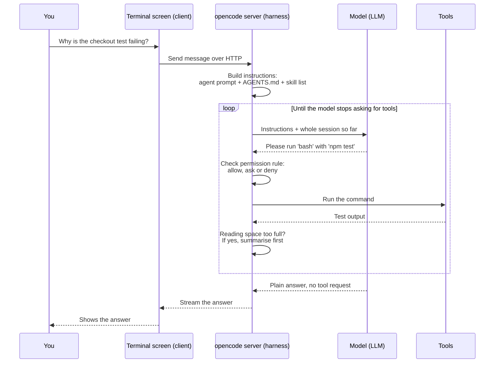
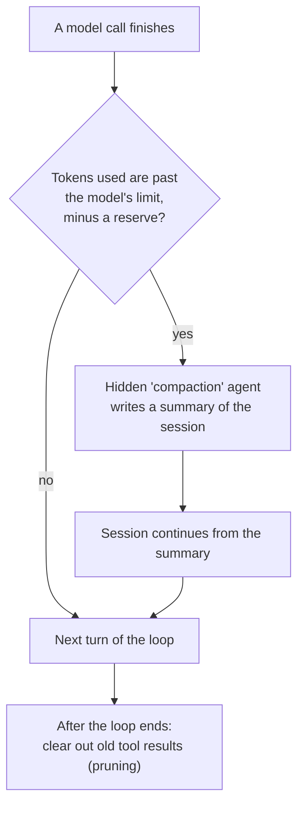

# opencode

> An open-source coding agent that runs in your terminal and can use models from many different companies. It is for developers who want to read, and change, the program that wraps the model.

*Last checked: October 2026. These apps change fast; check the linked sources for the current state.*

## At a glance

| | |
|---|---|
| Made by | Anomaly (GitHub organisation `anomalyco`). The repo used to live at `sst/opencode`; that address now forwards to `anomalyco/opencode`. |
| Open source? | Yes, MIT licence |
| Where it runs | Terminal (main), desktop app (beta), editor plug-in, web browser, or with no screen at all as a background server |
| Which models it can use | Many. Hosted models from many companies, plus models running on your own machine (for example through Ollama, LM Studio or llama.cpp) |
| Written in | Mostly TypeScript |
| Links | [Official site](https://opencode.ai/) · [source code](https://github.com/anomalyco/opencode) · [docs](https://opencode.ai/docs/) |

## What it is for

You open a terminal in your project folder and type `opencode`. A full-screen text app appears (TUI, terminal user interface). You type a job in plain English, such as "add a delete button to the notes page". The agent reads files, edits them, runs commands, and tells you what it did.

A normal session has two gears. You press Tab to switch between them. In **plan** the agent looks around and proposes an approach without changing anything unprompted. In **build** it does the work. If you dislike the result, `/undo` removes your last message, the replies after it, and the file changes that came with it.

The first time in a project you run `/init`. The agent studies the code and writes an `AGENTS.md` file, a page of standing notes about the project that it will read at the start of every later session.

## The parts

How this app fills each slot from [What an agent is made of](../anatomy.md). Where the makers have not published a detail, the table says "not published".

| Part | How this app does it | Layer |
|---|---|---|
| Brain (model) | You choose. opencode talks to models through a shared adapter library (AI SDK) and a public list of models (Models.dev). Keys are saved on your machine with `/connect`. A second, cheaper model (`small_model`) can handle small chores such as naming the session. The makers also sell optional model access (Zen and Go). | [6](../layers/06-running-the-model.md) |
| Job description (system prompt) | Built fresh on every turn of the loop from: the agent's own prompt, facts about your machine and folder, the list of saved routines (skills), your instruction files, and any instructions from add-on tool servers (MCP). Instruction files are `AGENTS.md` in the project (found by walking up the folders) and a global one in `~/.config/opencode/`. `CLAUDE.md` is read as a fallback. | [7](../layers/07-talking-to-it.md) |
| Reference books (knowledge) | No search index is built ahead of time. The agent looks things up when it needs them with `grep` (search inside files), `glob` (find files by name pattern), `read`, `webfetch` and `websearch`. It can also get error reports from the same code-checking helpers your editor uses (LSP servers). These are off by default. | [8](../layers/08-giving-it-knowledge.md) |
| Hands (tools) | Built in: `bash`, `read`, `edit`, `write`, `apply_patch`, `grep`, `glob`, `webfetch`, `websearch`, `todowrite` (a to-do list), `question` (ask you something), `skill` (load a saved routine), and an experimental `lsp` tool. You can add your own. | [9](../layers/09-giving-it-hands.md) |
| Heartbeat (loop) | A plain `while (true)` loop. It stops when the model's reply ends for any reason other than "I want a tool". There is no step limit unless you set `steps` on an agent. When the limit is hit, the model is told to answer in text only. | [10](../layers/10-the-loop.md) |
| Notebook (context and memory) | Each conversation is saved as a session you can reopen with `/sessions`. When the reading space fills up, a hidden helper agent writes a summary and the session carries on from that (compaction). Old tool results can also be cleared out (pruning). Notes that last across sessions are the `AGENTS.md` files. A separate long-term memory feature: not published. | 11 |
| Body (harness) | Split in two. A background program (server) runs the loop, tools and permission checks. The screen you type into (client) only talks to that server over HTTP. | 13 |

## How one request flows

> **Why this matters:** the screen is not the agent. The loop lives in the server, so any other screen (editor plug-in, web page, your own script) can drive the same agent by sending the same HTTP requests.

What happens when the reading space fills up:

> **Why this matters:** a summary is shorter than the real record, so some detail is lost each time. Anything the agent must never forget belongs in `AGENTS.md`, which is re-read on every turn, and not in the chat.

## What makes it different

**1. The screen and the engine are separate programs (client/server architecture).** Running `opencode` starts a server and a terminal screen that talks to it. `opencode serve` starts only the server. The server publishes a machine-readable description of every request it accepts (OpenAPI spec). The docs say the editor plug-ins drive it this way. The benefit is that one agent engine can sit behind many front ends.

**2. It is not tied to one model company (provider-agnostic).** The same tools, loop and permission rules work with any supported model. You can switch model without changing how you work. This also means quality varies: the makers offer a list of models they have tested (Zen) for that reason.

**3. Each "mode" is a named bundle of settings (an agent).** `build` and `plan` are both primary agents. Each is a prompt, a model choice and a set of permission rules. Helper agents (subagents) such as `general`, `explore` and `scout` are the same idea with a narrower job. You define your own in a Markdown file. Even the summariser that does compaction is an agent.

**4. Undo covers files, not only chat.** opencode takes a copy of your file state as it works (snapshot) and uses Git under the hood to roll changes back. `/undo` and `/redo` therefore need the project to be a Git repository.

## Adding to it

| You want to | Use | Where it lives |
|---|---|---|
| Give standing rules | Instruction files | `AGENTS.md` in the project, or `~/.config/opencode/AGENTS.md`. Extra files or web addresses can be listed under `instructions` in `opencode.json` |
| Connect outside services | Add-on tool servers (MCP servers) | `mcp` section of `opencode.json`. Local (a command to run) or remote (a web address) |
| Save a prompt you reuse | Custom commands | Markdown files in `.opencode/commands/`. Run as `/name`. `$ARGUMENTS` is replaced with what you type after it |
| Save a how-to the agent loads only when needed | Saved routines (skills) | `.opencode/skills/<name>/SKILL.md`. Also reads `.claude/skills/` and `.agents/skills/` |
| Add a specialist | Custom agents and helper agents (subagents) | Markdown files in `.opencode/agents/`, or the `agent` section of `opencode.json` |
| Add your own tool, or react to events | Plug-ins and custom tools | JavaScript or TypeScript files in `.opencode/plugins/`, or packages listed in the config |

Plug-ins can run code at set moments (hooks), for example before a tool runs (`tool.execute.before`) or after a session is compacted.

The MCP docs carry a warning worth repeating: every connected server adds its tool descriptions to the reading space, so a large one can use up the room before you type anything.

## Staying safe

Every tool request is checked against a rule with one of three answers: `allow` (run it), `ask` (stop and ask you), or `deny` (refuse). When asked, you answer once, always (for the rest of this session), or reject.

The defaults are permissive. Per the docs, most permissions start as `allow`. That includes editing files and running shell commands in the `build` agent. Three things are stricter out of the box:

- Reading `.env` files (where secret keys are often kept) is denied.
- Touching paths outside the project folder asks first (`external_directory`).
- Repeating the same tool call with the same input three times asks first (`doom_loop`).

You tighten this in `opencode.json`, per tool and per pattern. For example you can allow `git status` but ask for everything else in `bash`. Each agent can have its own rules, which is how `plan` is restricted: file edits and shell commands need your approval there.

A locked-down box for running commands (sandbox): the permission docs do not describe one. Commands run as you, on your machine. The permission rules are the safety layer, so read them before using `build` on anything you care about. The server listens only on your own machine by default and can be given a password.

## Words to know

| Word | Plain English |
|---|---|
| TUI (terminal user interface) | A full-screen app drawn with text inside the terminal |
| Provider | A company or program that serves a model, such as a cloud service or a local model runner |
| Provider-agnostic | Works with many providers, not tied to one |
| AI SDK / Models.dev | The adapter library and the public model list opencode uses to talk to providers |
| Client / server | Two programs: one shows the screen (client), one does the work (server) |
| HTTP | The request-and-reply language web browsers and servers use |
| OpenAPI spec | A machine-readable list of every request a server accepts |
| AGENTS.md | A plain text file of standing project notes the agent reads every turn |
| Session | One saved conversation with the agent |
| Token | A chunk of text, roughly a short word. Models count their reading space in tokens |
| Compaction | Replacing a long conversation with a summary to free up reading space |
| Pruning | Clearing out old tool results while keeping the rest of the conversation |
| Primary agent / subagent | A bundle of prompt, model and permissions. Primary ones you talk to. Subagents are helpers a primary agent hands work to |
| MCP (Model Context Protocol) server | An add-on program that offers extra tools to the agent in a standard way |
| Skill | A saved how-to file the agent loads only when the job needs it |
| Custom command | A saved prompt you run by typing `/name` |
| Plug-in / hook | Your own code (plug-in) that runs at a set moment in the agent's work (hook) |
| LSP (Language Server Protocol) server | The helper program editors use to find errors in code |
| grep / glob | Search inside files / find files by name pattern |
| Snapshot | A saved copy of the state of your files, used for undo |
| Git repository | A project folder whose change history is tracked by the Git tool |
| Sandbox | A locked-down box that limits what a running command can touch |
| Permission rule | A setting that says allow, ask or deny for a tool request |

## Sources

Official docs:

- [Intro](https://opencode.ai/docs/): what it is, install, `/init`, plan and build, undo, share
- [TUI](https://opencode.ai/docs/tui/): slash commands, undo needs Git
- [Providers](https://opencode.ai/docs/providers/): AI SDK, Models.dev, local models, `/connect`, Zen and Go
- [Tools](https://opencode.ai/docs/tools/): built-in tool list
- [Agents](https://opencode.ai/docs/agents/): build, plan, subagents, hidden agents, `steps`
- [Rules](https://opencode.ai/docs/rules/): `AGENTS.md`, lookup order, `CLAUDE.md` fallback
- [Config](https://opencode.ai/docs/config/): compaction, snapshot, `small_model`, server settings
- [Permissions](https://opencode.ai/docs/permissions/): allow, ask, deny and the defaults
- [Server](https://opencode.ai/docs/server/): client and server split, OpenAPI spec, password
- [MCP servers](https://opencode.ai/docs/mcp-servers/), [Plugins](https://opencode.ai/docs/plugins/), [Agent skills](https://opencode.ai/docs/skills/), [Commands](https://opencode.ai/docs/commands/), [Custom tools](https://opencode.ai/docs/custom-tools/)
- [LSP servers](https://opencode.ai/docs/lsp/), [IDE](https://opencode.ai/docs/ide/), [Web](https://opencode.ai/docs/web/)

Source code:

- [anomalyco/opencode](https://github.com/anomalyco/opencode): README (install, desktop app, agents), language breakdown
- [LICENSE](https://github.com/anomalyco/opencode/blob/dev/LICENSE): MIT
- [session/prompt.ts](https://github.com/anomalyco/opencode/blob/dev/packages/opencode/src/session/prompt.ts): the loop, stop condition, step limit, system prompt assembly
- [session/compaction.ts](https://github.com/anomalyco/opencode/blob/dev/packages/opencode/src/session/compaction.ts): overflow check, summary, pruning
