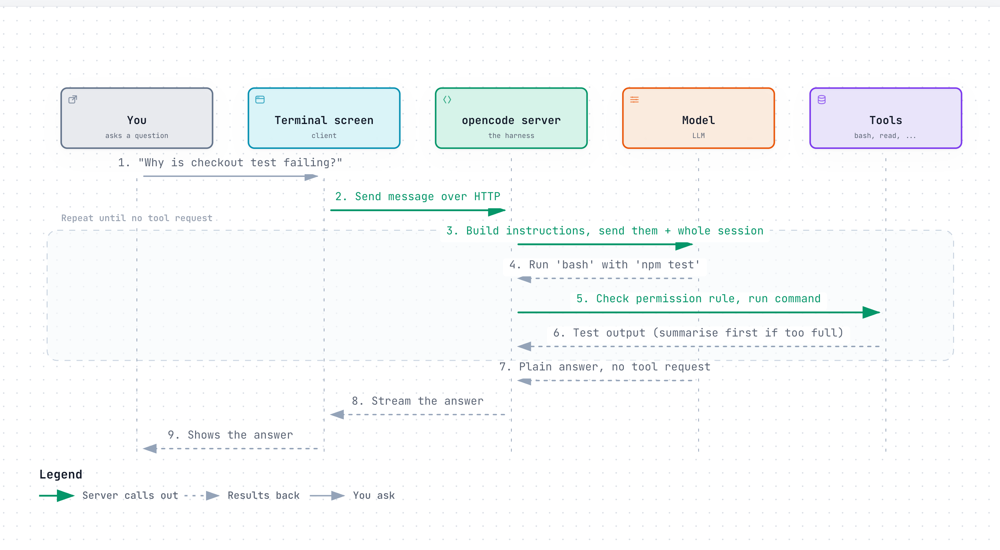
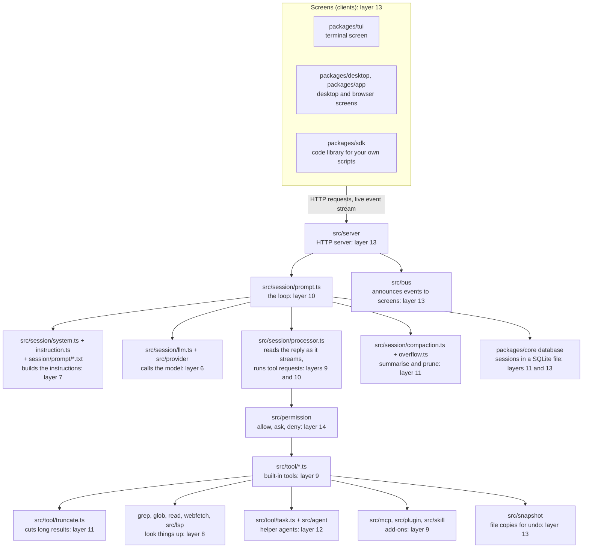
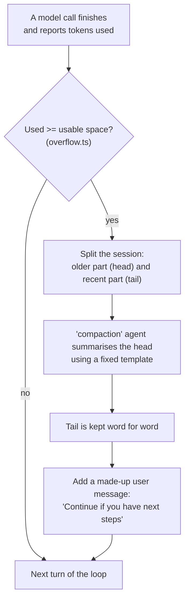

# opencode

> An open-source coding agent that runs in your terminal and can use models from many different companies. It is for developers who want to read, and change, the program that wraps the model.

*Last checked: October 2026. These apps change fast; check the linked sources for the current state.*

## At a glance

| | |
|---|---|
| Made by | Anomaly (GitHub organisation `anomalyco`). The repo used to live at `sst/opencode`; that address now forwards to `anomalyco/opencode`. |
| Open source? | Yes, MIT licence |
| Where it runs | Terminal (main), desktop app (beta), editor plug-in, web browser, or with no screen at all as a background server |
| Which models it can use | Many. Hosted models from many companies, plus models running on your own machine (for example through Ollama, LM Studio or llama.cpp) |
| Written in | Mostly TypeScript |
| Links | [Official site](https://opencode.ai/) · [source code](https://github.com/anomalyco/opencode) · [docs](https://opencode.ai/docs/) |

## What it is for

You open a terminal in your project folder and type `opencode`. A full-screen text app appears (TUI, terminal user interface). You type a job in plain English, such as "add a delete button to the notes page". The agent reads files, edits them, runs commands, and tells you what it did.

A normal session has two gears. You press Tab to switch between them. In **plan** the agent looks around and proposes an approach without changing anything unprompted. In **build** it does the work. If you dislike the result, `/undo` removes your last message, the replies after it, and the file changes that came with it.

The first time in a project you run `/init`. The agent studies the code and writes an `AGENTS.md` file, a page of standing notes about the project that it will read at the start of every later session.

## The parts

How this app fills each slot from [What an agent is made of](../anatomy.md). Where the makers have not published a detail, the table says "not published".

| Part | How this app does it | Layer |
|---|---|---|
| Brain (model) | You choose. opencode talks to models through a shared adapter library (AI SDK) and a public list of models (Models.dev). Keys are saved on your machine with `/connect`. A second, cheaper model (`small_model`) can handle small chores such as naming the session. The makers also sell optional model access (Zen and Go). | [6](../layers/06-running-the-model.md) |
| Job description (system prompt) | Built fresh on every turn of the loop from: the agent's own prompt, facts about your machine and folder, the list of saved routines (skills), your instruction files, and any instructions from add-on tool servers (MCP). Instruction files are `AGENTS.md` in the project (found by walking up the folders) and a global one in `~/.config/opencode/`. `CLAUDE.md` is read as a fallback. | [7](../layers/07-talking-to-it.md) |
| Reference books (knowledge) | No search index is built ahead of time. The agent looks things up when it needs them with `grep` (search inside files), `glob` (find files by name pattern), `read`, `webfetch` and `websearch`. It can also get error reports from the same code-checking helpers your editor uses (LSP servers). These are off by default. | [8](../layers/08-giving-it-knowledge.md) |
| Hands (tools) | Built in: `bash`, `read`, `edit`, `write`, `apply_patch`, `grep`, `glob`, `webfetch`, `websearch`, `todowrite` (a to-do list), `question` (ask you something), `skill` (load a saved routine), and an experimental `lsp` tool. You can add your own. | [9](../layers/09-giving-it-hands.md) |
| Heartbeat (loop) | A plain `while (true)` loop. It stops when the model's reply ends for any reason other than "I want a tool". There is no step limit unless you set `steps` on an agent. When the limit is hit, the model is told to answer in text only. | [10](../layers/10-the-loop.md) |
| Notebook (context and memory) | Each conversation is saved as a session you can reopen with `/sessions`. When the reading space fills up, a hidden helper agent writes a summary and the session carries on from that (compaction). Old tool results can also be cleared out (pruning) if you switch that on. Notes that last across sessions are the `AGENTS.md` files. A separate long-term memory feature: not published. | 11 |
| Body (harness) | Split in two. A background program (server) runs the loop, tools and permission checks. The screen you type into (client) only talks to that server over HTTP. | 13 |

## How one request flows

<a href="https://alwintwk.github.io/how-ai-agents-work/diagrams/apps-opencode-request.html">
  <picture>
    <source media="(prefers-color-scheme: dark)" srcset="../diagrams/apps-opencode-request.dark.png">
    
  </picture>
</a>

Click the diagram for the interactive version (zoom, dark mode, trace a path).

> **Why this matters:** the screen is not the agent. The loop lives in the server, so any other screen (editor plug-in, web page, your own script) can drive the same agent by sending the same HTTP requests.

## Component map

The names below are real folders and files in the source. Paths starting with `src/` are inside `packages/opencode/`.

> **Why this matters:** layers 6 to 14 are all here, and each is a separate folder you can open and read. The model call (layer 6) is one box among many. The rest is ordinary TypeScript.

## Deep dive, part by part

### How the instructions are put together (prompt assembly)

The instructions are rebuilt on every turn of the loop, not once per session. The joining order is in [`session/llm/request.ts`][request] and [`session/prompt.ts`][prompt]:

1. **The agent's own prompt.** If the agent has none, a default prompt chosen by model name. There is one text file per model family in [`session/prompt/`][prompts], picked by [`system.ts`][system].
2. **An environment block.** Model name, working folder, whether it is a Git repository, operating system, today's date.
3. **Instruction files.** Each is prefixed with `Instructions from: <path>`. [`instruction.ts`][instruction] walks up from the current folder and takes the first `AGENTS.md` (or `CLAUDE.md`) it finds, then the global one, then any files or web addresses listed in the config.
4. **Instructions sent by add-on tool servers** (MCP), wrapped in `<mcp_instructions>` tags.
5. **The list of saved routines** (skills): name and description only, not the full text.
6. **Any extra instruction attached to your message.**

All parts are joined with line breaks. A plug-in can then rewrite the result (hook `experimental.chat.system.transform`).

There is a second, quieter path. When the `read` tool opens a file, `instruction.ts` also walks up from that file and attaches any `AGENTS.md` it passes, once per message. So a sub-folder can carry its own rules that only load when the agent goes there.

**Design choice:** one prompt file per model family, because models respond differently to the same wording. **Cost:** every prompt file must be maintained and tested separately, and a model with no matching file gets a generic one.

### The tools and how a tool request is carried out (tool execution)

Every tool has the same four fields, defined in [`tool/tool.ts`][tool]: an `id`, a `description` (kept in a `.txt` file beside the code), `parameters` (the allowed inputs, as a checkable shape called a schema), and an `execute` function. Every tool returns the same shape: a `title`, an `output` string for the model, `metadata` for the screen, and optional file attachments.

What happens when the model asks for a tool ([`session/tools.ts`][tools], [`session/llm.ts`][llm]):

1. **Name repair.** If the model wrote the name in the wrong letter case, it is lower-cased. If the tool still does not exist, the request is rerouted to a tool called `invalid`, whose only job is to send the error text back to the model.
2. **Input check.** The inputs are checked against the schema. A failure returns "called with invalid arguments ... rewrite the input" as the tool result. The loop does not crash.
3. **Plug-in hook** `tool.execute.before`.
4. **Permission.** The tool calls `ask`, which looks up the rule. For `bash`, [`tool/shell.ts`][shell] first breaks the command into its separate commands with a code parser (tree-sitter) so each one is matched against the rules.
5. **Run.** Shell commands have a default time limit and the model may ask for a longer one.
6. **Truncate.** [`tool/truncate.ts`][truncate] cuts the output at a line limit or a size limit, whichever comes first (2000 lines or 50 KB when checked, changeable with `tool_output` in the config). The full output is saved to a file. The model gets the cut version plus a note saying where the full file is and to search it with `grep`.
7. **Plug-in hook** `tool.execute.after`, then the result is saved as part of the session.

The `edit` tool takes `oldString` and `newString`. [`tool/edit.ts`][edit] tries an exact match first, then a chain of looser matchers (ignoring trailing spaces, indentation, escape characters and so on). It refuses if there is more than one match, or if the loose match is much larger than what the model asked to replace.

**Design choice:** errors go back to the model as text so it can correct itself. **Cost:** a weak model can burn many turns retrying. Loose edit matching rescues near-misses but can hit the wrong place, which is why the size guard exists.

### The loop and when it stops

The loop is `while (true)` in [`session/prompt.ts`][prompt]. Each turn, in order:

1. Load the session's messages from the database, starting from the latest summary.
2. **Stop check.** Exit if the last reply's finish reason is anything other than `tool-calls` or `unknown`, and it holds no unanswered tool requests, and it answers your latest message.
3. If a helper-agent job is waiting, run it and start the next turn.
4. If a compaction job is waiting, run it and start the next turn.
5. If the last reply's token count is over the limit, queue a compaction and start the next turn.
6. Build tools and instructions, call the model, and hand the reply to [`processor.ts`][processor] as it streams in.

Other ways out:

- The processor returns `stop`: you rejected a permission prompt, or the reply ended in an error.
- The model company blocked the reply (finish reason `content-filter`). This is shown as an error.
- A fixed answer shape was requested (structured output) and has been captured.
- **Step limit.** `agent.steps` is unlimited by default. When set and reached, the loop adds a message telling the model tools are disabled and it must reply in text ([`max-steps.ts`][maxsteps]).

Two guards sit inside the turn. If the last three tool requests are the same tool with the same input, the processor raises the `doom_loop` permission, which asks you by default. Failed model calls that look temporary are retried with growing waits ([`retry.ts`][retry]).

A source comment in the stop check reads: "Some providers return 'stop' even when the assistant message contains tool calls." That is why the check looks at the tool requests too, not only the finish reason.

**Design choice:** state lives in the database and is re-read each turn, so a crash or a second screen sees the same truth. **Cost:** with no default step limit, the only brakes are the repeat guard and you.

### Managing the reading space (context management)

> **Why this matters:** the summary replaces the real record. Whatever the summariser leaves out is gone for the rest of the session.

Step by step ([`overflow.ts`][overflow], [`session/compaction.ts`][compaction], [`core/session/compaction.ts`][corecompaction]):

1. **Measure.** opencode does not count tokens itself for this check. It uses the count the model company sent back with the last reply.
2. **Compare.** Usable space is the model's input limit minus a reserve (`compaction.reserved` in the config, or a default buffer). If the count is at or over that, compact.
3. **Split.** A small budget of the most recent messages (the tail) is kept as is. Everything older (the head) will be summarised.
4. **Summarise.** The head is turned into text, with each tool result cut short. The hidden `compaction` agent fills in a fixed template with the headings Objective, Important Details, Work State, Next Move and Relevant Files.
5. **Merge.** If an older summary exists, the model is told to combine them. The prompt says plainly: "anything you do not carry into the new summary is lost."
6. **Carry on.** After an automatic compaction the loop adds a made-up user message asking the model to continue, or replays your last message if the request itself was too big.

Separately, **pruning** clears the text of old tool results while leaving the rest of the message. It is off unless you set `compaction.prune`. It protects the last two user turns, a recent slice of tool output, and anything loaded by the `skill` tool.

**Design choice:** a fixed template keeps summaries consistent and keeps file paths and error text. **Cost:** a summary costs an extra model call, and detail outside the template headings is dropped.

### Notes that outlive a session (memory)

opencode has no automatic long-term memory. Nothing in the source writes notes about you between sessions. What lasts:

- **`AGENTS.md`**, written by `/init` or by hand. It is the only thing a new session knows about past work.
- **Saved sessions.** Each conversation is stored and can be reopened, but a new session does not read old ones.
- **A to-do list** (`todowrite`), which lives inside one session.

**Design choice:** memory is a plain file you can read, edit and commit. **Cost:** nothing is learned unless a person or the agent writes it into that file.

### The wrapper program (harness): processes, storage, screens

- **Processes.** Running `opencode` starts a server and a terminal screen. The screen ([`packages/tui`][packages]) sends HTTP requests and listens to a stream of events. Desktop, web and editor screens do the same.
- **Storage.** Sessions, messages and message parts are rows in one SQLite database file in opencode's data folder ([`database.ts`][database]). Full copies of truncated tool results sit in a separate folder and are deleted after a few days.
- **Undo.** [`snapshot/index.ts`][snapshot] keeps a second, hidden Git history in opencode's data folder, pointed at your project files. Your own Git history is not touched.
- **Helper agents.** [`tool/task.ts`][task] starts a child session with its own reading space and a narrower set of permissions. Only the child's final answer returns to the parent.
- **Code style.** The source is built on a library called Effect, which wires parts together as named services.

**Design choice:** the server is the product and screens are thin. **Cost:** more moving parts than a single program, and Effect code is harder for a newcomer to read than a plain loop.

## Problems it faces

| Problem | Why it happens (which layer) | What this app does about it | What is still unsolved |
|---|---|---|---|
| Compaction that never ends | Loop (10) and context (11). If the summary does not shrink the session enough, the overflow check fires again next turn | Checks for overflow only on replies that are not themselves summaries | Open reports of endless compaction: [#27924][i27924], [#15533][i15533]. Earlier report: [#30680][i30680] |
| Detail lost after summarising | Context (11). A summary is shorter than the record | Fixed template, keeps a recent tail, merge instructions | Users report quality dropping over long sessions: [#30811][i30811] |
| No locked-down box for commands | Safety (14). Commands run as you | Permission rules, an ask-first rule for paths outside the project | Sandbox request still open: [#2242][i2242] |
| Models behave differently | Model (6) and tools (9). One harness, many models | One prompt file per model family, tool name repair, the `invalid` tool, the stop-check workaround | Model-specific bugs keep arriving, for example [#26220][i26220] and [#23517][i23517] |
| Edits land wrong or fail | Tools (9). The model must reproduce text exactly | Fallback matchers, refusal on multiple or oversized matches | Edge cases such as file encodings: [#49600][i49600] |
| Add-on tools fill the reading space | Tools (9) and context (11). Every tool description is sent every turn | The docs warn you; tools can be turned off per agent | No automatic trimming of tool descriptions: not published |
| The harness itself uses a lot of memory | Harness (13). A long-running server holding sessions | The makers ran a public "Memory Megathread": [#20695][i20695] | Closed, but see also [#12687][i12687] |
| Rules for helper agents are hard to get right | Helper agents (12) and safety (14) | Child permissions are derived from the parent | Past report of children being over-restricted: [#26700][i26700] |
| Hostile text in files or web pages steering the agent (prompt injection) | Tools (9) and safety (14) | A specific defence: not published | Not published |

**Compaction loops.** This is the clearest example of two layers colliding. The loop says "if over the limit, summarise and go again". The summariser says "here is a shorter version". If the shorter version is still over the limit, nothing in between says "give up". Issue [#27924][i27924] describes exactly this and notes that it keeps spending money while making no progress. Issue [#15533][i15533] describes a related case: the made-up "continue" message restarts an agent that had already finished.

**Lost detail.** The makers' own summary prompt admits the trade: what is not carried forward is lost. The fixed template and the kept tail reduce the damage. They cannot remove it. The practical answer is the one from the memory section: put durable facts in `AGENTS.md`.

**No sandbox.** The default rule in [`agent/agent.ts`][agent] is `"*": "allow"`. Permission rules decide whether a command starts. They do not limit what a started command can do. Until something like [#2242][i2242] lands, the safe options are stricter rules or running opencode inside a container you set up yourself.

## If you were building your own

**Worth copying:**

- **Send tool errors back as text.** Bad tool name, bad inputs and failed commands all become a result the model reads. The loop never crashes on a model mistake.
- **Save the full output, show a cut version.** The model gets a short result plus a file path it can search. Nothing is lost and the reading space stays small.
- **One shape for every tool.** `id`, `description`, `parameters`, `execute`. Built-in tools, add-on tools and plug-in tools all pass through the same permission check and truncation.
- **Agents as data.** A mode, a helper and the summariser are each a prompt plus permission rules. New behaviour needs a new file, not new code.
- **Keep state in a database and re-read it each turn.** Any screen can attach, and a restart loses nothing.

**Think twice:**

- **No default step limit.** It suits long jobs. It also means a confused loop runs until a guard or a person stops it. Set a limit in your own agent.
- **Auto-continue after summarising.** It keeps long jobs moving. It also caused the loop bugs above. If you copy it, add a counter that stops after a failed attempt.
- **Allow by default.** Fewer prompts feel smoother. With no sandbox underneath, the first safety net is the user reading the config docs.
- **Supporting every model.** Each model family needs its own prompt and its own workarounds. That is ongoing work a small project may not afford.

## What makes it different

**1. The screen and the engine are separate programs (client/server architecture).** Running `opencode` starts a server and a terminal screen that talks to it. `opencode serve` starts only the server. The server publishes a machine-readable description of every request it accepts (OpenAPI spec). The docs say the editor plug-ins drive it this way. The benefit is that one agent engine can sit behind many front ends.

**2. It is not tied to one model company (provider-agnostic).** The same tools, loop and permission rules work with any supported model. You can switch model without changing how you work. This also means quality varies: the makers offer a list of models they have tested (Zen) for that reason.

**3. Each "mode" is a named bundle of settings (an agent).** `build` and `plan` are both primary agents. Each is a prompt, a model choice and a set of permission rules. Helper agents (subagents) such as `general`, `explore` and `scout` are the same idea with a narrower job. You define your own in a Markdown file. Even the summariser that does compaction is an agent.

**4. Undo covers files, not only chat.** opencode takes a copy of your file state as it works (snapshot) and uses Git under the hood to roll changes back. `/undo` and `/redo` therefore need the project to be a Git repository.

## Adding to it

| You want to | Use | Where it lives |
|---|---|---|
| Give standing rules | Instruction files | `AGENTS.md` in the project, or `~/.config/opencode/AGENTS.md`. Extra files or web addresses can be listed under `instructions` in `opencode.json` |
| Connect outside services | Add-on tool servers (MCP servers) | `mcp` section of `opencode.json`. Local (a command to run) or remote (a web address) |
| Save a prompt you reuse | Custom commands | Markdown files in `.opencode/commands/`. Run as `/name`. `$ARGUMENTS` is replaced with what you type after it |
| Save a how-to the agent loads only when needed | Saved routines (skills) | `.opencode/skills/<name>/SKILL.md`. Also reads `.claude/skills/` and `.agents/skills/` |
| Add a specialist | Custom agents and helper agents (subagents) | Markdown files in `.opencode/agents/`, or the `agent` section of `opencode.json` |
| Add your own tool, or react to events | Plug-ins and custom tools | JavaScript or TypeScript files in `.opencode/plugins/`, or packages listed in the config |

Plug-ins can run code at set moments (hooks), for example before a tool runs (`tool.execute.before`) or after a session is compacted.

The MCP docs carry a warning worth repeating: every connected server adds its tool descriptions to the reading space, so a large one can use up the room before you type anything.

## Staying safe

Every tool request is checked against a rule with one of three answers: `allow` (run it), `ask` (stop and ask you), or `deny` (refuse). When asked, you answer once, always (for the rest of this session), or reject.

The defaults are permissive. Per the docs, most permissions start as `allow`. That includes editing files and running shell commands in the `build` agent. Three things are stricter out of the box:

- Reading `.env` files (where secret keys are often kept) is restricted. The docs say denied. The source code, when checked, sets it to ask first. An earlier complaint that the block was too strict is in [#4969][i4969].
- Touching paths outside the project folder asks first (`external_directory`).
- Repeating the same tool call with the same input three times asks first (`doom_loop`).

You tighten this in `opencode.json`, per tool and per pattern. For example you can allow `git status` but ask for everything else in `bash`. Each agent can have its own rules, which is how `plan` is restricted. The source sets file edits to `deny` for `plan`, except for its own plan notes. (The agents docs page describes this as ask-first, so check the current behaviour yourself.)

A locked-down box for running commands (sandbox): the permission docs do not describe one. Commands run as you, on your machine. The permission rules are the safety layer, so read them before using `build` on anything you care about. The server listens only on your own machine by default and can be given a password.

## Words to know

| Word | Plain English |
|---|---|
| TUI (terminal user interface) | A full-screen app drawn with text inside the terminal |
| Provider | A company or program that serves a model, such as a cloud service or a local model runner |
| Provider-agnostic | Works with many providers, not tied to one |
| AI SDK / Models.dev | The adapter library and the public model list opencode uses to talk to providers |
| Client / server | Two programs: one shows the screen (client), one does the work (server) |
| HTTP | The request-and-reply language web browsers and servers use |
| OpenAPI spec | A machine-readable list of every request a server accepts |
| AGENTS.md | A plain text file of standing project notes the agent reads every turn |
| Session | One saved conversation with the agent |
| Token | A chunk of text, roughly a short word. Models count their reading space in tokens |
| Compaction | Replacing a long conversation with a summary to free up reading space |
| Pruning | Clearing out old tool results while keeping the rest of the conversation |
| Primary agent / subagent | A bundle of prompt, model and permissions. Primary ones you talk to. Subagents are helpers a primary agent hands work to |
| MCP (Model Context Protocol) server | An add-on program that offers extra tools to the agent in a standard way |
| Skill | A saved how-to file the agent loads only when the job needs it |
| Custom command | A saved prompt you run by typing `/name` |
| Plug-in / hook | Your own code (plug-in) that runs at a set moment in the agent's work (hook) |
| LSP (Language Server Protocol) server | The helper program editors use to find errors in code |
| grep / glob | Search inside files / find files by name pattern |
| Snapshot | A saved copy of the state of your files, used for undo |
| Git repository | A project folder whose change history is tracked by the Git tool |
| Sandbox | A locked-down box that limits what a running command can touch |
| Permission rule | A setting that says allow, ask or deny for a tool request |
| Prompt assembly | Joining all the instruction pieces into the one text the model reads first |
| Schema | A checkable description of what inputs are allowed |
| Tool execution | The steps the harness takes to carry out a tool request |
| Truncate | Cut a long text short and say that it was cut |
| Finish reason | The label a model attaches to a reply saying why it stopped, such as "wants a tool" or "done" |
| Structured output | A reply forced into a fixed shape, such as a form with set fields |
| Content filter | A model company's block on a reply it will not give |
| Context management | Deciding what stays in the model's limited reading space |
| Head / tail | In compaction: the older part that gets summarised, and the recent part kept as is |
| tree-sitter | A code parser. Here it splits a shell line into its separate commands |
| SQLite | A small database stored in a single file |
| SDK (software development kit) | A ready-made code library for talking to a program |
| Event stream | A connection the server keeps open to push updates to a screen |
| Effect | A TypeScript library for structuring a program as named services |
| Container | A separate, walled-off environment for running programs |
| Prompt injection | Text inside a file or web page written to trick the agent into following it |
| Retry | Try a failed call again after a wait |

## Sources

Official docs:

- [Intro](https://opencode.ai/docs/): what it is, install, `/init`, plan and build, undo, share
- [TUI](https://opencode.ai/docs/tui/): slash commands, undo needs Git
- [Providers](https://opencode.ai/docs/providers/): AI SDK, Models.dev, local models, `/connect`, Zen and Go
- [Tools](https://opencode.ai/docs/tools/): built-in tool list
- [Agents](https://opencode.ai/docs/agents/): build, plan, subagents, hidden agents, `steps`
- [Rules](https://opencode.ai/docs/rules/): `AGENTS.md`, lookup order, `CLAUDE.md` fallback
- [Config](https://opencode.ai/docs/config/): compaction, snapshot, `small_model`, server settings
- [Permissions](https://opencode.ai/docs/permissions/): allow, ask, deny and the defaults
- [Server](https://opencode.ai/docs/server/): client and server split, OpenAPI spec, password
- [MCP servers](https://opencode.ai/docs/mcp-servers/), [Plugins](https://opencode.ai/docs/plugins/), [Agent skills](https://opencode.ai/docs/skills/), [Commands](https://opencode.ai/docs/commands/), [Custom tools](https://opencode.ai/docs/custom-tools/)
- [LSP servers](https://opencode.ai/docs/lsp/), [IDE](https://opencode.ai/docs/ide/), [Web](https://opencode.ai/docs/web/)

Source code:

- [anomalyco/opencode](https://github.com/anomalyco/opencode): README (install, desktop app, agents), language breakdown
- [LICENSE](https://github.com/anomalyco/opencode/blob/dev/LICENSE): MIT
- [session/prompt.ts](https://github.com/anomalyco/opencode/blob/dev/packages/opencode/src/session/prompt.ts): the loop, stop condition, step limit, system prompt assembly
- [session/compaction.ts](https://github.com/anomalyco/opencode/blob/dev/packages/opencode/src/session/compaction.ts): overflow check, summary, pruning
- Also read for the deep dive: [request.ts][request] and [system.ts][system] (prompt order), [prompt files][prompts], [instruction.ts][instruction], [tool.ts][tool], [tools.ts][tools], [llm.ts][llm], [shell.ts][shell], [truncate.ts][truncate], [edit.ts][edit], [task.ts][task], [processor.ts][processor], [retry.ts][retry], [max-steps.ts][maxsteps], [overflow.ts][overflow], [core compaction.ts][corecompaction] (summary template), [agent.ts][agent] (default permissions), [snapshot][snapshot], [database.ts][database], [packages folder][packages]

Issue tracker (evidence for "Problems it faces"):

- Compaction loops: [#27924][i27924], [#15533][i15533], [#30680][i30680]
- Lost detail over long sessions: [#30811][i30811]
- Sandbox request: [#2242][i2242]
- Model differences: [#26220][i26220], [#23517][i23517]
- Edit and file encoding: [#49600][i49600]
- Memory use: [#20695][i20695], [#12687][i12687]
- Permissions: [#26700][i26700], [#4969][i4969]

[prompt]: https://github.com/anomalyco/opencode/blob/dev/packages/opencode/src/session/prompt.ts
[compaction]: https://github.com/anomalyco/opencode/blob/dev/packages/opencode/src/session/compaction.ts
[request]: https://github.com/anomalyco/opencode/blob/dev/packages/opencode/src/session/llm/request.ts
[system]: https://github.com/anomalyco/opencode/blob/dev/packages/opencode/src/session/system.ts
[prompts]: https://github.com/anomalyco/opencode/tree/dev/packages/opencode/src/session/prompt
[instruction]: https://github.com/anomalyco/opencode/blob/dev/packages/opencode/src/session/instruction.ts
[processor]: https://github.com/anomalyco/opencode/blob/dev/packages/opencode/src/session/processor.ts
[overflow]: https://github.com/anomalyco/opencode/blob/dev/packages/opencode/src/session/overflow.ts
[llm]: https://github.com/anomalyco/opencode/blob/dev/packages/opencode/src/session/llm.ts
[tools]: https://github.com/anomalyco/opencode/blob/dev/packages/opencode/src/session/tools.ts
[retry]: https://github.com/anomalyco/opencode/blob/dev/packages/opencode/src/session/retry.ts
[tool]: https://github.com/anomalyco/opencode/blob/dev/packages/opencode/src/tool/tool.ts
[truncate]: https://github.com/anomalyco/opencode/blob/dev/packages/opencode/src/tool/truncate.ts
[edit]: https://github.com/anomalyco/opencode/blob/dev/packages/opencode/src/tool/edit.ts
[shell]: https://github.com/anomalyco/opencode/blob/dev/packages/opencode/src/tool/shell.ts
[task]: https://github.com/anomalyco/opencode/blob/dev/packages/opencode/src/tool/task.ts
[agent]: https://github.com/anomalyco/opencode/blob/dev/packages/opencode/src/agent/agent.ts
[snapshot]: https://github.com/anomalyco/opencode/blob/dev/packages/opencode/src/snapshot/index.ts
[corecompaction]: https://github.com/anomalyco/opencode/blob/dev/packages/core/src/session/compaction.ts
[database]: https://github.com/anomalyco/opencode/blob/dev/packages/core/src/database/database.ts
[maxsteps]: https://github.com/anomalyco/opencode/blob/dev/packages/core/src/session/runner/max-steps.ts
[packages]: https://github.com/anomalyco/opencode/tree/dev/packages
[i27924]: https://github.com/anomalyco/opencode/issues/27924
[i15533]: https://github.com/anomalyco/opencode/issues/15533
[i30680]: https://github.com/anomalyco/opencode/issues/30680
[i30811]: https://github.com/anomalyco/opencode/issues/30811
[i2242]: https://github.com/anomalyco/opencode/issues/2242
[i26220]: https://github.com/anomalyco/opencode/issues/26220
[i23517]: https://github.com/anomalyco/opencode/issues/23517
[i49600]: https://github.com/anomalyco/opencode/issues/49600
[i20695]: https://github.com/anomalyco/opencode/issues/20695
[i12687]: https://github.com/anomalyco/opencode/issues/12687
[i26700]: https://github.com/anomalyco/opencode/issues/26700
[i4969]: https://github.com/anomalyco/opencode/issues/4969
