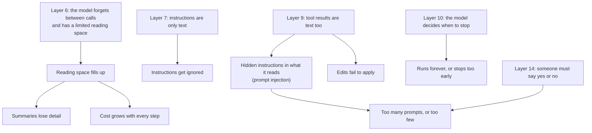

# The problems every agent runs into

> Six different apps, built by different teams, keep hitting the same handful of problems. Each problem comes from one specific layer, which is why no app has escaped them.

This page collects the "Problems it faces" sections of the six app pages and lines them up. The evidence (docs, source code, bug reports, security notices) is linked on each app's own page.

*Last checked: October 2026.*

## Where the problems come from

> **Why this matters:** none of these are bugs in one product. They follow from how the layers work. A new agent, including one you build, starts with all of them.

## The eight shared problems

### 1. The reading space fills up, and quality drops before it is full

**Layer:** 11 (memory), caused by [Layer 6](../layers/06-running-the-model.md). Every step adds tool results to a record that is re-sent in full.

| App | What it does |
|---|---|
| [Claude Code](claude-code.md) | Clears old tool results first, then summarises. Helper agents work in their own reading space. Add-ons load in two stages |
| [Codex CLI](codex-cli.md) | Keeps the start and end of long command output and drops the middle. Summarises through a dedicated server call |
| [opencode](opencode.md) | Saves full tool output to a file and shows the model a cut version. Summarises with a hidden helper agent |
| [Aider](aider.md) | Sends a ranked, size-capped map of the project instead of the files. Reports the limit but leaves trimming to you |
| [Hermes Agent](hermes-agent.md) | Saves huge tool output to a file with a preview. Replaces the middle of the chat with a summary |
| [OpenClaw](openclaw.md) | Prunes, then summarises. Lets the agent save notes first |

**Still unsolved everywhere:** Claude Code's docs call this the one constraint most of their advice is built around. It is managed, not removed.

### 2. Summaries lose detail (compaction)

**Layer:** 11. A summary is shorter than the record, so something is always dropped. Users of Claude Code, Codex CLI and opencode all report forgotten rules and repeated work after a summary.

A second, nastier form: **summarising that never finishes.** If the summary does not shrink things enough, the "too full" check fires again straight away. opencode, Codex CLI and Hermes Agent have each had reports of this loop.

**What helps:** re-read the durable instruction files from disk after summarising (Claude Code, Codex CLI); let the agent save notes just before (OpenClaw); keep the most recent turns word for word (opencode, Codex CLI); count failed attempts and stop.

### 3. Instructions are advice, not rules

**Layer:** [7](../layers/07-talking-to-it.md). An instruction file is text in the reading space. The model usually follows it. Nothing forces it to.

Claude Code's docs say plainly that `CLAUDE.md` is context, not enforcement, and users report rules being ignored. Aider's whole edit system depends on the model following a text layout, and its most common failure is the model not doing so.

**What helps:** anything that must always happen belongs in ordinary code. Claude Code and Codex CLI offer scripts that run at fixed moments (hooks). Aider runs commit, check and test in code, in the same order every time.

### 4. Hidden instructions in what the agent reads (prompt injection)

**Layers:** [9](../layers/09-giving-it-hands.md) and 14. A web page, an email or a file enters the same reading space as your instructions. The model cannot reliably tell them apart.

| App | Position |
|---|---|
| [OpenClaw](openclaw.md) | Docs say it is not solved. Highest exposure of the six: always on, reads messages from other people |
| [Hermes Agent](hermes-agent.md) | Scans for known patterns. The makers state the scanners are not a real barrier |
| [Codex CLI](codex-cli.md) | Network off by default, web search from saved copies by default. No complete fix claimed |
| [Claude Code](claude-code.md) | Permission checks and trust prompts. Docs: "no system is completely immune" |
| [opencode](opencode.md) | A specific defence: not published |
| [Aider](aider.md) | Lowest exposure: no tool menu, the human approves each command |

**Still unsolved everywhere.** No app claims a fix. The working defence is to limit what a tricked agent can do: a locked-down box (sandbox), few tools, little access.

### 5. Too many permission prompts, or too few

**Layer:** 14. Ask every time and people stop reading (Anthropic reports users approve 93% of prompts). Never ask and one mistake has your whole account.

| App | Starting point | Escape from prompt fatigue |
|---|---|---|
| [Codex CLI](codex-cli.md) | Sandbox on; asks only to go beyond it | The sandbox itself. But it blocks legitimate work such as installing packages, which brings the prompts back |
| [Claude Code](claude-code.md) | Asks before edits and commands in manual mode | A second model reviews actions (auto mode). Anthropic reports it misses some risky ones |
| [opencode](opencode.md) | Allows most things | You tighten rules by hand. No sandbox underneath |
| [Hermes Agent](hermes-agent.md) | Checks commands against risky patterns | A model judges risk; or run commands in a container |
| [OpenClaw](openclaw.md) | Host commands run without asking; sandbox off | You turn protections on |
| [Aider](aider.md) | Asks before every command | Little to ask about, since the model cannot act alone |

**The pattern:** a hard wall enforced by the operating system or a container is the only protection that does not depend on the model or the human paying attention. It is also the most work to build: Codex CLI needs separate code for three operating systems, each with its own bugs.

### 6. The loop runs too long, or stops too early

**Layer:** [10](../layers/10-the-loop.md). The model decides when it is done.

Claude Code, Codex CLI and opencode have **no step limit by default**. OpenClaw uses time limits only. Hermes Agent has a step budget, and has had a report of work being lost when the budget cut a scheduled job short. Aider caps its one retry loop at a small fixed number.

Stopping early is the quieter failure: the agent reports success without checking. Claude Code's answer is a check the agent can run (tests, a script at stop time, review by a fresh helper agent).

### 7. Edits fail to apply

**Layer:** 9. To change a file the model must reproduce the existing text exactly. One wrong space and the edit does not match.

Every coding app has built the same repair kit: a forgiving matcher that tolerates small slips, a refusal when the match is ambiguous, and an error message sent back to the model so it can retry. Aider's page has the most detail, because its edits are plain text and this is its main failure.

### 8. One wrapper, many models

**Layers:** 6 and 9. An app that supports many models inherits each model's habits. opencode keeps a separate prompt per model family plus repair code. Hermes Agent has open reports of local models printing a tool request as plain text, so it never runs. Aider picks an edit layout per model. OpenClaw's docs warn that weaker models are easier to trick.

Claude Code and Codex CLI avoid most of this by targeting one company's models, at the price of being tied to them.

## Problems only one family has

**Always-on personal agents (Hermes Agent, OpenClaw)**
- **Idle cost.** A check-in turn on a timer is a full model call even when there is no news.
- **Who is talking.** Anyone who can message the agent borrows its powers. Sender checks are ordinary code, and OpenClaw has published security notices about bugs in them.
- **Poisoned notes.** Saved notes carry no proof of where they came from. A trick that lands in memory is replayed in every later session.
- **Self-written instructions.** Hermes Agent's self-written how-to guides are never tested, and they pile up.
- **Long-running process health.** Memory and database growth over days.

**Coding agents (Claude Code, Codex CLI, opencode, Aider)**
- **Undo is partial.** File edits can be rewound. Commands that touched a database or a remote service cannot.
- **Usage limits.** Long sessions and helper agents use up paid allowances faster than people expect.

## What this means if you build your own

Lessons that recur across the six app pages:

1. **Send every failure back to the model as text.** Bad tool name, failed edit, blocked command. The loop survives and the model can try something else.
2. **Never let one tool result flood the reading space.** Cut it, and save the full version to a file the model can search.
3. **Keep instructions and memory in plain files.** Readable, editable, easy to put under version control.
4. **Load add-ons in two stages.** A one-line description first, the full text only when needed.
5. **Only add to the end of the conversation.** It lets the model provider reuse earlier work (prompt caching), which is the main cost control.
6. **Put the rules that matter in code.** Sender checks, permission checks, commit and test steps. Not in the prompt.
7. **Start with a step limit.** Three of these apps ship without one, and two of those have reports of loops that would not end.
8. **Run commands in a container before you write your own sandbox.**

And one decision to make early: **how much does the model decide?** Aider shows that a fixed recipe with a human choosing the files avoids problems 4, 5 and 6 almost entirely, and gives up the ability to explore on its own. Every step towards more freedom buys capability and one more row in the problems table.
