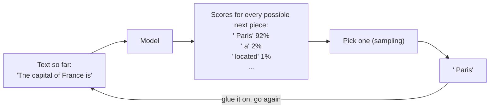
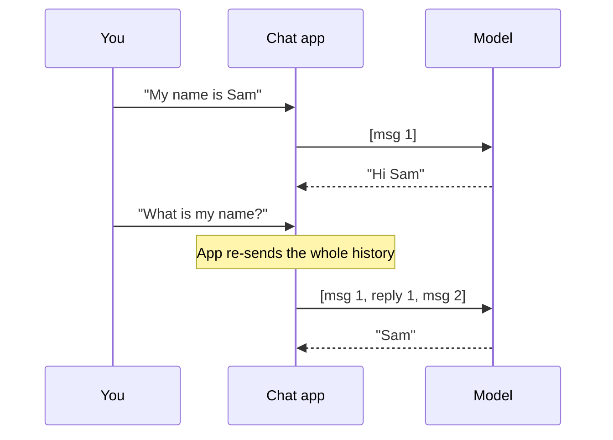

# Layer 6: Running the model

> A finished model does one thing: given some text, it scores every possible next word-piece, one gets picked, and the process repeats. It keeps nothing between calls.

**Below this layer:** a trained model (layers 1 to 5). **Above:** [Layer 7: talking to it](07-talking-to-it.md).

## The problem it solves

Training produces a huge file of numbers. That file does nothing on its own. Running the model (inference) is the step that turns "a file of numbers" into "text coming out".

How this step works explains most of the odd behaviour people notice: why the same question gives different answers, why long chats get expensive, and why the model "forgets".

## How it works

### One piece at a time

The model never writes a sentence. It reads everything so far and produces a score for every word-piece (token) it knows, tens of thousands of them. One is chosen, glued to the end, and the whole thing is read again to choose the next.

> **Why this matters:** the model does not plan a whole answer and then type it. Every piece is a fresh guess based on all the text before it, including the pieces it just wrote itself.

Step by step:
1. Your text is cut into word-pieces (tokens). A token is roughly three-quarters of an English word.
2. The model reads all the tokens and outputs a likelihood for each possible next token.
3. One token is picked (sampling). Usually a likely one, not always the single most likely.
4. That token is added to the end of the text.
5. Repeat from step 2 until the model picks a special "I am finished" token, or hits the length limit you set (max tokens).

This is also why answers appear word by word on screen (streaming): they really are produced that way.

### The randomness dial

Step 3 has a setting called **temperature**.

| Temperature | What happens | Good for |
|---|---|---|
| 0 | Almost always picks the top-scored piece | Pulling data out of text, sorting things into categories, code |
| Around 1 | Picks in proportion to the scores | General chat, writing |
| Higher | Unlikely pieces get picked more often | Brainstorming; gets incoherent fast |

Even at 0, answers are not guaranteed to be identical every time. Treat a model as "mostly repeatable", never "exactly repeatable".

### The reading space has a size limit

The model can only read a fixed amount of text per call: the **context window**. Everything counts against it: instructions, the whole chat so far, any documents you pasted, and the answer being written.

### It forgets everything between calls

This is the single most important fact for understanding agents. The model has no memory of your last message (it is stateless). A chat app fakes memory by sending the **entire conversation again** every time you press enter.

> **Why this matters:** if the app sent only message 2, the model would have no idea who Sam is. Everything an agent "knows" during a job is there because some program put it in the reading space for this call.

## Worked example

A ten-turn chat where each message and each reply is about 200 tokens:

- Turn 1 sends 200 tokens in.
- Turn 2 sends 600 in (message 1, reply 1, message 2).
- Turn 10 sends 3,800 in.

Total read across the chat: about 20,000 tokens, though you only typed 2,000. You pay per token read and per token written, so cost grows faster than the chat does. Agents feel this hard, because every tool result is added to the pile and re-read on every later turn. Providers soften it by remembering already-read text between calls (prompt caching), but the reading-space limit still applies.

## Common mistakes

- **"It remembers me."** It does not. The app re-sends history. A brand-new chat knows nothing unless the app pastes saved notes in.
- **Expecting identical output for identical input.** Picking has randomness. Lower the temperature, and still design for small differences.
- **Treating the reading space as free.** Stuffing in everything "just in case" costs money, slows replies, and makes the model worse at finding the part that matters.
- **Assuming it knows today's news.** The model's knowledge stops at the date its training text was collected (knowledge cutoff). Anything later must be put in the reading space (see [Layer 8](08-giving-it-knowledge.md)).
- **Confusing "sounds sure" with "is right".** The model picks likely-sounding text. A confident false statement (hallucination) is produced by exactly the same process as a true one.

## Words to know

| Word | Plain English |
|---|---|
| Inference | Running a trained model to get output |
| Token | A word-piece, the unit the model reads and writes |
| Sampling | Picking the next token from the scored options |
| Temperature | The dial for how adventurous the picking is |
| Context window | The most text the model can read in one call |
| Stateless | Keeps nothing between calls |
| Max tokens | The length limit you set on one reply |
| Streaming | Showing tokens as they are produced |
| Knowledge cutoff | The date the model's training text ends |
| Hallucination | A fluent, confident, false statement |
| Prompt caching | The provider keeping already-read text ready so repeat reads are cheaper |

## Learn more

- [Andrej Karpathy: Intro to Large Language Models](https://www.youtube.com/watch?v=zjkBMFhNj_g)
- [OpenAI tokenizer](https://platform.openai.com/tokenizer): paste text and watch it get cut into tokens.

**Next:** [Layer 7: talking to it](07-talking-to-it.md)
