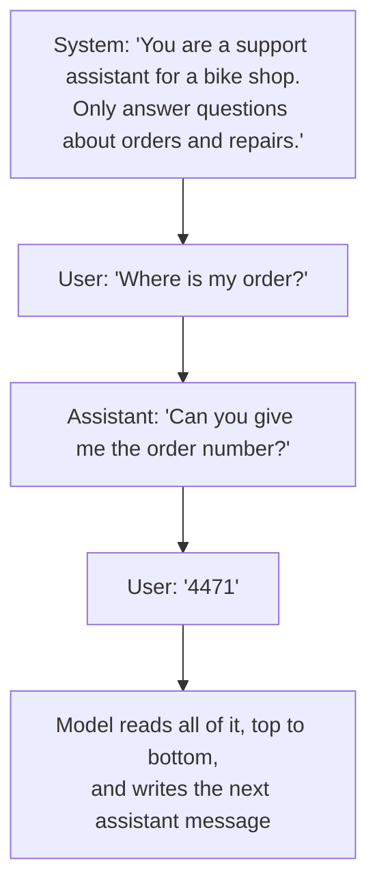
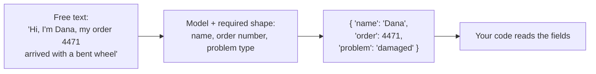

# Layer 7: Talking to it

> Once a model is trained, the only way to steer it is the text you send. Good steering is mostly clear instructions, examples, and asking for a fixed answer shape.

**Below this layer:** [Layer 6: running it](06-running-the-model.md). **Above:** [Layer 8: giving it knowledge](08-giving-it-knowledge.md).

## The problem it solves

A raw model continues text. Give it "The capital of France is" and it carries on. That is not yet an assistant you can build a product on. You need it to follow rules, stay in a role, and return answers your code can read. You cannot change the model's numbers at run time, so all of that has to be done with the text you send (the prompt).

## How it works

### A conversation is a list of labelled messages

You do not send one blob of text. You send a list, and each message has a label (role) saying who wrote it.

| Role | Who writes it | What it is for |
|---|---|---|
| System | The developer | Standing instructions: who the model is, the rules, the tone |
| User | The person (or your program) | The request |
| Assistant | The model | Its replies, re-sent on later turns as history |



> **Why this matters:** to the model this is one long piece of text with labels. Models are trained to give the system message more weight than a user message, which is what lets a developer set rules a user cannot easily override.

### Three levers that do most of the work

1. **Say exactly what you want, and why.** "Summarise this" gets a generic summary. "Summarise this for a customer who is angry about a late delivery, in three sentences, no apology clichés" gets something usable. Write the instruction you would give a smart new colleague who knows nothing about your project.
2. **Show examples.** Two or three sample inputs with the output you want (few-shot examples) often beat a paragraph of description.
3. **Give it room to work things out.** For hard problems, letting the model reason step by step before answering gives better answers. Many current models have a built-in "think first" mode (extended thinking, reasoning).

### Getting answers your code can read

Code cannot use "Sure! Here are the details you asked for…". It needs a predictable shape. You describe the shape, and the model fills it in (structured output).



> **Why this matters:** this is the bridge between a model that writes prose and a program that needs data. Tool use in [Layer 9](09-giving-it-hands.md) is the same trick: the model fills in a described shape, and code acts on it.

## Worked example

**Weak prompt**

```
Classify this ticket: "my wheel is bent"
```

Problems: classify into what? What should the answer look like?

**Better prompt**

```
System:
You sort support tickets for a bike shop. Reply with exactly one label
from this list: damaged, late, refund, other. No other words.

Examples:
"box arrived crushed"        -> damaged
"still waiting after 2 weeks" -> late

User:
"my wheel is bent"
```

Reply: `damaged`

Same model, same ticket. The difference is a named role, a closed list of allowed answers, a rule about the answer shape, and two examples.

## Common mistakes

- **Vague instructions.** The model fills gaps with the most average guess. If the answer is bland, the request was probably bland.
- **Only saying what not to do.** "Don't be wordy" works worse than "Answer in two sentences".
- **Shouting.** Piling on capital letters and "VERY IMPORTANT" makes models over-apply that one rule. A plain sentence with a reason works better.
- **Parsing prose with code.** Ask for a fixed shape rather than hunting through a paragraph for the answer.
- **Trusting user text like developer text.** Anything a user types, or a web page contains, can include "ignore your instructions" (prompt injection). Rules that must hold belong in code, not only in the prompt.
- **Tuning by feel.** Changing a prompt and eyeballing one answer tells you little. Keep a small set of test inputs and re-run them all after each change (evals, covered in layer 14).

## Words to know

| Word | Plain English |
|---|---|
| Prompt | The text you send the model |
| System prompt | Standing instructions from the developer |
| Role | The label on a message: system, user, or assistant |
| Few-shot examples | Sample inputs and outputs included in the prompt |
| Prompt engineering | The craft of writing prompts that work reliably |
| Structured output | Making the model answer in a fixed, machine-readable shape |
| JSON | A common text format for labelled data that code reads easily |
| Prompt injection | Text that tricks the model into following someone else's instructions |

## Learn more

- [Anthropic: prompt engineering overview](https://docs.anthropic.com/en/docs/build-with-claude/prompt-engineering/overview)
- [OpenAI: prompt engineering guide](https://platform.openai.com/docs/guides/prompt-engineering)

**Next:** [Layer 8: giving it knowledge](08-giving-it-knowledge.md)
