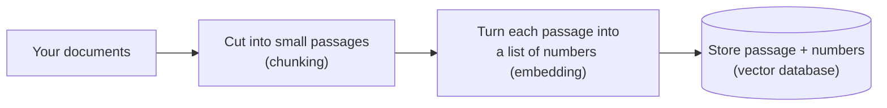
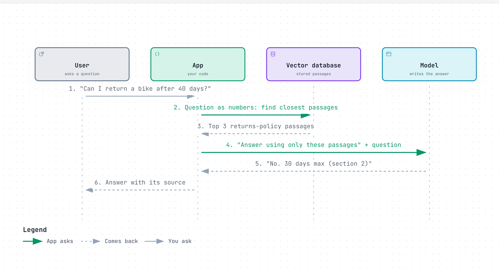

# Layer 8: Giving it knowledge

> The model only knows what it saw in training. To answer about anything else, look the facts up first and paste them into the reading space, then ask.

**Below this layer:** [Layer 7: talking to it](07-talking-to-it.md). **Above:** [Layer 9: giving it hands](09-giving-it-hands.md).

## The problem it solves

Ask a model about your company's refund policy and it has two bad options: say "I don't know", or write something that sounds like a refund policy. It tends towards the second (hallucination), because producing likely-sounding text is all it does.

It has never seen your documents, and its knowledge stops at its training date. Retraining it on your documents is slow and expensive, and has to be redone whenever a document changes.

The cheap fix: treat it like an open-book exam. Find the relevant pages, put them in front of the model, and tell it to answer from those pages. This is **retrieval-augmented generation (RAG)**: fetch first, then write.

## How it works

There are two phases. One happens once, ahead of time. The other happens on every question.

### Phase 1: prepare the library (once)

1. **Cut documents into passages** (chunking). A whole manual is too big and too unfocused; a paragraph or section is about right.
2. **Turn each passage into numbers** (embedding). A separate small model converts text into a list of numbers, built so that passages with similar meaning get similar numbers. "How do I get my money back" and "refund procedure" land close together even though they share no words.
3. **Save the numbers next to the text** in a store that is good at "find me the nearest numbers" (vector database).

### Phase 2: answer a question (every time)

<a href="https://alwintwk.github.io/how-ai-agents-work/diagrams/08-giving-it-knowledge-lookup.html">
  <picture>
    <source media="(prefers-color-scheme: dark)" srcset="../diagrams/08-giving-it-knowledge-lookup.dark.png">
    
  </picture>
</a>

Click the diagram for the interactive version (zoom, dark mode, trace a path).

> **Why this matters:** the model did not learn anything. The app did a search and pasted the result into the prompt. All the "knowledge" lives in the search step, which is ordinary software you can inspect and fix.

## Worked example

A bike shop has a 60-page handbook.

- **Without retrieval:** "What's the warranty on e-bike batteries?" The model answers "typically 2 years", a plausible guess. The handbook says 18 months. Wrong, and delivered confidently.
- **With retrieval:** the app finds the passage "E-bike batteries are covered for 18 months from delivery" and includes it. The model answers "18 months from delivery" and names the section.

The quality of the answer now depends almost entirely on whether the search found the right passage. If search returns the tyre warranty instead, the model will confidently answer about tyres.

## Three ways to give a model knowledge

| Way | Plain English | Good when | Weak when |
|---|---|---|---|
| Paste it all in (long context) | Put the whole document in the prompt | The material is small and fits in the reading space | It is large, or you pay to re-read it on every call |
| Look it up (RAG) | Search, then paste only the relevant bits | Lots of material, changes often, you need to cite sources | Search misses the right passage |
| Retrain (fine-tuning) | Adjust the model's numbers with extra examples | You need a consistent style or skill | You need fresh facts. It is slow to update and it can still make things up |

Rule of thumb: for **facts**, look them up. For **behaviour**, write instructions first and retrain only if instructions are not enough.

## Making search better

- **Match meaning and exact words together** (hybrid search). Search-by-meaning is weak on exact codes like "error E-4471". Classic keyword search is strong there. Use both.
- **Re-sort the results** (reranking). Fetch 20 candidates quickly, then use a slower, more careful model to choose the best 3.
- **Let the model do the searching.** Instead of the app always searching once, give the model a search tool and let it decide what to look for, and whether to search again. This needs [Layer 9](09-giving-it-hands.md) and [Layer 10](10-the-loop.md), and it is how most current agents find things.

## Common mistakes

- **Blaming the model when search failed.** Look at what was retrieved first. Most bad answers trace back to the wrong passages.
- **Passages that are too big or too small.** Too big buries the answer in noise. Too small cuts the answer in half.
- **Pasting in too much.** Twenty loosely related passages do worse than three good ones.
- **No "I don't know" path.** Tell the model what to do when the passages do not contain the answer, or it will fill the gap.
- **Forgetting who is allowed to see what.** If the library holds private documents, the search must filter by the asker's permissions. The model will happily repeat anything it is shown.
- **Trusting retrieved text as instructions.** A document can contain "ignore previous instructions". Retrieved text is data, not orders.

## Words to know

| Word | Plain English |
|---|---|
| RAG | Retrieval-augmented generation: look things up, then answer from them |
| Chunking | Cutting documents into passages |
| Embedding | A list of numbers that stands for the meaning of a text |
| Vector database | A store that finds the entries with the closest numbers |
| Semantic search | Search by meaning rather than exact words |
| Hybrid search | Meaning search and keyword search combined |
| Reranking | A second, more careful sort of search results |
| Fine-tuning | Further training of a model on your own examples |
| Grounding | Tying an answer to a source you supplied |

## Learn more

- [Lewis et al., Retrieval-Augmented Generation (2020)](https://arxiv.org/abs/2005.11401): the paper that named the idea.
- [Anthropic: Contextual retrieval](https://www.anthropic.com/news/contextual-retrieval): practical ways to make retrieval miss less.
- [Pinecone: What is a vector database?](https://www.pinecone.io/learn/vector-database/)

**Next:** [Layer 9: giving it hands](09-giving-it-hands.md)
