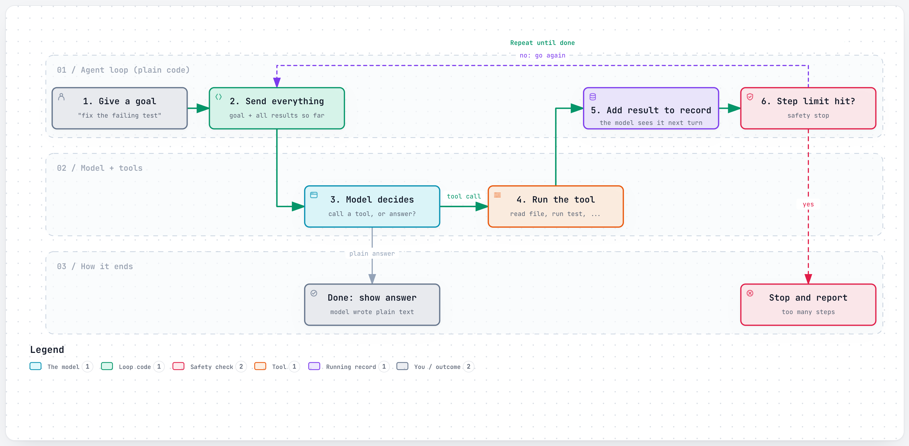
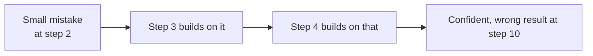

# Layer 10: The loop

> Put the tool round trip from Layer 9 inside a "repeat until done" and you have an agent. The model looks at each result and chooses its own next step.

**Below this layer:** [Layer 9: giving it hands](09-giving-it-hands.md). **Above:** Layer 11: memory (planned).

## The problem it solves

One tool call handles "what's the weather?". It does not handle "find out why the checkout test fails and fix it". Nobody knows ahead of time how many steps that takes, or which ones. You have to run the test, read the error, open a file, maybe open another, try a change, run the test again.

The programmer cannot write those steps down beforehand, because each step depends on what the last one turned up. So the decision "what next?" is handed to the model, over and over, until it says it is finished.

This is the exact point where a chatbot becomes an agent.

## How it works

<a href="https://alwintwk.github.io/how-ai-agents-work/diagrams/10-the-loop.html">
  <picture>
    <source media="(prefers-color-scheme: dark)" srcset="../diagrams/10-the-loop.dark.png">
    
  </picture>
</a>

<sub>Click the diagram for the interactive version (zoom, dark mode, trace a path).</sub>

> **Why this matters:** there is no hidden intelligence in the loop itself. It is a `while` loop a beginner could write. All the decision-making happens in the model's reply; all the doing happens in the tools.

Step by step:
1. Start a record containing the instructions, the tool menu, and the user's goal.
2. Send the whole record to the model.
3. If the reply asks for a tool: run it, add the request and the result to the record, go back to step 2.
4. If the reply is plain text with no tool request: that is the final answer. Stop.
5. Keep a safety limit (maximum steps, time, or cost) so a confused agent cannot run forever.

The pattern is often called **ReAct**, short for "reason and act": think about what to do, do it, look at what happened, think again.

### The whole thing in code

A sketch in Python using the Anthropic SDK. `run_tool` is your own function that carries out a request and returns text.

```python
import anthropic

client = anthropic.Anthropic()
messages = [{"role": "user", "content": "Why is the checkout test failing?"}]

for step in range(20):  # safety limit
    response = client.messages.create(
        model="claude-opus-5-5",
        max_tokens=4096,
        system="You are a careful engineer. Investigate before you conclude.",
        tools=tools,  # the menu from Layer 9
        messages=messages,
    )
    messages.append({"role": "assistant", "content": response.content})

    if response.stop_reason != "tool_use":
        break  # plain answer: the agent is done

    results = []
    for block in response.content:
        if block.type == "tool_use":
            results.append({
                "type": "tool_result",
                "tool_use_id": block.id,
                "content": run_tool(block.name, block.input),
            })
    messages.append({"role": "user", "content": results})
```

That is a complete agent. Real products add permission prompts, error handling, and memory management around it, but this loop is the core of every one of them.

## Worked example

Goal: **"Why is the checkout test failing?"**

| Turn | Model's reply | Result added to the record |
|---|---|---|
| 1 | Run `npm test checkout` | `Expected 107.99, received 108.00` in `cart.test.ts:42` |
| 2 | Read `cart.test.ts` | Test applies a 10% discount, then 8% tax |
| 3 | Read `cart.ts` | Code rounds after tax, then applies the discount |
| 4 | *(plain text)* "The order of operations is reversed: `cart.ts` rounds before the discount. Swap lines 18 and 19." | Loop ends |

Nobody told the agent to read `cart.ts`. It chose that because of what turn 2 showed. That choice, made at run time from results, is what the word "agent" means.

Note also that by turn 4 the model is re-reading the test output and both files. The record only grows. That cost, and what to do about it, is Layer 11.

## Workflow or agent?

| | Fixed recipe (workflow) | Agent |
|---|---|---|
| Who picks the next step | The programmer, in code | The model, at run time |
| Number of steps | Known ahead of time | Unknown |
| Cost and speed | Low, predictable | Higher, varies |
| Good for | Jobs you can write as a checklist: translate, then summarise, then file | Open-ended jobs: debugging, research, anything where the path depends on what you find |
| Fails by | Not coping with a case you did not plan for | Wandering, repeating itself, stopping early |

Start with the simplest thing that works. Many "agent" projects are better as a three-step workflow.

## How loops go wrong



> **Why this matters:** in a single answer, a mistake is one mistake. In a loop, each step trusts the record so far, so an early error carries forward. This is why agents need a way to check their work against reality, such as running the tests, not just reasoning about them.

- **Going in circles.** Trying the same failing action repeatedly. Fix: a step limit, and clear error messages so it can try something different.
- **Stopping early.** Declaring success without checking. Fix: instruct it to verify (run the test, re-read the file) before finishing.
- **Wandering off.** Fixing unrelated things it noticed along the way. Fix: a tighter goal and tighter instructions.
- **Running out of reading space.** Long jobs fill the context window. Fix: Layer 11.

## Common mistakes

- **No step limit.** A stuck loop spends money until something stops it.
- **Swallowing tool errors.** If the model never sees the error, it cannot correct course.
- **No way to check its own work.** An agent that can run the tests is far more reliable than one that can only read code and guess.
- **Reaching for an agent when a checklist would do.** More freedom means more ways to fail.
- **Adding more agents to fix a confused one.** Get one loop working well before splitting work across several (layer 12).

## Words to know

| Word | Plain English |
|---|---|
| Agent | A model in a loop that picks its own next action from the results so far |
| Agent loop | Ask the model, run the tool it asked for, show it the result, repeat |
| ReAct | "Reason and act": the think, act, look pattern |
| Stop condition | What ends the loop: a plain answer, or a limit |
| Workflow | A fixed sequence of steps decided by the programmer |
| Autonomy | How much the model decides without a person checking |
| Compounding error | An early mistake carried into every later step |

## Learn more

- [Anthropic: Building effective agents](https://www.anthropic.com/engineering/building-effective-agents)
- [Yao et al., ReAct: Synergizing Reasoning and Acting in Language Models (2022)](https://arxiv.org/abs/2210.03629): the paper that named the pattern.
- [What an agent is made of](../anatomy.md): how the loop fits with the other parts.
